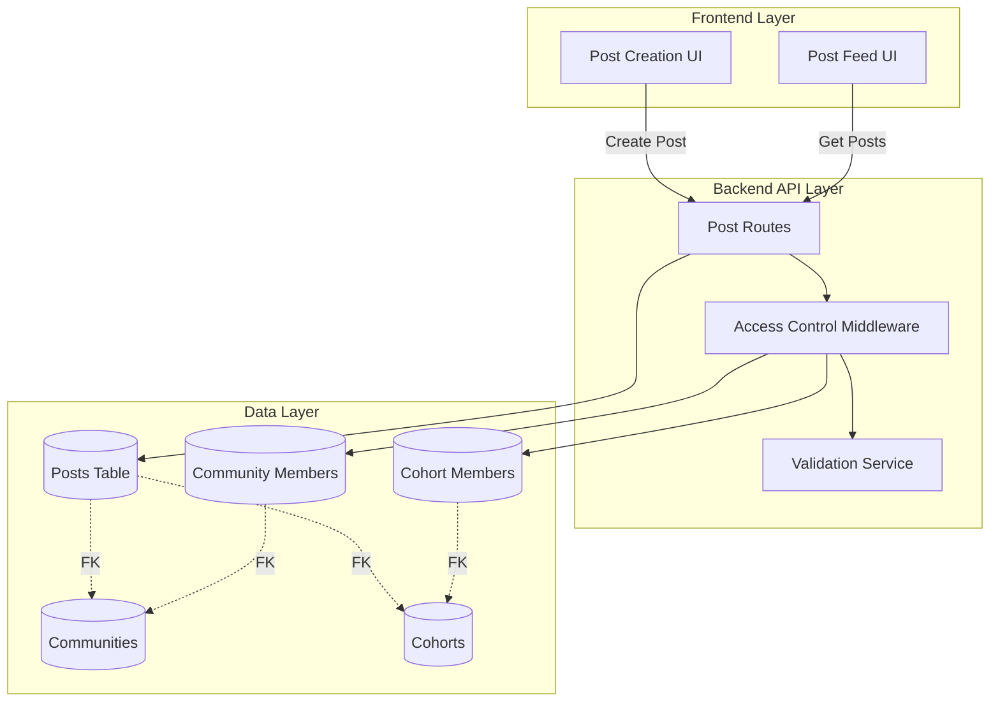
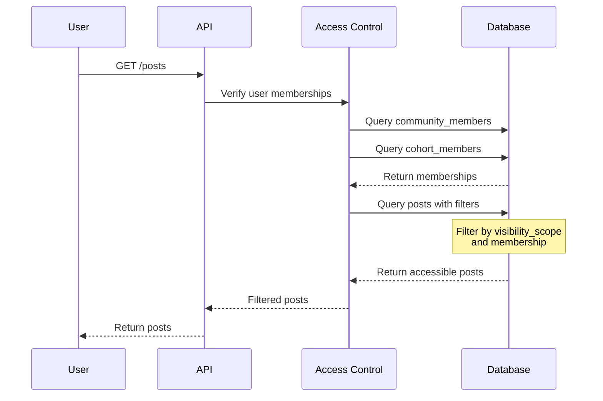

# Design Document: Community Post Access Control

## Overview

This design implements a comprehensive access control system for community posts to address the critical security vulnerability where posts are currently visible to all users regardless of membership. The solution introduces visibility scoping at two levels (community and cohort), enforces membership-based access control through middleware, and optimizes database queries for performance.

The design follows a defense-in-depth approach with access control enforced at multiple layers: database schema constraints, backend middleware verification, and frontend UI validation. This ensures that even if one layer fails, the system maintains security.

## Architecture

### High-Level Architecture



### Access Control Flow



## Components and Interfaces

### 1. Database Schema Changes

#### Posts Table Migration

```sql
-- Add new columns to posts table
ALTER TABLE posts 
ADD COLUMN visibility_scope ENUM('community', 'cohort') NOT NULL DEFAULT 'community',
ADD COLUMN cohort_id INT NULL,
ADD CONSTRAINT fk_posts_cohort 
    FOREIGN KEY (cohort_id) REFERENCES cohorts(id) ON DELETE CASCADE;

-- Create indexes for performance
CREATE INDEX idx_posts_visibility_scope ON posts(visibility_scope);
CREATE INDEX idx_posts_cohort_id ON posts(cohort_id);
CREATE INDEX idx_posts_community_cohort ON posts(visibility_scope, community_ids, cohort_id);

-- Migrate existing data
UPDATE posts 
SET visibility_scope = 'community', 
    cohort_id = NULL 
WHERE visibility_scope IS NULL;
```

Note: The `community_ids` column is maintained for backward compatibility but will be refactored to a single `community_id` column in the implementation.

### 2. Access Control Middleware

#### AccessControlService

```javascript
class AccessControlService {
  /**
   * Get user's community memberships
   * @param {number} userId - User ID
   * @returns {Promise<number[]>} Array of community IDs
   */
  async getUserCommunities(userId) {
    // Query community_members table
    // Return array of community IDs where user is a member
  }

  /**
   * Get user's cohort memberships
   * @param {number} userId - User ID
   * @returns {Promise<number[]>} Array of cohort IDs
   */
  async getUserCohorts(userId) {
    // Query cohort_members table
    // Return array of cohort IDs where user is a member
  }

  /**
   * Check if user can access a specific post
   * @param {number} userId - User ID
   * @param {Object} post - Post object with visibility_scope, community_ids, cohort_id
   * @returns {Promise<boolean>} True if user has access
   */
  async canAccessPost(userId, post) {
    if (post.visibility_scope === 'community') {
      const userCommunities = await this.getUserCommunities(userId);
      const postCommunityIds = post.community_ids.split(',').map(id => parseInt(id.trim()));
      return postCommunityIds.some(id => userCommunities.includes(id));
    } else if (post.visibility_scope === 'cohort') {
      const userCohorts = await this.getUserCohorts(userId);
      return userCohorts.includes(post.cohort_id);
    }
    return false;
  }

  /**
   * Build SQL WHERE clause for filtering posts by user membership
   * @param {number} userId - User ID
   * @returns {Promise<string>} SQL WHERE clause
   */
  async buildPostFilterClause(userId) {
    const userCommunities = await this.getUserCommunities(userId);
    const userCohorts = await this.getUserCohorts(userId);
    
    if (userCommunities.length === 0 && userCohorts.length === 0) {
      return '1 = 0'; // No memberships, return no posts
    }
    
    const clauses = [];
    
    if (userCommunities.length > 0) {
      const communityIds = userCommunities.join(',');
      clauses.push(`(visibility_scope = 'community' AND community_ids REGEXP '(^|,)(${communityIds})(,|$)')`);
    }
    
    if (userCohorts.length > 0) {
      const cohortIds = userCohorts.join(',');
      clauses.push(`(visibility_scope = 'cohort' AND cohort_id IN (${cohortIds}))`);
    }
    
    return clauses.join(' OR ');
  }
}
```

### 3. Updated Post Routes

#### POST /v1/api/posts (Create Post)

```javascript
app.post(
  "/v1/api/posts",
  [UrlMiddleware, TokenMiddleware({ role: "convener" })],
  async function (req, res) {
    const {
      text,
      media_1,
      media_2,
      media_3,
      media_4,
      visibility_scope,
      community_id,
      cohort_id,
      mentioned_ids,
      can_reply,
    } = req.body;

    // Validation
    const validationResult = await ValidationService.validateObject(
      {
        text: "required|string",
        media_1: "url",
        media_2: "url",
        media_3: "url",
        media_4: "url",
        visibility_scope: "required|in:community,cohort",
        community_id: "required|integer",
        cohort_id: visibility_scope === 'cohort' ? "required|integer" : "integer",
        mentioned_ids: "commaInt",
        can_reply: `required|in:${Object.values(POST_REPLY).join(",")}`,
      },
      req.body
    );

    if (validationResult.error) {
      return res.status(400).json(validationResult);
    }

    // Verify cohort belongs to community if cohort-scoped
    if (visibility_scope === 'cohort') {
      const cohortSdk = new BackendSDK();
      cohortSdk.setTable("cohorts");
      const cohorts = await cohortSdk.get({ id: cohort_id });
      
      if (cohorts.length === 0) {
        return res.status(400).json({
          error: true,
          message: "Cohort not found"
        });
      }
      
      // Verify cohort belongs to a programme in the specified community
      const programmeSdk = new BackendSDK();
      const programmeCheck = await programmeSdk.rawQuery(`
        SELECT p.id FROM programmes p
        JOIN cohorts c ON c.programme_id = p.id
        WHERE c.id = ${cohort_id} AND p.community_id = ${community_id}
      `);
      
      if (programmeCheck.length === 0) {
        return res.status(400).json({
          error: true,
          message: "Cohort does not belong to the specified community"
        });
      }
    }

    // Create post
    const sdk = new BackendSDK();
    sdk.setTable("posts");
    const post_id = await sdk.insert({
      text,
      media_1,
      media_2,
      media_3,
      media_4,
      community_ids: community_id.toString(), // Backward compatibility
      cohort_id: visibility_scope === 'cohort' ? cohort_id : null,
      visibility_scope,
      mentioned_ids,
      posted_by: req.user_id,
      can_reply,
      status: POST_STATUSES.PUBLISHED,
    });

    return res.status(200).json({
      error: false,
      message: "Post created successfully",
      post_id,
    });
  }
);
```

#### GET /v1/api/posts (Get All Posts)

```javascript
app.get(
  "/v1/api/posts",
  [UrlMiddleware, TokenMiddleware({ role: "convener|learner" })],
  async function (req, res) {
    const accessControl = new AccessControlService();
    const filterClause = await accessControl.buildPostFilterClause(req.user_id);
    
    const sdk = new BackendSDK();
    const posts = await sdk.rawQuery(`
      SELECT p.* FROM posts p
      WHERE p.status = 'published' AND (${filterClause})
      ORDER BY p.created_at DESC
      LIMIT 100
    `);

    // Fetch user and community data (existing logic)
    // ... (same as current implementation)

    return res.status(200).json({
      error: false,
      message: "Posts fetched successfully",
      posts: postsWithDetails,
    });
  }
);
```

#### GET /v1/posts/:post_id (Get Single Post)

```javascript
app.get(
  "/v1/posts/:post_id",
  [UrlMiddleware, TokenMiddleware({ role: "convener|learner" })],
  async function (req, res) {
    const { post_id } = req.params;
    
    // Validate
    const validationResult = await ValidationService.validateObject(
      { post_id: "required|integer" },
      { post_id }
    );
    
    if (validationResult.error) {
      return res.status(400).json(validationResult);
    }

    // Fetch post
    const sdk = new BackendSDK();
    sdk.setTable("posts");
    const posts = await sdk.get({ id: post_id });
    const post = Array.isArray(posts) ? posts[0] : posts;

    if (!post) {
      return res.status(404).json({
        error: true,
        message: "Post not found",
      });
    }

    // Check access
    const accessControl = new AccessControlService();
    const hasAccess = await accessControl.canAccessPost(req.user_id, post);

    if (!hasAccess) {
      // Return 404 to avoid leaking post existence
      return res.status(404).json({
        error: true,
        message: "Post not found",
      });
    }

    // Fetch user and community data (existing logic)
    // ... (same as current implementation)

    return res.status(200).json({
      error: false,
      message: "Post retrieved successfully",
      post: postWithDetails,
    });
  }
);
```

### 4. Frontend Components

#### VisibilityScopeSelector Component

```typescript
interface VisibilityScopeSelectorProps {
  communityId: number;
  onScopeChange: (scope: 'community' | 'cohort', cohortId?: number) => void;
}

const VisibilityScopeSelector: React.FC<VisibilityScopeSelectorProps> = ({
  communityId,
  onScopeChange
}) => {
  const [scope, setScope] = useState<'community' | 'cohort'>('community');
  const [selectedCohort, setSelectedCohort] = useState<number | null>(null);
  const [cohorts, setCohorts] = useState<Cohort[]>([]);

  useEffect(() => {
    // Fetch cohorts for the community
    fetchCohortsForCommunity(communityId).then(setCohorts);
  }, [communityId]);

  const handleScopeChange = (newScope: 'community' | 'cohort') => {
    setScope(newScope);
    if (newScope === 'community') {
      setSelectedCohort(null);
      onScopeChange('community');
    }
  };

  const handleCohortChange = (cohortId: number) => {
    setSelectedCohort(cohortId);
    onScopeChange('cohort', cohortId);
  };

  return (
    <View>
      <Text>Who can see this post?</Text>
      
      <RadioButton
        label="Entire Community"
        selected={scope === 'community'}
        onPress={() => handleScopeChange('community')}
      />
      
      <RadioButton
        label="Specific Cohort"
        selected={scope === 'cohort'}
        onPress={() => handleScopeChange('cohort')}
      />
      
      {scope === 'cohort' && (
        <Picker
          selectedValue={selectedCohort}
          onValueChange={handleCohortChange}
        >
          <Picker.Item label="Select a cohort..." value={null} />
          {cohorts.map(cohort => (
            <Picker.Item 
              key={cohort.id} 
              label={cohort.name} 
              value={cohort.id} 
            />
          ))}
        </Picker>
      )}
    </View>
  );
};
```

#### Updated Post Creation Form

```typescript
const CreatePostForm: React.FC = () => {
  const [text, setText] = useState('');
  const [visibilityScope, setVisibilityScope] = useState<'community' | 'cohort'>('community');
  const [cohortId, setCohortId] = useState<number | null>(null);
  const [canSubmit, setCanSubmit] = useState(false);

  useEffect(() => {
    // Enable submit only if text is present and visibility is properly configured
    const isValid = text.trim().length > 0 && 
                    (visibilityScope === 'community' || 
                     (visibilityScope === 'cohort' && cohortId !== null));
    setCanSubmit(isValid);
  }, [text, visibilityScope, cohortId]);

  const handleScopeChange = (scope: 'community' | 'cohort', selectedCohortId?: number) => {
    setVisibilityScope(scope);
    setCohortId(selectedCohortId || null);
  };

  const handleSubmit = async () => {
    const postData = {
      text,
      visibility_scope: visibilityScope,
      community_id: currentCommunityId,
      cohort_id: cohortId,
      can_reply: 'everyone',
    };

    await createPost(postData);
  };

  return (
    <View>
      <TextInput
        value={text}
        onChangeText={setText}
        placeholder="What's on your mind?"
      />
      
      <VisibilityScopeSelector
        communityId={currentCommunityId}
        onScopeChange={handleScopeChange}
      />
      
      <Button
        title="Post"
        onPress={handleSubmit}
        disabled={!canSubmit}
      />
    </View>
  );
};
```

## Data Models

### Post Model (Updated)

```typescript
interface Post {
  id: number;
  text: string;
  media_1?: string;
  media_2?: string;
  media_3?: string;
  media_4?: string;
  visibility_scope: 'community' | 'cohort';
  community_ids: string; // Comma-separated, maintained for backward compatibility
  cohort_id?: number | null;
  mentioned_ids?: string; // Comma-separated user IDs
  posted_by: number;
  can_reply: 'everyone' | 'nobody' | 'people_mentioned';
  status: 'draft' | 'published';
  created_at: Date;
  updated_at: Date;
}
```

### Community Member Model

```typescript
interface CommunityMember {
  id: number;
  community_id: number;
  user_id: number;
  role?: string;
  status: string;
  created_at: Date;
  updated_at: Date;
}
```

### Cohort Member Model

```typescript
interface CohortMember {
  id: number;
  cohort_id: number;
  user_id: number;
  status: string;
  created_at: Date;
  updated_at: Date;
}
```

### Access Control Context

```typescript
interface UserMembershipContext {
  userId: number;
  communityIds: number[];
  cohortIds: number[];
}
```


## Correctness Properties

A property is a characteristic or behavior that should hold true across all valid executions of a system—essentially, a formal statement about what the system should do. Properties serve as the bridge between human-readable specifications and machine-verifiable correctness guarantees.

### Property 1: Post Creation Requires Visibility Scope

*For any* post creation request, the API SHALL reject the request if visibility_scope is not provided or is not one of the valid values ('community' or 'cohort').

**Validates: Requirements 1.1**

### Property 2: Community-Scoped Posts Have NULL Cohort ID

*For any* post created with visibility_scope='community', the stored post record SHALL have cohort_id set to NULL.

**Validates: Requirements 1.2**

### Property 3: Cohort-Scoped Posts Require Both IDs

*For any* post creation request with visibility_scope='cohort', the API SHALL reject the request if either community_id or cohort_id is missing, and SHALL store both values if the request is valid.

**Validates: Requirements 1.3**

### Property 4: Cohort Must Belong to Community

*For any* post creation request with visibility_scope='cohort', the API SHALL reject the request if the specified cohort does not belong to a programme within the specified community.

**Validates: Requirements 1.4**

### Property 5: Post Data Persistence Round-Trip

*For any* valid post created, retrieving the post by ID SHALL return the same visibility_scope, community_id, and cohort_id values that were provided during creation.

**Validates: Requirements 1.5**

### Property 6: Community-Scoped Post Access Control

*For any* community-scoped post and any user, the post SHALL be included in the user's feed if and only if the user is a member of the post's community (as recorded in community_members table).

**Validates: Requirements 2.2, 4.1, 4.2**

### Property 7: Cohort-Scoped Post Access Control

*For any* cohort-scoped post and any user, the post SHALL be included in the user's feed if and only if the user is a member of the post's cohort (as recorded in cohort_members table).

**Validates: Requirements 2.3, 4.1, 4.3**

### Property 8: Unauthorized Access Returns 404

*For any* post that a user cannot access (due to lack of community or cohort membership), attempting to retrieve that post by ID SHALL return a 404 Not Found response, not revealing whether the post exists.

**Validates: Requirements 2.5, 8.1, 8.2**

### Property 9: Posts Ordered by Creation Date

*For any* user's post feed, the posts SHALL be ordered by created_at timestamp in descending order (newest first).

**Validates: Requirements 4.4**

### Property 10: Comment Access Requires Post Access

*For any* comment retrieval or creation request, the operation SHALL succeed if and only if the requesting user has access to the parent post according to the post's visibility scope and the user's memberships.

**Validates: Requirements 6.1, 6.2, 6.3, 6.4**

### Property 11: Pagination Limit Enforced

*For any* request to retrieve posts, the response SHALL contain no more than 100 posts, regardless of how many posts the user has access to.

**Validates: Requirements 9.5**

## Error Handling

### Validation Errors

All validation errors return HTTP 400 with a structured error response:

```json
{
  "error": true,
  "message": "Validation failed",
  "details": {
    "field": "visibility_scope",
    "error": "Must be one of: community, cohort"
  }
}
```

### Access Control Errors

Access control violations return HTTP 404 (not 403) to avoid leaking information about post existence:

```json
{
  "error": true,
  "message": "Post not found"
}
```

### Database Errors

Database errors return HTTP 500 without exposing query details:

```json
{
  "error": true,
  "message": "Internal server error"
}
```

All errors are logged with full context for debugging, including:
- User ID
- Requested resource
- Timestamp
- Error details (server-side only)

### Error Logging

```javascript
class AccessControlLogger {
  logAccessViolation(userId, postId, reason) {
    console.error({
      type: 'ACCESS_VIOLATION',
      userId,
      postId,
      reason,
      timestamp: new Date().toISOString()
    });
  }

  logValidationError(userId, endpoint, validationErrors) {
    console.warn({
      type: 'VALIDATION_ERROR',
      userId,
      endpoint,
      errors: validationErrors,
      timestamp: new Date().toISOString()
    });
  }
}
```

## Testing Strategy

### Dual Testing Approach

This feature requires both unit tests and property-based tests to ensure comprehensive coverage:

- **Unit tests**: Verify specific examples, edge cases, and error conditions
- **Property tests**: Verify universal properties across all inputs

Together, these approaches provide comprehensive coverage where unit tests catch concrete bugs and property tests verify general correctness.

### Property-Based Testing

We will use **fast-check** (for TypeScript/JavaScript) to implement property-based tests. Each test will run a minimum of 100 iterations to ensure thorough coverage through randomization.

#### Test Configuration

```typescript
import fc from 'fast-check';

// Configure for minimum 100 runs
const testConfig = { numRuns: 100 };
```

#### Property Test Examples

**Property 6: Community-Scoped Post Access Control**

```typescript
// Feature: community-post-access-control, Property 6: Community-scoped post access control
describe('Property 6: Community-Scoped Post Access Control', () => {
  it('should return community posts only to community members', async () => {
    await fc.assert(
      fc.asyncProperty(
        fc.record({
          userId: fc.integer({ min: 1, max: 1000 }),
          postId: fc.integer({ min: 1, max: 1000 }),
          communityId: fc.integer({ min: 1, max: 100 }),
          isMember: fc.boolean()
        }),
        async ({ userId, postId, communityId, isMember }) => {
          // Setup: Create post with community scope
          await createPost({
            id: postId,
            visibility_scope: 'community',
            community_ids: communityId.toString(),
            cohort_id: null
          });

          // Setup: Set user membership
          if (isMember) {
            await addCommunityMember(communityId, userId);
          } else {
            await removeCommunityMember(communityId, userId);
          }

          // Test: Fetch posts for user
          const posts = await getPostsForUser(userId);
          const hasPost = posts.some(p => p.id === postId);

          // Assert: User sees post if and only if they're a member
          expect(hasPost).toBe(isMember);
        }
      ),
      testConfig
    );
  });
});
```

**Property 7: Cohort-Scoped Post Access Control**

```typescript
// Feature: community-post-access-control, Property 7: Cohort-scoped post access control
describe('Property 7: Cohort-Scoped Post Access Control', () => {
  it('should return cohort posts only to cohort members', async () => {
    await fc.assert(
      fc.asyncProperty(
        fc.record({
          userId: fc.integer({ min: 1, max: 1000 }),
          postId: fc.integer({ min: 1, max: 1000 }),
          cohortId: fc.integer({ min: 1, max: 100 }),
          isMember: fc.boolean()
        }),
        async ({ userId, postId, cohortId, isMember }) => {
          // Setup: Create post with cohort scope
          await createPost({
            id: postId,
            visibility_scope: 'cohort',
            cohort_id: cohortId
          });

          // Setup: Set user membership
          if (isMember) {
            await addCohortMember(cohortId, userId);
          } else {
            await removeCohortMember(cohortId, userId);
          }

          // Test: Fetch posts for user
          const posts = await getPostsForUser(userId);
          const hasPost = posts.some(p => p.id === postId);

          // Assert: User sees post if and only if they're a member
          expect(hasPost).toBe(isMember);
        }
      ),
      testConfig
    );
  });
});
```

**Property 4: Cohort Must Belong to Community**

```typescript
// Feature: community-post-access-control, Property 4: Cohort must belong to community
describe('Property 4: Cohort Must Belong to Community', () => {
  it('should reject posts when cohort does not belong to community', async () => {
    await fc.assert(
      fc.asyncProperty(
        fc.record({
          communityId: fc.integer({ min: 1, max: 100 }),
          cohortId: fc.integer({ min: 1, max: 100 }),
          belongsToCommunity: fc.boolean()
        }),
        async ({ communityId, cohortId, belongsToCommunity }) => {
          // Setup: Create cohort relationship
          if (belongsToCommunity) {
            await createCohortInCommunity(cohortId, communityId);
          } else {
            await createCohortInDifferentCommunity(cohortId, communityId);
          }

          // Test: Attempt to create post
          const result = await createPost({
            visibility_scope: 'cohort',
            community_id: communityId,
            cohort_id: cohortId,
            text: 'Test post'
          });

          // Assert: Post creation succeeds if and only if cohort belongs to community
          if (belongsToCommunity) {
            expect(result.error).toBe(false);
          } else {
            expect(result.error).toBe(true);
            expect(result.message).toContain('does not belong');
          }
        }
      ),
      testConfig
    );
  });
});
```

### Unit Testing

Unit tests complement property tests by covering specific scenarios:

#### Access Control Scenarios

```typescript
describe('Post Access Control', () => {
  it('should allow community member to see community post', async () => {
    const user = await createUser();
    const community = await createCommunity();
    await addCommunityMember(community.id, user.id);
    
    const post = await createPost({
      visibility_scope: 'community',
      community_ids: community.id.toString()
    });

    const posts = await getPostsForUser(user.id);
    expect(posts).toContainEqual(expect.objectContaining({ id: post.id }));
  });

  it('should not allow non-member to see community post', async () => {
    const user = await createUser();
    const community = await createCommunity();
    
    const post = await createPost({
      visibility_scope: 'community',
      community_ids: community.id.toString()
    });

    const posts = await getPostsForUser(user.id);
    expect(posts).not.toContainEqual(expect.objectContaining({ id: post.id }));
  });

  it('should return 404 when non-member requests post by ID', async () => {
    const user = await createUser();
    const community = await createCommunity();
    
    const post = await createPost({
      visibility_scope: 'community',
      community_ids: community.id.toString()
    });

    const response = await getPostById(post.id, user.id);
    expect(response.status).toBe(404);
    expect(response.body.message).toBe('Post not found');
  });
});
```

#### Edge Cases

```typescript
describe('Edge Cases', () => {
  it('should return empty list for user with no memberships', async () => {
    const user = await createUser();
    const posts = await getPostsForUser(user.id);
    expect(posts).toEqual([]);
  });

  it('should handle posts with multiple community IDs (backward compatibility)', async () => {
    const user = await createUser();
    const community1 = await createCommunity();
    const community2 = await createCommunity();
    await addCommunityMember(community1.id, user.id);
    
    const post = await createPost({
      visibility_scope: 'community',
      community_ids: `${community1.id},${community2.id}`
    });

    const posts = await getPostsForUser(user.id);
    expect(posts).toContainEqual(expect.objectContaining({ id: post.id }));
  });

  it('should enforce 100 post limit', async () => {
    const user = await createUser();
    const community = await createCommunity();
    await addCommunityMember(community.id, user.id);
    
    // Create 150 posts
    for (let i = 0; i < 150; i++) {
      await createPost({
        visibility_scope: 'community',
        community_ids: community.id.toString()
      });
    }

    const posts = await getPostsForUser(user.id);
    expect(posts.length).toBeLessThanOrEqual(100);
  });
});
```

#### Comment Access Control

```typescript
describe('Comment Access Control', () => {
  it('should allow comment retrieval if user has post access', async () => {
    const user = await createUser();
    const community = await createCommunity();
    await addCommunityMember(community.id, user.id);
    
    const post = await createPost({
      visibility_scope: 'community',
      community_ids: community.id.toString()
    });

    const comments = await getCommentsForPost(post.id, user.id);
    expect(comments).toBeDefined();
  });

  it('should reject comment retrieval if user lacks post access', async () => {
    const user = await createUser();
    const community = await createCommunity();
    
    const post = await createPost({
      visibility_scope: 'community',
      community_ids: community.id.toString()
    });

    const response = await getCommentsForPost(post.id, user.id);
    expect(response.error).toBe(true);
    expect(response.message).toContain('permission');
  });

  it('should allow comment creation if user has post access', async () => {
    const user = await createUser();
    const community = await createCommunity();
    await addCommunityMember(community.id, user.id);
    
    const post = await createPost({
      visibility_scope: 'community',
      community_ids: community.id.toString()
    });

    const comment = await createComment({
      post_id: post.id,
      text: 'Test comment',
      user_id: user.id
    });

    expect(comment.error).toBe(false);
  });
});
```

### Integration Testing

Integration tests verify end-to-end flows:

```typescript
describe('End-to-End Post Creation and Access', () => {
  it('should complete full post lifecycle with access control', async () => {
    // Create users and community
    const convener = await createUser({ role: 'convener' });
    const learner1 = await createUser({ role: 'learner' });
    const learner2 = await createUser({ role: 'learner' });
    const community = await createCommunity({ owner_id: convener.id });
    
    // Add learner1 to community, leave learner2 out
    await addCommunityMember(community.id, learner1.id);
    
    // Convener creates post
    const post = await createPost({
      visibility_scope: 'community',
      community_id: community.id,
      text: 'Test post',
      posted_by: convener.id
    });
    
    // Verify learner1 can see post
    const learner1Posts = await getPostsForUser(learner1.id);
    expect(learner1Posts).toContainEqual(expect.objectContaining({ id: post.id }));
    
    // Verify learner2 cannot see post
    const learner2Posts = await getPostsForUser(learner2.id);
    expect(learner2Posts).not.toContainEqual(expect.objectContaining({ id: post.id }));
    
    // Verify learner2 gets 404 when requesting by ID
    const response = await getPostById(post.id, learner2.id);
    expect(response.status).toBe(404);
  });
});
```

### Test Coverage Goals

- **Property tests**: 100% coverage of access control properties
- **Unit tests**: 100% coverage of validation logic and edge cases
- **Integration tests**: Coverage of all user flows (create, read, comment)
- **Minimum iterations**: 100 per property test
- **Test data**: Randomized users, communities, cohorts, and posts
