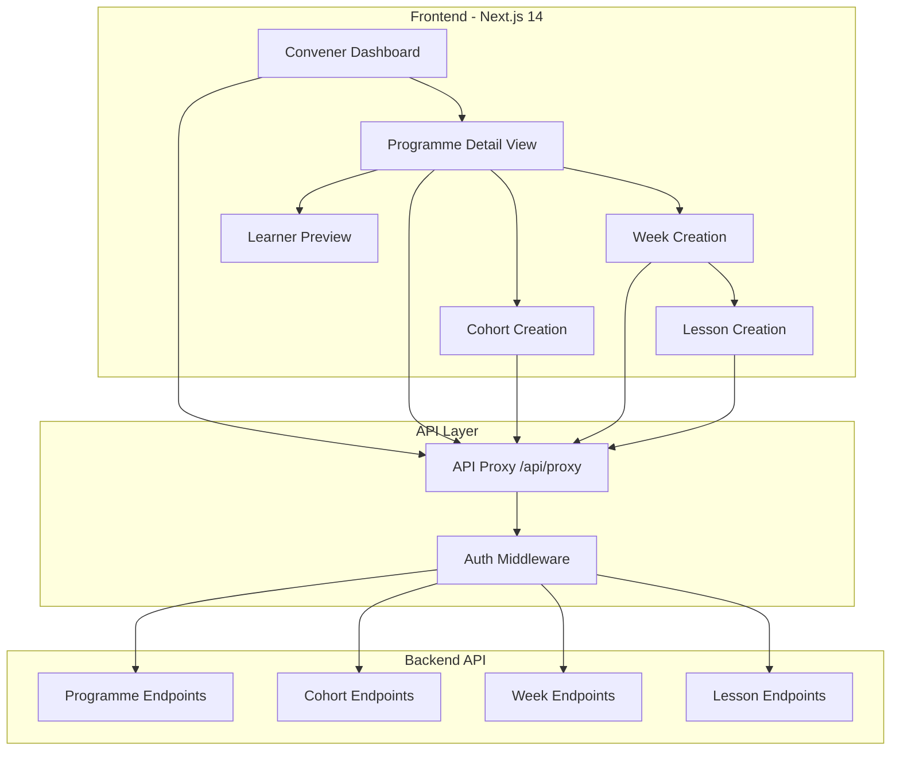

# Design Document: Convener Dashboard

## Overview

The Convener Dashboard is a self-service web application that enables conveners to create and manage learning programmes without developer assistance. Built with Next.js 14 and TypeScript, it provides a visual interface for programme management, cohort creation, content organization, and learner experience preview.

The dashboard integrates with existing backend API endpoints (from the wlimp-programme-rollout spec) and follows established patterns from the student-facing web application. It emphasizes usability, responsive design, and real-time feedback to streamline the programme creation workflow.

### Key Design Principles

1. **Self-Service First**: Conveners should be able to complete all programme management tasks independently
2. **Progressive Disclosure**: Show complexity only when needed, start with simple workflows
3. **Immediate Feedback**: Provide real-time validation and visual confirmation of actions
4. **Mobile-Responsive**: Support programme management on any device
5. **Consistency**: Reuse existing UI components and patterns from the codebase

## Architecture

### High-Level Architecture



### Technology Stack

- **Frontend Framework**: Next.js 14 with App Router
- **Language**: TypeScript
- **Styling**: Tailwind CSS (existing design system)
- **State Management**: React hooks + Context API (AuthContext)
- **HTTP Client**: Axios (via existing apiClient)
- **Form Handling**: React Hook Form (recommended for complex forms)
- **Drag-and-Drop**: @dnd-kit/core (for lesson reordering)
- **Authentication**: Existing cookie-based auth system

### Routing Structure

```
/convener
  /dashboard                    # Main dashboard - list of programmes
  /programmes/new               # Create new programme
  /programmes/[id]              # Programme detail view
    /cohorts/new                # Create cohort modal/page
    /weeks/new                  # Create week modal/page
    /weeks/[weekId]/lessons/new # Create lesson modal/page
    /preview                    # Preview as learner
```

## Components and Interfaces

### Core Components

#### 1. ConvenerDashboard Component

Main landing page for conveners showing all their programmes.

```typescript
interface ConvenerDashboardProps {
  // No props - uses AuthContext for user data
}

interface Programme {
  id: number;
  name: string;
  description: string;
  status: 'draft' | 'published';
  totalWeeks: number;
  totalCohorts: number;
  createdAt: string;
  updatedAt: string;
}
```

**Responsibilities:**
- Fetch and display all programmes created by the convener
- Provide "Create Programme" action
- Show programme status (draft/published)
- Navigate to programme detail view

#### 2. ProgrammeDetailView Component

Detailed view of a single programme with cohorts, weeks, and lessons.

```typescript
interface ProgrammeDetailViewProps {
  programmeId: string;
}

interface ProgrammeDetail extends Programme {
  cohorts: Cohort[];
  weeks: WeekWithLessons[];
}

interface Cohort {
  id: number;
  name: string;
  enrollmentCode: string;
  startDate: string;
  enrolledCount: number;
}

interface WeekWithLessons {
  id: string;
  weekNumber: number;
  title: string;
  startDate: string;
  lessons: Lesson[];
}

interface Lesson {
  id: string;
  title: string;
  description: string;
  contentType: 'video' | 'pdf' | 'link' | 'text';
  contentUrl: string;
  orderIndex: number;
}
```

**Responsibilities:**
- Display programme overview
- List all cohorts with enrollment codes
- Display weeks in sequential order
- Show lessons within each week
- Provide actions: create cohort, create week, create lesson, preview, publish

#### 3. ProgrammeForm Component

Form for creating and editing programmes.

```typescript
interface ProgrammeFormProps {
  mode: 'create' | 'edit';
  initialData?: Partial<Programme>;
  onSubmit: (data: ProgrammeFormData) => Promise<void>;
  onCancel: () => void;
}

interface ProgrammeFormData {
  name: string;
  description: string;
  startDate: string;
}
```

**Validation Rules:**
- name: required, 3-200 characters
- description: optional, max 1000 characters
- startDate: required, valid date, not in the past

#### 4. CohortForm Component

Form for creating cohorts with enrollment codes.

```typescript
interface CohortFormProps {
  programmeId: string;
  onSubmit: (data: CohortFormData) => Promise<void>;
  onCancel: () => void;
}

interface CohortFormData {
  name: string;
  enrollmentCode: string;
  startDate: string;
}
```

**Validation Rules:**
- name: required, 3-200 characters
- enrollmentCode: required, alphanumeric with hyphens, unique
- startDate: required, valid date

**Features:**
- Auto-generate enrollment code suggestion
- Check enrollment code uniqueness in real-time
- Display enrollment code prominently after creation

#### 5. WeekForm Component

Form for creating weeks within a programme.

```typescript
interface WeekFormProps {
  programmeId: string;
  suggestedWeekNumber: number;
  onSubmit: (data: WeekFormData) => Promise<void>;
  onCancel: () => void;
}

interface WeekFormData {
  weekNumber: number;
  title: string;
  startDate: string;
}
```

**Validation Rules:**
- weekNumber: required, positive integer, unique within programme
- title: required, 3-200 characters
- startDate: required, valid date

**Features:**
- Auto-suggest next week number
- Validate week number uniqueness
- Calculate suggested start date based on previous weeks

#### 6. LessonForm Component

Form for creating and editing lessons with different content types.

```typescript
interface LessonFormProps {
  weekId: string;
  mode: 'create' | 'edit';
  initialData?: Partial<Lesson>;
  suggestedOrderIndex: number;
  onSubmit: (data: LessonFormData) => Promise<void>;
  onCancel: () => void;
}

interface LessonFormData {
  title: string;
  description: string;
  contentType: 'video' | 'pdf' | 'link' | 'text';
  contentUrl: string; // For video, pdf, link
  contentText?: string; // For text type
  orderIndex: number;
}
```

**Validation Rules:**
- title: required, 3-200 characters
- description: optional, max 1000 characters
- contentType: required, one of: video, pdf, link, text
- contentUrl: required for video/pdf/link, valid URL
- contentText: required for text type, max 50000 characters
- orderIndex: required, non-negative integer

**Features:**
- Dynamic form fields based on content type
- URL validation with format checking
- Rich text editor for text content type
- Preview content before saving

#### 7. LessonReorderList Component

Drag-and-drop interface for reordering lessons within a week.

```typescript
interface LessonReorderListProps {
  weekId: string;
  lessons: Lesson[];
  onReorder: (lessonIds: string[]) => Promise<void>;
}
```

**Features:**
- Drag-and-drop using @dnd-kit
- Visual feedback during drag
- Optimistic UI updates
- Rollback on API failure
- Alternative up/down buttons for mobile
- Keyboard accessibility (arrow keys + Enter)

#### 8. ProgrammePreview Component

Preview mode showing programme as learners would see it.

```typescript
interface ProgrammePreviewProps {
  programmeId: string;
  cohortId?: string;
}
```

**Features:**
- Reuse existing learner-facing components
- Display preview banner indicating this is preview mode
- Show current week calculation
- Render lessons with actual content viewers
- Exit preview button to return to dashboard

#### 9. PublishProgrammeButton Component

Button and confirmation dialog for publishing programmes.

```typescript
interface PublishProgrammeButtonProps {
  programmeId: string;
  currentStatus: 'draft' | 'published';
  onPublish: () => Promise<void>;
}
```

**Features:**
- Confirmation dialog before publishing
- Validation checks (must have at least one cohort and one week)
- Status indicator
- Disable if already published

### API Integration Layer

#### ConvenerAPI Service

Wrapper around existing API client with convener-specific methods.

```typescript
class ConvenerAPI {
  // Programme Management
  async createProgramme(data: ProgrammeFormData): Promise<Programme>;
  async updateProgramme(id: string, data: Partial<ProgrammeFormData>): Promise<Programme>;
  async getProgramme(id: string): Promise<ProgrammeDetail>;
  async getMyProgrammes(): Promise<Programme[]>;
  async publishProgramme(id: string): Promise<void>;
  
  // Cohort Management
  async createCohort(programmeId: string, data: CohortFormData): Promise<Cohort>;
  async getCohorts(programmeId: string): Promise<Cohort[]>;
  async checkEnrollmentCodeAvailability(code: string): Promise<boolean>;
  
  // Week Management
  async createWeek(programmeId: string, data: WeekFormData): Promise<WeekWithLessons>;
  async getWeeks(programmeId: string): Promise<WeekWithLessons[]>;
  
  // Lesson Management
  async createLesson(weekId: string, data: LessonFormData): Promise<Lesson>;
  async updateLesson(lessonId: string, data: Partial<LessonFormData>): Promise<Lesson>;
  async reorderLessons(weekId: string, lessonIds: string[]): Promise<Lesson[]>;
}
```

### Custom Hooks

#### useConvenerProgrammes

Hook for fetching and managing convener's programmes.

```typescript
function useConvenerProgrammes() {
  const [programmes, setProgrammes] = useState<Programme[]>([]);
  const [isLoading, setIsLoading] = useState(true);
  const [error, setError] = useState<Error | null>(null);
  
  const refetch = async () => { /* ... */ };
  const createProgramme = async (data: ProgrammeFormData) => { /* ... */ };
  
  return { programmes, isLoading, error, refetch, createProgramme };
}
```

#### useProgrammeDetail

Hook for fetching and managing programme details.

```typescript
function useProgrammeDetail(programmeId: string) {
  const [programme, setProgramme] = useState<ProgrammeDetail | null>(null);
  const [isLoading, setIsLoading] = useState(true);
  const [error, setError] = useState<Error | null>(null);
  
  const refetch = async () => { /* ... */ };
  const updateProgramme = async (data: Partial<ProgrammeFormData>) => { /* ... */ };
  const publishProgramme = async () => { /* ... */ };
  
  return { programme, isLoading, error, refetch, updateProgramme, publishProgramme };
}
```

#### useLessonReorder

Hook for managing lesson reordering with optimistic updates.

```typescript
function useLessonReorder(weekId: string, initialLessons: Lesson[]) {
  const [lessons, setLessons] = useState(initialLessons);
  const [isReordering, setIsReordering] = useState(false);
  
  const reorder = async (lessonIds: string[]) => {
    // Optimistic update
    const newOrder = lessonIds.map((id, index) => ({
      ...lessons.find(l => l.id === id)!,
      orderIndex: index
    }));
    setLessons(newOrder);
    
    try {
      await ConvenerAPI.reorderLessons(weekId, lessonIds);
    } catch (error) {
      // Rollback on failure
      setLessons(initialLessons);
      throw error;
    }
  };
  
  return { lessons, isReordering, reorder };
}
```

## Data Models

### Frontend Data Models

All data models are TypeScript interfaces that match the backend API responses.

#### Programme Model

```typescript
interface Programme {
  id: number;
  name: string;
  description: string;
  startDate: string;
  status: 'draft' | 'published';
  createdBy: number;
  createdAt: string;
  updatedAt: string;
}

interface ProgrammeDetail extends Programme {
  cohorts: Cohort[];
  weeks: WeekWithLessons[];
}
```

#### Cohort Model

```typescript
interface Cohort {
  id: number;
  programmeId: number;
  name: string;
  enrollmentCode: string;
  startDate: string;
  status: 'active' | 'inactive';
  enrolledCount: number;
  createdAt: string;
  updatedAt: string;
}
```

#### Week Model

```typescript
interface Week {
  id: string; // UUID
  programmeId: number;
  weekNumber: number;
  title: string;
  startDate: string;
  createdAt: string;
  updatedAt: string;
}

interface WeekWithLessons extends Week {
  lessons: Lesson[];
}
```

#### Lesson Model

```typescript
interface Lesson {
  id: string; // UUID
  weekId: string;
  title: string;
  description: string;
  contentType: 'video' | 'pdf' | 'link' | 'text';
  contentUrl: string;
  orderIndex: number;
  createdAt: string;
  updatedAt: string;
}
```

### Form Data Models

Simplified models for form submissions.

```typescript
interface ProgrammeFormData {
  name: string;
  description: string;
  startDate: string;
}

interface CohortFormData {
  name: string;
  enrollmentCode: string;
  startDate: string;
}

interface WeekFormData {
  weekNumber: number;
  title: string;
  startDate: string;
}

interface LessonFormData {
  title: string;
  description: string;
  contentType: 'video' | 'pdf' | 'link' | 'text';
  contentUrl: string;
  contentText?: string;
  orderIndex: number;
}
```

## Correctness Properties

*A property is a characteristic or behavior that should hold true across all valid executions of a system—essentially, a formal statement about what the system should do. Properties serve as the bridge between human-readable specifications and machine-verifiable correctness guarantees.*

### Property 1: Convener-Only Access

*For any* user attempting to access the convener dashboard, access should be granted if and only if the user has the convener role.

**Validates: Requirements 1.1, 1.2**

### Property 2: Programme Creation Persistence

*For any* valid programme data submitted by a convener, the programme should appear in the convener's programme list after creation.

**Validates: Requirements 2.1, 2.2, 2.3**

### Property 3: Invalid Data Rejection

*For any* form submission with invalid or incomplete data (programme, cohort, week, or lesson), the system should prevent submission and display specific validation errors for each invalid field.

**Validates: Requirements 2.6, 3.5, 4.4, 5.8, 10.2, 10.4**

### Property 4: Cohort Creation with Enrollment Code

*For any* valid cohort data submitted for a programme, the system should create the cohort and generate a unique enrollment code that is displayed to the convener.

**Validates: Requirements 3.1, 3.2, 3.3**

### Property 5: Cohort Display Completeness

*For any* programme with created cohorts, all cohorts should appear in the programme detail view.

**Validates: Requirements 3.4**

### Property 6: Week Sequential Ordering

*For any* programme with multiple weeks, the weeks should be displayed in ascending order by week number.

**Validates: Requirements 4.3, 4.5**

### Property 7: Lesson Content Type Validation

*For any* lesson creation with a specific content type (video, pdf, link, or text), the system should validate that the provided content data matches the content type requirements.

**Validates: Requirements 5.1, 5.2, 5.3, 5.4, 5.5**

### Property 8: Lesson Reordering Persistence

*For any* reordering of lessons within a week, the new order should persist after the API call completes successfully, and all lessons should maintain their identity (no lessons added or removed).

**Validates: Requirements 6.1, 6.2, 6.3**

### Property 9: API Call Correctness

*For any* create, update, or delete operation on programmes, cohorts, weeks, or lessons, the system should call the correct API endpoint with the correct HTTP method and payload structure.

**Validates: Requirements 2.2, 3.2, 4.2, 5.6, 5.7, 6.3, 8.1, 8.2**

### Property 10: Error Message Display

*For any* failed API call or validation error, the system should display a user-friendly error message that explains what went wrong.

**Validates: Requirements 8.3, 10.1**

### Property 11: Data Caching Efficiency

*For any* programme detail view, repeated requests for the same data within a short time period should use cached data rather than making redundant API calls.

**Validates: Requirements 8.5**

### Property 12: Responsive Layout Adaptation

*For any* viewport size (mobile, tablet, desktop), the dashboard should display an appropriate layout optimized for that screen size with all interactive elements meeting minimum touch target sizes (44x44px).

**Validates: Requirements 9.1, 9.2, 9.3, 9.4**

### Property 13: Draft Status Default

*For any* newly created programme, the initial status should be set to 'draft' until explicitly published by the convener.

**Validates: Requirements 12.1**

### Property 14: Publication Visibility Control

*For any* programme, learners should be able to access it if and only if the programme status is 'published'.

**Validates: Requirements 12.3, 12.4**

## Error Handling

### Error Categories

#### 1. Validation Errors

**Trigger**: Invalid form input
**Handling**:
- Display inline error messages next to invalid fields
- Highlight invalid fields with red border
- Prevent form submission
- Focus first invalid field

**Example**:
```typescript
{
  field: 'name',
  message: 'Programme name must be between 3 and 200 characters'
}
```

#### 2. API Errors

**Trigger**: Backend API returns error response
**Handling**:
- Display toast notification with error message
- Log error details to console
- Provide retry option for transient errors
- Show specific error messages for known error codes

**Error Code Mapping**:
- 400: "Invalid data. Please check your input."
- 401: "Session expired. Please log in again."
- 403: "You don't have permission to perform this action."
- 404: "Resource not found."
- 409: "This enrollment code already exists. Please choose a different code."
- 500: "Something went wrong. Please try again."

#### 3. Network Errors

**Trigger**: Network connectivity issues
**Handling**:
- Display offline indicator
- Queue actions for retry when connection restored
- Show "You appear to be offline" message
- Provide manual retry button

#### 4. Optimistic Update Failures

**Trigger**: Optimistic UI update followed by failed API call
**Handling**:
- Revert UI to previous state
- Display error message
- Highlight affected items
- Offer retry option

**Example** (Lesson Reordering):
```typescript
try {
  // Optimistic update
  setLessons(newOrder);
  
  // API call
  await api.reorderLessons(weekId, lessonIds);
} catch (error) {
  // Rollback
  setLessons(originalOrder);
  
  // Show error
  toast.error('Failed to reorder lessons. Please try again.');
}
```

### Error Logging

All errors should be logged with context for debugging:

```typescript
function logError(error: Error, context: Record<string, any>) {
  console.error('Error:', {
    message: error.message,
    stack: error.stack,
    context,
    timestamp: new Date().toISOString(),
    userId: getCurrentUserId(),
  });
  
  // In production, send to error tracking service
  if (process.env.NODE_ENV === 'production') {
    // sendToErrorTracking(error, context);
  }
}
```

## Testing Strategy

### Dual Testing Approach

The convener dashboard requires both unit tests and property-based tests for comprehensive coverage:

- **Unit tests**: Verify specific examples, edge cases, error conditions, and UI interactions
- **Property tests**: Verify universal properties across all inputs using randomized data

Together, these approaches ensure both concrete correctness (unit tests) and general correctness (property tests).

### Property-Based Testing

**Library**: fast-check (TypeScript property-based testing library)

**Configuration**:
- Minimum 100 iterations per property test
- Each test tagged with feature name and property number
- Tag format: `Feature: convener-dashboard, Property {number}: {property_text}`

**Example Property Test**:

```typescript
import fc from 'fast-check';

// Feature: convener-dashboard, Property 2: Programme Creation Persistence
describe('Property 2: Programme Creation Persistence', () => {
  it('should persist any valid programme data', async () => {
    await fc.assert(
      fc.asyncProperty(
        fc.record({
          name: fc.string({ minLength: 3, maxLength: 200 }),
          description: fc.string({ maxLength: 1000 }),
          startDate: fc.date({ min: new Date() }).map(d => d.toISOString().split('T')[0]),
        }),
        async (programmeData) => {
          // Create programme
          const created = await api.createProgramme(programmeData);
          
          // Fetch programmes list
          const programmes = await api.getMyProgrammes();
          
          // Verify programme appears in list
          expect(programmes.some(p => p.id === created.id)).toBe(true);
        }
      ),
      { numRuns: 100 }
    );
  });
});
```

### Unit Testing

**Library**: Jest + React Testing Library

**Focus Areas**:
- Component rendering with specific props
- User interactions (clicks, form submissions)
- Edge cases (empty states, maximum values)
- Error conditions (API failures, validation errors)
- Integration between components

**Example Unit Test**:

```typescript
import { render, screen, fireEvent, waitFor } from '@testing-library/react';
import { ProgrammeForm } from './ProgrammeForm';

describe('ProgrammeForm', () => {
  it('should display validation error for short programme name', async () => {
    const onSubmit = jest.fn();
    render(<ProgrammeForm mode="create" onSubmit={onSubmit} onCancel={() => {}} />);
    
    // Enter short name
    const nameInput = screen.getByLabelText('Programme Name');
    fireEvent.change(nameInput, { target: { value: 'AB' } });
    
    // Submit form
    const submitButton = screen.getByText('Create Programme');
    fireEvent.click(submitButton);
    
    // Verify error message
    await waitFor(() => {
      expect(screen.getByText(/must be between 3 and 200 characters/i)).toBeInTheDocument();
    });
    
    // Verify onSubmit not called
    expect(onSubmit).not.toHaveBeenCalled();
  });
  
  it('should handle API error gracefully', async () => {
    const onSubmit = jest.fn().mockRejectedValue(new Error('API Error'));
    render(<ProgrammeForm mode="create" onSubmit={onSubmit} onCancel={() => {}} />);
    
    // Fill valid data
    fireEvent.change(screen.getByLabelText('Programme Name'), { 
      target: { value: 'Test Programme' } 
    });
    fireEvent.change(screen.getByLabelText('Start Date'), { 
      target: { value: '2026-01-01' } 
    });
    
    // Submit
    fireEvent.click(screen.getByText('Create Programme'));
    
    // Verify error message displayed
    await waitFor(() => {
      expect(screen.getByText(/failed to create programme/i)).toBeInTheDocument();
    });
  });
});
```

### Integration Testing

**Focus**: End-to-end workflows

**Example Scenarios**:
1. Create programme → Create cohort → Create week → Create lesson → Preview
2. Create multiple weeks → Reorder lessons → Verify persistence
3. Create programme → Publish → Verify learner access
4. Handle network failure during lesson creation → Retry → Success

### Test Coverage Goals

- **Unit Tests**: 80% code coverage minimum
- **Property Tests**: All 14 correctness properties implemented
- **Integration Tests**: All major user workflows covered
- **Accessibility Tests**: WCAG 2.1 AA compliance for all interactive elements

### Testing Commands

```bash
# Run all tests
npm test

# Run unit tests only
npm test -- --testPathPattern=".test.tsx?"

# Run property tests only
npm test -- --testPathPattern=".pbt.tsx?"

# Run with coverage
npm test -- --coverage

# Run specific test file
npm test ProgrammeForm.test.tsx
```

## Implementation Notes

### Phase 1: Core Dashboard (MVP)

1. Authentication and routing setup
2. ConvenerDashboard component with programme list
3. ProgrammeForm for creating programmes
4. Basic ProgrammeDetailView showing programme info

### Phase 2: Content Management

1. CohortForm and cohort display
2. WeekForm and week display
3. LessonForm with all content types
4. Basic lesson list display

### Phase 3: Advanced Features

1. Lesson reordering with drag-and-drop
2. Programme preview mode
3. Publish/unpublish functionality
4. Enhanced error handling and loading states

### Phase 4: Polish and Optimization

1. Responsive design refinements
2. Performance optimization (caching, lazy loading)
3. Accessibility improvements
4. Comprehensive testing

### Reusable Components

The following existing components should be reused:
- `FormInput` - for all text inputs
- `LoadingSpinner` - for loading states
- `DashboardHeader` - adapted for convener context
- `ErrorBoundary` - for error handling
- Lesson content viewers (VideoLessonContent, PdfLessonContent, etc.) - for preview mode

### New Shared Components

Create these reusable components:
- `FormSelect` - dropdown select input
- `FormTextarea` - multi-line text input
- `FormDatePicker` - date selection input
- `Modal` - modal dialog wrapper
- `Toast` - notification system
- `ConfirmDialog` - confirmation dialog
- `EmptyState` - empty state placeholder

### Accessibility Considerations

- All interactive elements minimum 44x44px touch targets
- Keyboard navigation support for all actions
- ARIA labels for screen readers
- Focus management in modals and forms
- Color contrast meeting WCAG AA standards
- Error messages announced to screen readers

### Performance Considerations

- Lazy load lesson content viewers
- Implement virtual scrolling for large lesson lists
- Cache API responses with SWR or React Query
- Optimize bundle size by code splitting routes
- Debounce enrollment code availability checks
- Use optimistic updates for better perceived performance

### Security Considerations

- All API calls go through authenticated proxy
- Validate user role on every protected route
- Sanitize user input before display
- Prevent XSS in rich text content
- Rate limit enrollment code generation
- Log all programme modifications for audit trail
