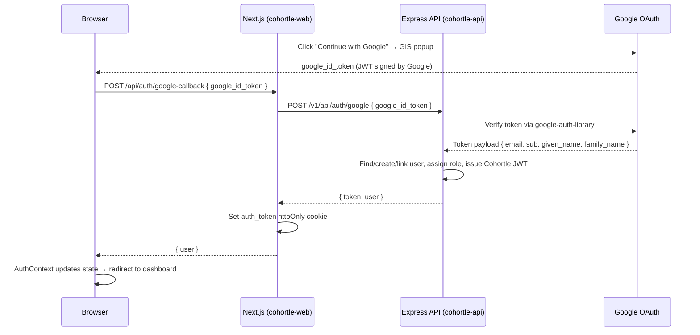

# Design Document: Google Auth Integration

## Overview

This design adds Google OAuth 2.0 sign-in and sign-up to Cohortle alongside the existing email/password flow. The approach uses the **Google Identity Services (GIS)** JavaScript library on the frontend to obtain a Google ID token, which is then sent to a new backend endpoint (`POST /v1/api/auth/google`) for server-side validation using the `google-auth-library` npm package. The backend validates the token, creates or links the user, and issues a Cohortle JWT — exactly as the existing email/password flow does. No new authentication infrastructure is introduced; the existing JWT, cookie, and role systems are reused.

---

## Architecture



### Key Design Decisions

1. **Server-side token validation**: The Google ID token is validated on the backend using `google-auth-library`, not on the frontend. This prevents token forgery and keeps the `GOOGLE_CLIENT_ID` secret on the server.
2. **Reuse existing cookie mechanism**: A new Next.js API route `/api/auth/google-callback` mirrors the existing `/api/auth/login` route — it calls the backend, receives the JWT, and sets the `auth_token` httpOnly cookie.
3. **No `next-auth`**: The existing custom auth system is extended rather than replaced, keeping the architecture consistent.
4. **GIS "One Tap" / popup flow**: The Google Identity Services library is used with the `google.accounts.id.initialize` + `google.accounts.id.renderButton` API, which handles the popup and returns a credential (ID token) via a callback.

---

## Components and Interfaces

### Backend: `GoogleAuthService` (`cohortle-api/services/GoogleAuthService.js`)

Responsible for validating Google ID tokens and extracting user identity.

```javascript
class GoogleAuthService {
  /**
   * Validates a Google ID token and returns the payload.
   * @param {string} idToken - The Google ID token from the frontend
   * @returns {Promise<{email, sub, given_name, family_name, email_verified}>}
   * @throws {Error} if token is invalid or GOOGLE_CLIENT_ID is not configured
   */
  async verifyIdToken(idToken) { ... }
}
```

**Package**: `google-auth-library` (to be installed: `npm install google-auth-library`)

### Backend: New route in `cohortle-api/routes/auth.js`

```
POST /v1/api/auth/google
Body: { google_id_token: string }
Response 200: { error: false, token: string, user: { id, email, role, email_verified } }
Response 400: { error: true, message: "google_id_token is required" }
Response 401: { error: true, message: "Invalid or expired Google token" }
Response 503: { error: true, message: "Google authentication is not configured" }
```

The route handler follows the same pattern as `/v1/api/auth/login`:
1. Validate request body
2. Call `GoogleAuthService.verifyIdToken()`
3. Find or create user via `findOrCreateGoogleUser()`
4. Issue Cohortle JWT via existing `createTokenWithRole()`
5. Return `{ token, user }`

### Backend: `findOrCreateGoogleUser(payload)` (helper in `auth.js`)

```javascript
async function findOrCreateGoogleUser({ email, sub, given_name, family_name }) {
  // 1. Look up user by email
  // 2a. If not found → create new user (google_id=sub, password=null, email_verified=1, role=student)
  // 2b. If found with matching google_id → return existing user
  // 2c. If found with google_id=null → link account (set google_id=sub, email_verified=1)
  // 3. Return user with role
}
```

### Frontend: `GoogleAuthButton` component (`cohortle-web/src/components/auth/GoogleAuthButton.tsx`)

```typescript
interface GoogleAuthButtonProps {
  onSuccess: (user: User) => void;
  onError: (message: string) => void;
  disabled?: boolean;
}
```

- Loads the GIS script (`https://accounts.google.com/gsi/client`) via a `<Script>` tag
- Calls `google.accounts.id.initialize({ client_id, callback })` on mount
- Renders a styled "Continue with Google" button using `google.accounts.id.renderButton` or a custom button that triggers `google.accounts.id.prompt()`
- On credential response, calls `POST /api/auth/google-callback` with the `credential` (ID token)
- Hides itself if `NEXT_PUBLIC_GOOGLE_CLIENT_ID` is not set

### Frontend: New Next.js API route (`cohortle-web/src/app/api/auth/google-callback/route.ts`)

Mirrors `/api/auth/login/route.ts`:
1. Receives `{ google_id_token }` from the browser
2. Calls backend `POST /v1/api/auth/google`
3. Sets `auth_token` httpOnly cookie
4. Returns `{ user }` to the browser

### Frontend: `AuthContext` updates

Add a `loginWithGoogle(googleIdToken: string)` method to `AuthContext` that:
1. Calls `POST /api/auth/google-callback`
2. Sets user state from the response
3. Redirects to the appropriate dashboard

### Frontend: `LoginForm` and `SignupForm` updates

Add `<GoogleAuthButton>` below the existing form submit button, separated by an "or" divider.

---

## Data Models

### Database Migration: `add-google-id-to-users`

```javascript
// cohortle-api/migrations/YYYYMMDD-add-google-id-to-users.js
await queryInterface.addColumn('users', 'google_id', {
  type: Sequelize.STRING(255),
  allowNull: true,
  defaultValue: null,
  after: 'password',
});
await queryInterface.addIndex('users', ['google_id'], {
  name: 'users_google_id_unique',
  unique: true,
  where: { google_id: { [Sequelize.Op.ne]: null } }, // partial unique index
});
```

### Sequelize Model Update: `cohortle-api/models/users.js`

Add to the model definition:
```javascript
google_id: {
  type: DataTypes.STRING(255),
  allowNull: true,
},
```

### JWT Payload (unchanged)

The existing JWT structure is reused without modification:
```json
{
  "user_id": 123,
  "email": "user@example.com",
  "role": "student",
  "permissions": ["view_programmes", "enroll"],
  "email_verified": true
}
```

---

## Correctness Properties

*A property is a characteristic or behavior that should hold true across all valid executions of a system — essentially, a formal statement about what the system should do. Properties serve as the bridge between human-readable specifications and machine-verifiable correctness guarantees.*

### Property 1: Invalid Google tokens are always rejected

*For any* string that is not a valid Google ID token (expired, malformed, wrong audience), the `GoogleAuthService.verifyIdToken()` function should throw an error or return a rejection.

**Validates: Requirements 2.3, 2.5**

---

### Property 2: New Google user creation invariants

*For any* valid Google token payload with an email that does not exist in the database, after calling `findOrCreateGoogleUser()`, the resulting user record should have:
- `google_id` equal to the token's `sub` value
- `password` equal to `null`
- `email_verified` equal to `1`
- `role` equal to `student`

**Validates: Requirements 3.1, 3.2, 3.3, 3.4**

---

### Property 3: Google authentication is idempotent (no duplicate users)

*For any* valid Google token, calling the `/v1/api/auth/google` endpoint multiple times with the same token payload should result in exactly one user record for that email in the database.

**Validates: Requirements 3.1, 4.1**

---

### Property 4: Account linking preserves existing user data

*For any* existing user record with `google_id = NULL`, after `findOrCreateGoogleUser()` is called with a Google token matching that email:
- The user's `role` is unchanged
- The user's `password` is unchanged
- The user's `google_id` is set to the token's `sub` value
- The user's `email_verified` is `1`

**Validates: Requirements 5.1, 5.2, 5.3**

---

### Property 5: Role-based redirect is deterministic

*For any* user object returned from the Google auth flow, the redirect destination should be `/dashboard` if `role === 'student'` and `/convener/dashboard` if `role === 'convener'`, with no other outcomes for these two roles.

**Validates: Requirements 6.4**

---

### Property 6: Migration preserves existing user records

*For any* set of existing user records before the migration runs, after the migration runs, all existing records should have the same values for all pre-existing columns, with `google_id` set to `null`.

**Validates: Requirements 7.2**

---

## Error Handling

| Scenario | Backend Response | Frontend Behaviour |
|---|---|---|
| `google_id_token` missing from request | 400 `{ error: true, message: "google_id_token is required" }` | Show inline error on form |
| Token invalid / expired / wrong audience | 401 `{ error: true, message: "Invalid or expired Google token" }` | Show "Google sign-in failed. Please try again." |
| `GOOGLE_CLIENT_ID` not configured | 503 `{ error: true, message: "Google authentication is not configured" }` | Hide Google button; log console warning |
| User cancels Google popup | No backend call | Return to page silently (no error shown) |
| Backend unreachable / 500 | 500 `{ error: true, message: "Something went wrong" }` | Show "Something went wrong. Please try again later." |
| Duplicate `google_id` (race condition) | 409 `{ error: true, message: "Account conflict" }` | Show generic error; log details server-side |

All errors are logged server-side with `console.error` including the user's email (if available) and the error stack.

---

## Testing Strategy

### Unit Tests

- `GoogleAuthService.verifyIdToken()` with mocked `google-auth-library` OAuth2Client
  - Valid token → returns payload
  - Expired token → throws error
  - Wrong audience → throws error
  - Missing `GOOGLE_CLIENT_ID` → throws configuration error
- `findOrCreateGoogleUser()` with mocked database
  - New email → creates user with correct fields
  - Existing email + matching `google_id` → returns existing user, no insert
  - Existing email + `google_id = null` → updates `google_id` and `email_verified`
- `GoogleAuthButton` component
  - Renders when `NEXT_PUBLIC_GOOGLE_CLIENT_ID` is set
  - Does not render when env var is missing
  - Shows loading state during auth flow

### Property-Based Tests

Property tests use `fast-check` (already installed in both packages).

Each property test runs a minimum of 100 iterations.

**Tag format**: `Feature: google-auth-integration, Property {N}: {property_text}`

- **Property 1**: Generate arbitrary strings as fake tokens → `verifyIdToken()` should always reject them
  - `Feature: google-auth-integration, Property 1: Invalid Google tokens are always rejected`

- **Property 2**: Generate random email/name/sub combinations for new users → verify all four invariants hold after `findOrCreateGoogleUser()`
  - `Feature: google-auth-integration, Property 2: New Google user creation invariants`

- **Property 3**: Call `findOrCreateGoogleUser()` twice with the same payload → verify user count for that email is exactly 1
  - `Feature: google-auth-integration, Property 3: Google authentication is idempotent`

- **Property 4**: Generate random existing users with `google_id = null` → call `findOrCreateGoogleUser()` → verify role, password unchanged and `google_id`/`email_verified` updated
  - `Feature: google-auth-integration, Property 4: Account linking preserves existing user data`

- **Property 5**: Generate random role strings (`student`, `convener`) → verify redirect URL is deterministic
  - `Feature: google-auth-integration, Property 5: Role-based redirect is deterministic`

- **Property 6**: Generate random user records → run migration → verify all pre-existing columns unchanged and `google_id = null`
  - `Feature: google-auth-integration, Property 6: Migration preserves existing user records`

### Integration Tests

- `POST /v1/api/auth/google` with a mocked `GoogleAuthService`:
  - New user flow: 200 + JWT + user object with `role: student`
  - Returning user flow: 200 + JWT
  - Account linking flow: 200 + JWT, existing role preserved
  - Missing token: 400
  - Invalid token: 401
