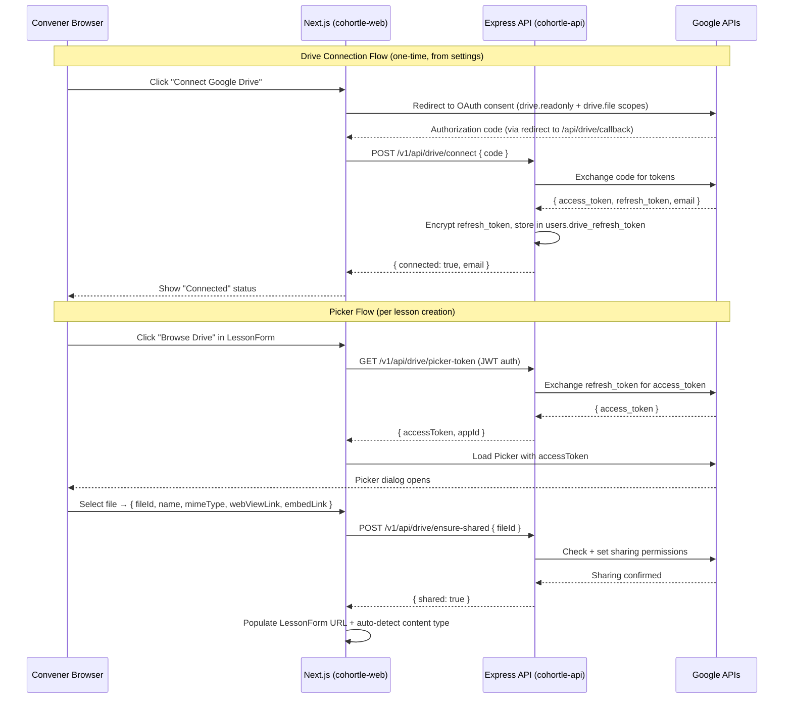

# Design Document: Google Drive Integration

## Overview

This design adds Google Drive integration to Cohortle, enabling conveners to browse their Google Drive from within the lesson creation form and select files as lesson content. The integration is built as an opt-in extension to the existing Google OAuth system — conveners connect Drive access separately from their main login, from the settings page.

The architecture follows three main flows:

1. **Drive Connection** — A separate OAuth flow (from settings) that requests Drive scopes and stores an encrypted refresh token in the database
2. **Picker Flow** — The frontend requests a short-lived access token from the backend, uses it to open Google's native Picker dialog, and receives file metadata on selection
3. **Sharing + Rendering** — After selection, the backend verifies/sets public sharing permissions; the frontend generates the correct embed URL for the lesson viewer

No new authentication infrastructure is introduced. The existing JWT, cookie, role, and proxy systems are reused throughout.

---

## Architecture



### Key Design Decisions

1. **Separate Drive OAuth flow**: Drive connection is decoupled from the main Google login. This avoids requesting Drive scopes from all users and keeps the login flow clean. The Drive OAuth uses the standard authorization code flow (not the GIS popup) to obtain a refresh token.

2. **Encrypted refresh tokens**: Refresh tokens are encrypted with AES-256-GCM before storage. The encryption key is an environment variable. Access tokens are never stored — generated on demand and discarded.

3. **Backend-mediated Picker token**: The Google Picker requires an access token. Rather than storing one, the backend generates a fresh access token from the refresh token on each Picker request. This keeps credentials server-side.

4. **Sharing via `drive.file` scope**: The `drive.file` scope allows modifying sharing on files created by or opened with the app. For files the convener owns, this is sufficient. For shared drive files the convener doesn't own, the API will return a permission error, which is surfaced to the convener.

5. **Drive URL detection is purely client-side**: URL pattern matching and embed URL generation happen in the frontend utility layer, keeping the lesson viewer fast and avoiding unnecessary backend calls for rendering.

---

## Components and Interfaces

### Backend: `DriveService` (`cohortle-api/services/DriveService.js`)

Central service for all Drive API interactions.

```javascript
class DriveService {
  /**
   * Exchanges an authorization code for tokens and stores the encrypted refresh token.
   * @param {number} userId
   * @param {string} code - Authorization code from OAuth callback
   * @returns {Promise<{ email: string }>}
   */
  async connectDrive(userId, code) { ... }

  /**
   * Revokes the stored refresh token and clears it from the database.
   * @param {number} userId
   */
  async disconnectDrive(userId) { ... }

  /**
   * Generates a fresh access token for the Picker API.
   * @param {number} userId
   * @returns {Promise<{ accessToken: string, appId: string }>}
   * @throws {DriveNotConnectedError} if no refresh token is stored
   * @throws {DriveTokenRevokedError} if the refresh token is invalid
   */
  async getPickerToken(userId) { ... }

  /**
   * Verifies and sets "anyone with the link can view" sharing on a file.
   * @param {number} userId
   * @param {string} fileId
   * @returns {Promise<{ shared: boolean, alreadyShared: boolean }>}
   * @throws {DrivePermissionError} if sharing cannot be set
   */
  async ensureFileShared(userId, fileId) { ... }
}
```

### Backend: `TokenEncryptionService` (`cohortle-api/services/TokenEncryptionService.js`)

Handles AES-256-GCM encryption/decryption of refresh tokens.

```javascript
class TokenEncryptionService {
  /**
   * Encrypts a plaintext token.
   * @param {string} plaintext
   * @returns {string} base64-encoded ciphertext (iv:authTag:ciphertext)
   */
  encrypt(plaintext) { ... }

  /**
   * Decrypts an encrypted token.
   * @param {string} encrypted - base64-encoded (iv:authTag:ciphertext)
   * @returns {string} plaintext token
   */
  decrypt(encrypted) { ... }
}
```

### Backend: New routes in `cohortle-api/routes/drive.js`

```
GET  /v1/api/drive/picker-token
  Auth: JWT (convener role required)
  Response 200: { accessToken: string, appId: string }
  Response 401: { error: true, message: "Drive token revoked. Please reconnect." }
  Response 403: { error: true, message: "Google Drive is not connected." }
  Response 503: { error: true, message: "Drive service not configured." }

POST /v1/api/drive/connect
  Auth: JWT (convener role required)
  Body: { code: string }
  Response 200: { connected: true, email: string }
  Response 400: { error: true, message: "Authorization code is required." }
  Response 500: { error: true, message: "Failed to connect Google Drive." }

POST /v1/api/drive/disconnect
  Auth: JWT (convener role required)
  Response 200: { disconnected: true }

POST /v1/api/drive/ensure-shared
  Auth: JWT (convener role required)
  Body: { fileId: string }
  Response 200: { shared: true, alreadyShared: boolean }
  Response 403: { error: true, message: "Cannot modify sharing: file is in a shared drive you do not own." }
  Response 401: { error: true, message: "Drive token revoked. Please reconnect." }
```

### Frontend: `useDriveConnection` hook (`cohortle-web/src/lib/hooks/useDriveConnection.ts`)

```typescript
interface DriveConnectionState {
  isConnected: boolean;
  connectedEmail: string | null;
  isLoading: boolean;
  error: string | null;
}

function useDriveConnection(): {
  state: DriveConnectionState;
  connect: () => void;       // Redirects to Google OAuth
  disconnect: () => Promise<void>;
  refresh: () => Promise<void>;
}
```

### Frontend: `useDrivePicker` hook (`cohortle-web/src/lib/hooks/useDrivePicker.ts`)

```typescript
interface DriveFile {
  id: string;
  name: string;
  mimeType: string;
  webViewLink: string;
  embedLink: string;
}

function useDrivePicker(): {
  openPicker: () => Promise<DriveFile | null>;
  isLoading: boolean;
  error: string | null;
}
```

The hook:
1. Calls `GET /api/proxy/drive/picker-token` to get a fresh access token
2. Loads the Google Picker JS library (`https://apis.google.com/js/api.js`) if not already loaded
3. Initialises the Picker with the access token and MIME type filters
4. Returns the selected file or `null` if cancelled

### Frontend: `DriveConnectionSection` component (`cohortle-web/src/components/convener/DriveConnectionSection.tsx`)

Added to the convener settings page. Shows connection status, "Connect" or "Disconnect" button.

### Frontend: `DrivePickerButton` component (`cohortle-web/src/components/convener/DrivePickerButton.tsx`)

A button rendered inside `LessonForm` next to the content URL field. Calls `useDrivePicker`, then calls `POST /api/proxy/drive/ensure-shared`, then populates the form fields.

### Frontend: `driveUrlUtils.ts` (`cohortle-web/src/lib/utils/driveUrlUtils.ts`)

```typescript
/** Returns true if the URL is a Google Drive/Docs/Slides/Sheets URL */
export function isDriveUrl(url: string): boolean

/** Returns the embed URL for a given Drive URL and MIME type */
export function getDriveEmbedUrl(url: string, mimeType?: string): string | null

/** Maps a Drive MIME type to a Cohortle lesson content type */
export function mimeTypeToLessonType(mimeType: string): LessonContentType

/** Extracts the file/document ID from a Drive URL */
export function extractDriveFileId(url: string): string | null
```

### Frontend: `LessonForm` updates

- Add `DrivePickerButton` next to the URL input for `pdf`, `link`, and `video` content types
- On file selection, call `ensureShared`, then set `contentUrl` and `contentType` via `react-hook-form`'s `setValue`

### Frontend: `PdfLessonContent` updates

- Before rendering the iframe, call `getDriveEmbedUrl()` to convert Drive URLs to embed URLs
- Use the embed URL as the iframe `src` instead of the raw URL

---

## Data Models

### Database Migration: `add-drive-fields-to-users`

```javascript
// cohortle-api/migrations/YYYYMMDD-add-drive-fields-to-users.js
await queryInterface.addColumn('users', 'drive_refresh_token', {
  type: Sequelize.TEXT,
  allowNull: true,
  defaultValue: null,
  comment: 'AES-256-GCM encrypted Google Drive refresh token',
});
await queryInterface.addColumn('users', 'drive_connected_email', {
  type: Sequelize.STRING(255),
  allowNull: true,
  defaultValue: null,
  comment: 'Google account email used for Drive connection',
});
```

### Sequelize Model Update: `cohortle-api/models/users.js`

```javascript
drive_refresh_token: {
  type: DataTypes.TEXT,
  allowNull: true,
},
drive_connected_email: {
  type: DataTypes.STRING(255),
  allowNull: true,
},
```

### Drive Audit Log

Sharing changes are logged to the server console (and optionally a `drive_audit_logs` table in a future iteration) with the following structure:

```json
{
  "event": "drive_file_shared",
  "userId": 123,
  "fileId": "1BxiMVs0XRA5nFMdKvBdBZjgmUUqptlbs74OgVE2upms",
  "fileName": "Lesson Slides.pdf",
  "timestamp": "2026-01-01T12:00:00.000Z",
  "alreadyShared": false
}
```

---

## Correctness Properties

*A property is a characteristic or behavior that should hold true across all valid executions of a system — essentially, a formal statement about what the system should do. Properties serve as the bridge between human-readable specifications and machine-verifiable correctness guarantees.*

### Property 1: Refresh token encryption round-trip

*For any* valid refresh token string, encrypting then decrypting it using `TokenEncryptionService` should produce the original string.

**Validates: Requirements 2.1, 2.2**

---

### Property 2: Encrypted tokens never contain plaintext

*For any* valid refresh token string, the encrypted output from `TokenEncryptionService.encrypt()` should not contain the original plaintext token as a substring, and the value stored in the database after `connectDrive()` should differ from the plaintext token.

**Validates: Requirements 2.1, 2.3**

---

### Property 3: Tokens never appear in API responses

*For any* Drive API endpoint response, the response body should not contain the stored refresh token string or any access token string that was generated during the request.

**Validates: Requirements 2.4, 3.7**

---

### Property 4: MIME type mapping is total and deterministic

*For any* MIME type string, `mimeTypeToLessonType()` should always return one of the valid Cohortle lesson content types (`pdf`, `link`, `video`, `text`) and should return the same value for the same input on repeated calls.

**Validates: Requirements 6.1, 6.2, 6.3, 6.4, 6.5**

---

### Property 5: Drive URL detection correctness

*For any* URL constructed from the Google Drive/Docs/Slides/Sheets URL patterns with a random file ID, `isDriveUrl()` should return `true`; for any URL that does not match these patterns (e.g., arbitrary HTTP URLs), it should return `false`.

**Validates: Requirements 7.1, 7.2, 7.3, 7.4, 6.6**

---

### Property 6: Embed URL generation preserves file ID

*For any* valid Google Drive URL containing a file/document ID, the embed URL generated by `getDriveEmbedUrl()` should contain the same file/document ID as the input URL, and `extractDriveFileId()` applied to the embed URL should return the same ID.

**Validates: Requirements 7.5, 7.6, 7.7**

---

### Property 7: Picker token endpoint requires convener role

*For any* request to `GET /v1/api/drive/picker-token` without a valid convener JWT (including no token, expired tokens, and tokens with non-convener roles), the endpoint should return a 401 or 403 response and never include an access token in the response body.

**Validates: Requirements 3.2**

---

### Property 8: Migration preserves existing user records

*For any* set of existing user records before the migration runs, after the migration runs, all existing records should have the same values for all pre-existing columns, with `drive_refresh_token` and `drive_connected_email` set to `null`.

**Validates: Requirements 9.3**

---

### Property 9: Audit log created on every sharing change

*For any* call to `DriveService.ensureFileShared()` that results in a permission change (i.e., `alreadyShared` is `false`), a Drive audit log entry should be created containing the `userId`, `fileId`, `fileName`, and `timestamp`.

**Validates: Requirements 5.3**

---

### Property 10: Error logging includes userId and fileId

*For any* Drive API error that occurs during `ensureFileShared()` or `getPickerToken()`, the logged error entry should include the `userId` of the requesting convener and the `fileId` (where applicable).

**Validates: Requirements 11.4**

---

## Error Handling

| Scenario | Backend Response | Frontend Behaviour |
|---|---|---|
| No Drive connection when requesting picker token | 403 `{ error: true, message: "Google Drive is not connected." }` | Show inline message directing convener to settings |
| Refresh token revoked/expired | 401 `{ error: true, message: "Drive token revoked. Please reconnect." }` | Clear connection state, show "Reconnect Drive" prompt |
| File sharing fails (shared drive, no ownership) | 403 `{ error: true, message: "Cannot modify sharing: file is in a shared drive you do not own." }` | Show specific error; do not populate lesson URL |
| File sharing fails (other reason) | 500 `{ error: true, message: "Failed to set file sharing." }` | Show generic error; allow manual URL entry |
| Google Drive API rate limit | 429 `{ error: true, message: "Google Drive rate limit reached. Please try again shortly." }` | Show rate limit message |
| Google Drive API unreachable | 503 `{ error: true, message: "Google Drive is currently unavailable." }` | Show service unavailable message |
| Picker JS library fails to load | N/A (client-side) | Show error; allow manual URL entry |
| `DRIVE_TOKEN_ENCRYPTION_KEY` not set | 503 at startup | All Drive endpoints return 503 |
| Missing `NEXT_PUBLIC_GOOGLE_API_KEY` | N/A (client-side) | Hide "Browse Drive" button; log console warning |

All backend errors are logged with `console.error` including `userId`, `fileId` (if applicable), and the full error stack.

---

## Testing Strategy

### Unit Tests

**Backend**:
- `TokenEncryptionService`: encrypt/decrypt round-trip, encrypted output differs from plaintext, wrong key throws
- `DriveService.connectDrive()`: stores encrypted token, stores email, handles Google API errors
- `DriveService.disconnectDrive()`: clears token, calls Google revocation endpoint
- `DriveService.getPickerToken()`: returns access token, throws `DriveNotConnectedError` when no token, throws `DriveTokenRevokedError` on invalid token
- `DriveService.ensureFileShared()`: returns `alreadyShared: true` when already public, calls permissions API when not, throws `DrivePermissionError` on shared drive

**Frontend**:
- `driveUrlUtils.isDriveUrl()`: returns true for all Drive URL patterns, false for non-Drive URLs
- `driveUrlUtils.getDriveEmbedUrl()`: returns correct embed URLs for each Drive type
- `driveUrlUtils.mimeTypeToLessonType()`: returns correct lesson type for each MIME type
- `driveUrlUtils.extractDriveFileId()`: extracts correct ID from each URL pattern
- `DrivePickerButton`: shows "not connected" message when Drive not connected, shows loading state during picker token fetch

### Property-Based Tests

Property tests use `fast-check` (already installed in both packages). Each property test runs a minimum of 100 iterations.

**Tag format**: `Feature: google-drive-integration, Property {N}: {property_text}`

- **Property 1**: Generate arbitrary token strings → encrypt then decrypt → should equal original
  - `Feature: google-drive-integration, Property 1: Refresh token encryption round-trip`

- **Property 2**: Generate arbitrary token strings → encrypt → encrypted output should not contain plaintext
  - `Feature: google-drive-integration, Property 2: Encrypted tokens are never plaintext`

- **Property 3**: Generate arbitrary MIME type strings → `mimeTypeToLessonType()` → should always return a valid lesson type
  - `Feature: google-drive-integration, Property 3: MIME type mapping is total and deterministic`

- **Property 4**: Generate Drive URLs from known patterns with random file IDs → `isDriveUrl()` should return true; generate non-Drive URLs → should return false
  - `Feature: google-drive-integration, Property 4: Drive URL detection correctness`

- **Property 5**: Generate Drive URLs with random file IDs → `getDriveEmbedUrl()` → embed URL should contain the same file ID
  - `Feature: google-drive-integration, Property 5: Embed URL generation preserves file ID`

- **Property 6**: Generate Drive URLs → extract file ID → construct canonical URL → `isDriveUrl()` should return true
  - `Feature: google-drive-integration, Property 6: Drive file ID extraction round-trip`

- **Property 7**: Generate requests with non-convener JWTs (or no JWT) → picker token endpoint → should always return 401 or 403
  - `Feature: google-drive-integration, Property 7: Picker token endpoint requires convener role`

- **Property 8**: Generate random user records → run migration → all pre-existing columns unchanged, new columns null
  - `Feature: google-drive-integration, Property 8: Migration preserves existing user records`

### Integration Tests

- `POST /v1/api/drive/connect`: valid code → 200 + connected email; missing code → 400
- `GET /v1/api/drive/picker-token`: connected convener → 200 + access token; no connection → 403; non-convener → 403
- `POST /v1/api/drive/ensure-shared`: already shared file → 200 + `alreadyShared: true`; unshared file → 200 + sharing set; permission error → 403
- `POST /v1/api/drive/disconnect`: connected convener → 200 + token cleared
