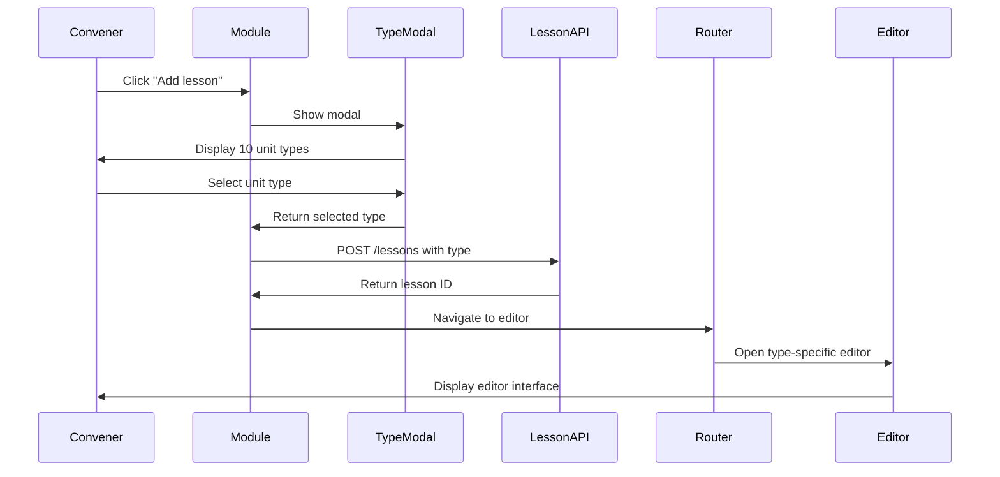

# Design Document: Lesson Unit Type Selection

## Overview

This design implements a modal-based lesson unit type selection system for the Cohortz learning management platform. The feature transforms the current immediate lesson creation flow into a two-step process: first selecting a unit type from a modal, then creating the lesson with that type and routing to the appropriate editor.

The design leverages existing React Native components (OptionModal, SlideModal) and extends the current lesson data model to include a type field. It introduces a new UnitTypeSelectionModal component and a routing system that maps unit types to their corresponding editor screens.

### Key Design Decisions

1. **Modal-First Approach**: Use existing OptionModal component for consistency with current UI patterns
2. **Type Field Addition**: Extend lesson model with a type field rather than creating separate tables for each unit type
3. **Backward Compatibility**: Default to "video" type for existing lessons without a type field
4. **Incremental Editor Development**: Reuse existing editors where possible (video, assignment) and create new ones as needed
5. **Assignment Integration**: Maintain existing assignment system by creating linked records when type is "assignment"

## Architecture

### Component Hierarchy

```
Module Component (existing)
├── Add Lesson Button (modified)
├── UnitTypeSelectionModal (new)
│   ├── UnitTypeGrid (new)
│   │   └── UnitTypeCard (new) × 10
│   └── Modal Actions (close button)
├── Lesson List (modified)
│   └── LessonRow (modified)
│       ├── Type Icon (new)
│       ├── Lesson Name
│       └── Assignment Indicator (existing)
└── Lesson Options Modal (existing)
```

### Data Flow



### State Management

The feature uses React hooks for local state management:

- **Module Component State**: Manages modal visibility and selected type
- **UnitTypeSelectionModal State**: Manages selection highlighting
- **Lesson API State**: Managed by React Query (existing pattern)
- **Navigation State**: Managed by Expo Router (existing pattern)

## Components and Interfaces

### 1. UnitTypeSelectionModal Component

**Purpose**: Display available lesson unit types in a modal for convener selection

**Props**:
```typescript
interface UnitTypeSelectionModalProps {
  isVisible: boolean;
  onSelectType: (type: LessonUnitType) => void;
  onCancel: () => void;
}
```

**Behavior**:
- Renders using OptionModal for consistency
- Displays 10 unit types in a 2-column grid layout
- Each type shows an icon and label
- Taps trigger onSelectType callback
- Backdrop tap or cancel button triggers onCancel

**Implementation Notes**:
- Use FlatList with numColumns={2} for grid layout
- Icons from @expo/vector-icons (Ionicons)
- Responsive sizing for different screen sizes

### 2. UnitTypeCard Component

**Purpose**: Represent a single unit type option in the selection modal

**Props**:
```typescript
interface UnitTypeCardProps {
  type: LessonUnitType;
  icon: string;
  label: string;
  onPress: () => void;
}
```

**Visual Design**:
- Card with icon centered at top
- Label text below icon
- Touchable with press feedback
- Border and shadow for depth
- Primary color accent on press

### 3. Modified Module Component

**Changes Required**:
- Add state for modal visibility: `const [showTypeModal, setShowTypeModal] = useState(false)`
- Modify handleCreateLesson to show modal instead of creating immediately
- Add new handler: `handleTypeSelected(type: LessonUnitType)`
- Add UnitTypeSelectionModal to render tree

**New Handler Logic**:
```typescript
const handleTypeSelected = async (type: LessonUnitType) => {
  setShowTypeModal(false);
  
  const newLesson = {
    module_id: id,
    name: getDefaultLessonName(type),
    description: '',
    url: '',
    order_number: lessons.length + 1,
    type: type,
  };
  
  CreateLesson(newLesson, {
    onSuccess: (data) => {
      refetch();
      routeToEditor(type, data.id);
    }
  });
};
```

### 4. Lesson Type Icons

**Icon Mapping**:
- Text lesson: `document-text-outline`
- Video lesson: `videocam-outline`
- Document (PDF): `document-attach-outline`
- Live session: `videocam` (filled)
- Link/External resource: `link-outline`
- Assignment: `clipboard-outline`
- Quiz: `help-circle-outline`
- Forms and survey: `list-outline`
- Reflection prompt: `bulb-outline`
- Practical task: `hammer-outline`

### 5. Routing System

**Purpose**: Map lesson types to appropriate editor screens

**Implementation**:
```typescript
const routeToEditor = (type: LessonUnitType, lessonId: number) => {
  const routes: Record<LessonUnitType, string> = {
    video: '/convener-screens/community/uploadLesson',
    text: '/convener-screens/community/textLessonEditor',
    pdf: '/convener-screens/community/pdfLessonEditor',
    live_session: '/convener-screens/community/liveSessionEditor',
    link: '/convener-screens/community/linkLessonEditor',
    assignment: '/convener-screens/assignment/[lessonId]',
    quiz: '/convener-screens/community/quizEditor',
    form: '/convener-screens/community/formEditor',
    reflection: '/convener-screens/community/reflectionEditor',
    practical_task: '/convener-screens/community/practicalTaskEditor',
  };
  
  router.push({
    pathname: routes[type],
    params: { lessonId, moduleId: id, moduleTitle: title }
  });
};
```

### 6. New Editor Screens

Each new editor screen follows the existing pattern from uploadLesson.tsx:

**Common Structure**:
- SafeAreaView with NavHead
- ScrollView for content
- Form inputs specific to unit type
- Save button at bottom
- Loading states during save
- Error handling with alerts

**Text Lesson Editor**:
- Rich text editor (reuse from uploadLesson.tsx)
- No video upload section
- Save button updates lesson text field

**PDF Lesson Editor**:
- Document picker for PDF files
- PDF preview component
- Upload progress indicator
- Save uploads PDF and stores URL

**Live Session Editor**:
- Date/time picker for session scheduling
- Text input for meeting link/details
- Duration selector
- Save stores session metadata in lesson description (JSON)

**Link Lesson Editor**:
- URL input field with validation
- Description text area
- Optional thumbnail URL input
- Save stores link data in lesson description (JSON)

**Quiz Editor**:
- Question list with add/remove
- Multiple choice answer options
- Correct answer selection
- Save stores quiz data in lesson description (JSON)

**Form Editor**:
- Form field builder (text, multiple choice, checkbox, etc.)
- Field reordering
- Required field toggle
- Save stores form schema in lesson description (JSON)

**Reflection Prompt Editor**:
- Prompt text area
- Optional guidance text
- Word count suggestion input
- Save stores prompt data in lesson description (JSON)

**Practical Task Editor**:
- Task description text area
- Media submission type selector (image, video, document, any)
- File size limit input
- Submission deadline
- Save stores task config in lesson description (JSON)

## Data Models

### Extended Lesson Model

```typescript
interface Lesson {
  id: number;
  module_id: number;
  name: string;
  description: string; // Used for storing structured data for some types
  url: string; // Used for video URL or external links
  order_number: number;
  status: 'published' | 'draft';
  type: LessonUnitType; // NEW FIELD
  created_at: string;
  updated_at: string;
}

type LessonUnitType = 
  | 'text'
  | 'video'
  | 'pdf'
  | 'live_session'
  | 'link'
  | 'assignment'
  | 'quiz'
  | 'form'
  | 'reflection'
  | 'practical_task';
```

### Unit Type Configuration

```typescript
interface UnitTypeConfig {
  type: LessonUnitType;
  label: string;
  icon: string;
  defaultName: string;
  editorRoute: string;
}

const UNIT_TYPE_CONFIGS: UnitTypeConfig[] = [
  {
    type: 'text',
    label: 'Text Lesson',
    icon: 'document-text-outline',
    defaultName: 'New Text Lesson',
    editorRoute: '/convener-screens/community/textLessonEditor',
  },
  {
    type: 'video',
    label: 'Video Lesson',
    icon: 'videocam-outline',
    defaultName: 'New Video Lesson',
    editorRoute: '/convener-screens/community/uploadLesson',
  },
  // ... remaining 8 types
];
```

### Lesson Description JSON Schemas

For unit types that store structured data in the description field:

**Live Session**:
```typescript
interface LiveSessionData {
  scheduledDate: string; // ISO 8601
  duration: number; // minutes
  meetingLink: string;
  notes: string;
}
```

**Link**:
```typescript
interface LinkData {
  url: string;
  description: string;
  thumbnailUrl?: string;
}
```

**Quiz**:
```typescript
interface QuizData {
  questions: QuizQuestion[];
}

interface QuizQuestion {
  id: string;
  text: string;
  options: string[];
  correctIndex: number;
}
```

**Form**:
```typescript
interface FormData {
  fields: FormField[];
}

interface FormField {
  id: string;
  type: 'text' | 'textarea' | 'multiple_choice' | 'checkbox' | 'rating';
  label: string;
  required: boolean;
  options?: string[]; // For multiple_choice and checkbox
}
```

**Reflection**:
```typescript
interface ReflectionData {
  prompt: string;
  guidance: string;
  suggestedWordCount?: number;
}
```

**Practical Task**:
```typescript
interface PracticalTaskData {
  description: string;
  allowedMediaTypes: ('image' | 'video' | 'document')[];
  maxFileSize: number; // bytes
  deadline?: string; // ISO 8601
}
```

### API Changes

**POST /v1/api/modules/:moduleId/lessons**

Request body (extended):
```typescript
{
  module_id: number;
  name: string;
  description?: string;
  url?: string;
  order_number: number;
  type?: LessonUnitType; // NEW - defaults to 'video' if not provided
}
```

Response:
```typescript
{
  id: number;
  module_id: number;
  name: string;
  description: string;
  url: string;
  order_number: number;
  status: 'draft';
  type: LessonUnitType; // NEW
  created_at: string;
  updated_at: string;
}
```

**GET /v1/api/modules/:moduleId/lessons**

Response (extended):
```typescript
{
  lessons: Lesson[]; // Each lesson now includes type field
}
```

### Database Migration

```sql
-- Add type column to lessons table
ALTER TABLE lessons 
ADD COLUMN type VARCHAR(50) DEFAULT 'video';

-- Add index for filtering by type
CREATE INDEX idx_lessons_type ON lessons(type);

-- Add check constraint for valid types
ALTER TABLE lessons
ADD CONSTRAINT check_lesson_type 
CHECK (type IN (
  'text', 'video', 'pdf', 'live_session', 'link',
  'assignment', 'quiz', 'form', 'reflection', 'practical_task'
));
```


## Correctness Properties

A property is a characteristic or behavior that should hold true across all valid executions of a system—essentially, a formal statement about what the system should do. Properties serve as the bridge between human-readable specifications and machine-verifiable correctness guarantees.

### Property 1: Lesson Type Round-Trip Consistency

*For any* valid lesson unit type, when a lesson is created with that type and then retrieved from the API, the retrieved lesson should have the same type value.

**Validates: Requirements 2.1, 8.5**

### Property 2: Default Name Mapping Completeness

*For any* valid lesson unit type, the system should have a corresponding default name that follows the pattern "New [Type] Lesson" or similar descriptive format.

**Validates: Requirements 2.3**

### Property 3: Type-to-Route Mapping Completeness

*For any* valid lesson unit type, the routing system should have a corresponding editor route defined, and no two different types should map to the same route (except where intentional, like text and video both using rich editors).

**Validates: Requirements 3.1, 3.2, 3.3, 3.4, 3.5, 3.6, 3.7, 3.8, 3.9, 3.10**

### Property 4: Type-to-Icon Mapping Uniqueness

*For any* two different lesson unit types, the system should assign distinct icons to each type, ensuring visual differentiation in the lesson list.

**Validates: Requirements 4.1, 4.2**

### Property 5: Assignment-Lesson Linking Integrity

*For any* lesson created with type "assignment", if an assignment record is created, that assignment's lessonId field should match the lesson's id.

**Validates: Requirements 5.2**

### Property 6: Assignment Cascade Deletion

*For any* lesson of type "assignment" that has an associated assignment record, deleting the lesson should also delete the associated assignment record, leaving no orphaned assignments.

**Validates: Requirements 5.5**

### Property 7: Type Field Validation

*For any* lesson creation request, if the type field is provided, it should only be accepted if it matches one of the 10 valid lesson unit types; otherwise, the API should reject the request with a validation error.

**Validates: Requirements 8.2, 8.3**

## Error Handling

### Client-Side Error Handling

**Modal Dismissal**:
- Tapping backdrop or cancel button closes modal without creating lesson
- No API calls made on cancellation
- State returns to pre-modal state

**Network Errors**:
- Catch network failures during lesson creation
- Display user-friendly error alert with retry option
- Log error details for debugging
- Maintain modal state to allow retry

**Validation Errors**:
- Catch 400 Bad Request responses from API
- Parse error message from response
- Display specific validation error to user
- Allow user to correct and retry

**Navigation Errors**:
- Catch routing failures when navigating to editors
- Display error alert
- Return to module view
- Log error with lesson ID and type for debugging

### Server-Side Error Handling

**Type Validation**:
- Validate type field against allowed values
- Return 400 Bad Request with descriptive message for invalid types
- Log validation failures

**Database Errors**:
- Wrap lesson creation in transaction
- Rollback on failure to prevent orphaned records
- Return 500 Internal Server Error with generic message
- Log detailed error for debugging

**Assignment Integration Errors**:
- If assignment creation fails for type "assignment", rollback lesson creation
- Maintain referential integrity
- Return appropriate error code
- Log integration failure

### Error Recovery

**Transactional Integrity**:
- Use database transactions for lesson + assignment creation
- Ensure atomic operations (both succeed or both fail)
- No partial state on errors

**Retry Logic**:
- Client provides retry button on network errors
- Exponential backoff for automatic retries (if implemented)
- Maximum retry attempts to prevent infinite loops

**Graceful Degradation**:
- If type field is missing, default to "video"
- If icon mapping fails, use default icon
- If routing fails, show error but don't crash app

## Testing Strategy

### Dual Testing Approach

This feature requires both unit tests and property-based tests to ensure comprehensive coverage:

- **Unit tests**: Verify specific examples, edge cases, and error conditions
- **Property tests**: Verify universal properties across all inputs

Both testing approaches are complementary and necessary. Unit tests catch concrete bugs in specific scenarios, while property tests verify general correctness across a wide range of inputs.

### Property-Based Testing

**Library**: Use `fast-check` for TypeScript/JavaScript property-based testing

**Configuration**:
- Minimum 100 iterations per property test
- Each test tagged with feature name and property number
- Tag format: `Feature: lesson-unit-type-selection, Property {number}: {property_text}`

**Property Test Implementation**:

Each correctness property listed above should be implemented as a single property-based test:

1. **Property 1 Test**: Generate random lesson data with random valid types, create via API, retrieve, and verify type matches
2. **Property 2 Test**: Generate all valid types, verify each has a default name in the config
3. **Property 3 Test**: Generate all valid types, verify each has a route in the routing map
4. **Property 4 Test**: Generate all pairs of different types, verify their icons are different
5. **Property 5 Test**: Generate random assignment-type lessons, verify assignment lessonId matches lesson id
6. **Property 6 Test**: Generate random assignment-type lessons, delete lesson, verify assignment is also deleted
7. **Property 7 Test**: Generate random invalid type values, verify API rejects them; generate valid types, verify API accepts them

### Unit Testing

**Focus Areas**:
- Modal rendering with all 10 unit types
- Button click handlers and callbacks
- Type selection triggering lesson creation
- Modal dismissal without creation
- Backward compatibility with legacy lessons (no type field)
- Assignment integration (specific case)
- Error handling for network failures
- Error handling for validation failures
- Loading states during creation
- Navigation to specific editors

**Test Examples**:
- Test that clicking "Add lesson" shows the modal
- Test that modal displays all 10 unit types
- Test that selecting a type calls the creation API with correct payload
- Test that canceling the modal doesn't create a lesson
- Test that lessons without type field default to "video"
- Test that assignment-type lessons create both lesson and assignment records
- Test that network errors display error messages
- Test that invalid types are rejected by validation
- Test that loading indicator appears during creation
- Test that successful creation navigates to correct editor

### Integration Testing

**Scenarios**:
- End-to-end flow: Click "Add lesson" → Select type → Verify lesson created → Verify navigation to editor
- Assignment integration: Select assignment type → Verify lesson and assignment created → Verify AssignmentIndicator appears
- Error recovery: Simulate network failure → Verify error message → Retry → Verify success
- Legacy compatibility: Load module with old lessons → Verify they display with default video icon

### Manual Testing Checklist

- [ ] Modal appears quickly when clicking "Add lesson"
- [ ] All 10 unit types are visible and labeled correctly
- [ ] Icons are distinct and recognizable
- [ ] Tapping a type provides visual feedback
- [ ] Lesson is created with correct type
- [ ] Navigation goes to correct editor for each type
- [ ] Editors load with correct lesson data
- [ ] Assignment type integrates with existing assignment system
- [ ] Legacy lessons without type display correctly
- [ ] Error messages are clear and helpful
- [ ] Retry works after network errors
- [ ] Loading states are smooth and informative
- [ ] Modal dismissal works correctly
- [ ] No orphaned records after errors

### Performance Testing

- Measure modal display latency (target: <100ms)
- Measure lesson creation + navigation time (target: <2s)
- Test with slow network conditions
- Verify loading indicators appear appropriately
- Test with large numbers of lessons in module

### Accessibility Testing

- Verify all unit type cards are accessible via screen reader
- Ensure proper labels for icons
- Test keyboard navigation (if applicable)
- Verify color contrast meets WCAG standards
- Test with larger text sizes
