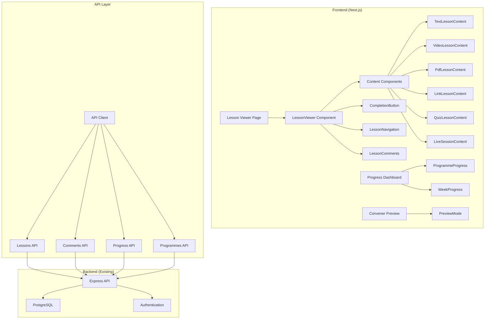
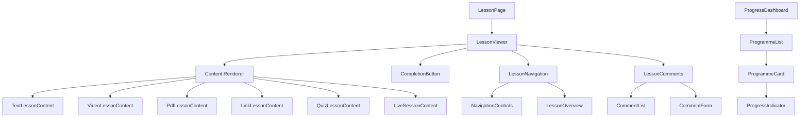

# Design Document: MVP Completion Gaps

## Overview

This design document outlines the technical implementation for completing the Cohortle MVP by addressing critical gaps in the learner experience. The backend API is fully functional, and the convener flow is complete. The primary focus is implementing the lesson viewer component and associated learner UI features to enable end-to-end learning workflows.

The design leverages existing architectural patterns, API endpoints, and UI components while introducing new learner-focused interfaces. The implementation follows a component-based architecture using React, TypeScript, and Tailwind CSS, with React Query for state management and API integration.

## Architecture

### System Architecture



### Component Hierarchy



### Data Flow

1. **Lesson Loading**: User navigates to `/lessons/[id]` → Page fetches lesson data and completion status
2. **Content Rendering**: Lesson type detection → Appropriate content component renders
3. **Completion Tracking**: User marks complete → API call → UI updates → Progress recalculated
4. **Navigation**: User clicks next/previous → Route change → New lesson loads
5. **Comments**: User posts comment → API call → Comment list refreshes

## Components and Interfaces

### Core Components

#### LessonViewer Component

**Purpose**: Main container for lesson viewing experience
**Location**: `src/components/lessons/LessonViewer.tsx`

```typescript
interface LessonViewerProps {
  lessonId: string;
  cohortId: string;
}

interface LessonViewerState {
  lesson: Lesson | null;
  completion: LessonCompletion | null;
  isLoading: boolean;
  error: Error | null;
}
```

**Responsibilities**:
- Orchestrate lesson data fetching
- Determine lesson type and render appropriate content component
- Handle completion state management
- Coordinate navigation and comments

#### Content Components

**TextLessonContent**
```typescript
interface TextLessonContentProps {
  title: string;
  htmlContent: string;
}
```

**VideoLessonContent**
```typescript
interface VideoLessonContentProps {
  title: string;
  videoUrl: string;
  textContent?: string;
  onVideoEnd?: () => void;
}
```

**PdfLessonContent**
```typescript
interface PdfLessonContentProps {
  title: string;
  pdfUrl: string;
  textContent?: string;
}
```

**LinkLessonContent**
```typescript
interface LinkLessonContentProps {
  title: string;
  linkUrl: string;
  textContent?: string;
}
```

**QuizLessonContent**
```typescript
interface QuizLessonContentProps {
  title: string;
  quizData: QuizData;
  onQuizComplete: (score: number) => void;
}

interface QuizData {
  questions: QuizQuestion[];
  passingScore?: number;
}

interface QuizQuestion {
  id: string;
  type: 'multiple-choice' | 'true-false' | 'text-input';
  question: string;
  options?: string[];
  correctAnswer: string | number;
  explanation?: string;
}
```

**LiveSessionContent**
```typescript
interface LiveSessionContentProps {
  title: string;
  sessionData: LiveSessionData;
}

interface LiveSessionData {
  scheduledDate: string;
  duration: number;
  joinUrl?: string;
  status: 'upcoming' | 'live' | 'completed';
  description?: string;
}
```

#### Navigation Components

**LessonNavigation**
```typescript
interface LessonNavigationProps {
  currentLessonId: string;
  moduleId: string;
  cohortId: string;
  isCompleted: boolean;
}

interface NavigationState {
  previousLesson: Lesson | null;
  nextLesson: Lesson | null;
  allLessons: ModuleLesson[];
}
```

#### Progress Components

**ProgressDashboard**
```typescript
interface ProgressDashboardProps {
  userId: string;
}

interface ProgrammeProgress {
  programmeId: string;
  programmeName: string;
  totalLessons: number;
  completedLessons: number;
  progressPercentage: number;
  lastAccessedLesson?: string;
  estimatedTimeToComplete?: number;
}
```

**CompletionButton**
```typescript
interface CompletionButtonProps {
  lessonId: string;
  cohortId: string;
  isCompleted: boolean;
  onComplete?: () => void;
}
```

### API Integration Layer

#### Enhanced Lesson API

```typescript
// Extend existing lessons.ts
export interface LessonWithProgress extends Lesson {
  completion?: LessonCompletion;
  nextLessonId?: string;
  previousLessonId?: string;
}

export async function fetchLessonWithNavigation(
  lessonId: string,
  cohortId: string
): Promise<LessonWithProgress> {
  // Implementation combines lesson data with navigation context
}

export async function fetchModuleProgress(
  moduleId: string,
  cohortId: string
): Promise<ModuleProgress> {
  // Implementation fetches progress for entire module
}
```

#### Progress API

```typescript
// New file: src/lib/api/progress.ts
export interface ProgrammeProgress {
  programmeId: string;
  programmeName: string;
  totalLessons: number;
  completedLessons: number;
  progressPercentage: number;
  weeks: WeekProgress[];
}

export interface WeekProgress {
  weekId: string;
  weekName: string;
  totalLessons: number;
  completedLessons: number;
  lessons: LessonProgress[];
}

export interface LessonProgress {
  lessonId: string;
  lessonName: string;
  isCompleted: boolean;
  completedAt?: string;
}

export async function fetchUserProgress(): Promise<ProgrammeProgress[]>;
export async function fetchProgrammeProgress(programmeId: string): Promise<ProgrammeProgress>;
```

### Utility Functions

#### Lesson Type Detection

```typescript
// Enhanced src/lib/utils/lessonTypeDetection.ts
export type LessonType = 'text' | 'video' | 'pdf' | 'link' | 'quiz' | 'live-session';

export function detectLessonType(lesson: Lesson): LessonType {
  // Enhanced logic to detect all 6 lesson types
  if (lesson.quiz_data) return 'quiz';
  if (lesson.live_session_data) return 'live-session';
  if (lesson.media) {
    if (isVideoUrl(lesson.media)) return 'video';
    if (isPdfUrl(lesson.media)) return 'pdf';
    return 'link';
  }
  return 'text';
}
```

#### Video URL Helpers

```typescript
// Enhanced src/lib/utils/videoUrlHelpers.ts
export function getVideoEmbedUrl(url: string): string;
export function isYouTubeUrl(url: string): boolean;
export function isBunnyStreamUrl(url: string): boolean;
export function getVideoThumbnail(url: string): string;
```

## Data Models

### Enhanced Lesson Model

```typescript
// Enhanced lesson types
export interface Lesson {
  id: string;
  name: string;
  text?: string;
  media?: string;
  module_id: number;
  order_index: number;
  created_at: string;
  updated_at: string;
  
  // New fields for enhanced lesson types
  quiz_data?: QuizData;
  live_session_data?: LiveSessionData;
  content_type: 'text' | 'video' | 'pdf' | 'link' | 'quiz' | 'live-session';
  estimated_duration?: number; // in minutes
}

export interface QuizData {
  questions: QuizQuestion[];
  passing_score?: number;
  allow_retakes: boolean;
  time_limit?: number; // in minutes
}

export interface LiveSessionData {
  scheduled_date: string;
  duration: number; // in minutes
  join_url?: string;
  meeting_id?: string;
  passcode?: string;
  description?: string;
}
```

### Progress Models

```typescript
export interface LessonCompletion {
  lesson_id: string;
  user_id: string;
  cohort_id: string;
  completed: boolean;
  completed_at?: string;
  score?: number; // for quizzes
  time_spent?: number; // in seconds
}

export interface ModuleProgress {
  module_id: string;
  total_lessons: number;
  completed_lessons: number;
  progress_percentage: number;
  lessons: LessonProgress[];
}
```

### Navigation Models

```typescript
export interface ModuleLesson {
  id: string;
  name: string;
  order_index: number;
  content_type: string;
  is_completed: boolean;
  estimated_duration?: number;
}

export interface NavigationContext {
  currentLesson: ModuleLesson;
  previousLesson?: ModuleLesson;
  nextLesson?: ModuleLesson;
  allLessons: ModuleLesson[];
  moduleInfo: {
    id: string;
    name: string;
    week_name: string;
  };
}
```

## Correctness Properties

*A property is a characteristic or behavior that should hold true across all valid executions of a system—essentially, a formal statement about what the system should do. Properties serve as the bridge between human-readable specifications and machine-verifiable correctness guarantees.*

Now I'll analyze the acceptance criteria to determine which can be tested as properties:

### Property 1: Lesson Type Detection and Rendering
*For any* valid lesson object, the system should detect the correct lesson type and render the appropriate content component with all required elements present.
**Validates: Requirements 1.1, 1.5, 1.10, 1.14, 1.18, 1.22**

### Property 2: HTML Content Preservation
*For any* valid HTML content in text lessons, the system should preserve all formatting elements (bold, italic, lists, headings) in the rendered output.
**Validates: Requirements 1.2**

### Property 3: Lesson Title Display
*For any* lesson, the title should appear before the content in the DOM structure.
**Validates: Requirements 1.3**

### Property 4: Video Provider Detection
*For any* video URL, the system should correctly identify the provider (YouTube, BunnyStream) and generate the appropriate embed URL format.
**Validates: Requirements 1.6, 1.7**

### Property 5: Video Completion Tracking
*For any* video lesson, when the video ends, the system should trigger completion tracking if the lesson is not already complete.
**Validates: Requirements 1.9**

### Property 6: PDF Error Handling
*For any* invalid or inaccessible PDF URL, the system should display appropriate error states without crashing.
**Validates: Requirements 1.12**

### Property 7: External Link Attributes
*For any* link lesson, external links should have target="_blank" and appropriate security attributes.
**Validates: Requirements 1.16**

### Property 8: Link Click Tracking
*For any* link lesson, clicking the link should trigger progress tracking calls.
**Validates: Requirements 1.17**

### Property 9: Quiz Question Rendering
*For any* quiz with multiple question types, the system should render appropriate input elements for each question type (multiple choice, true/false, text input).
**Validates: Requirements 1.19**

### Property 10: Quiz Score Calculation
*For any* completed quiz, the calculated score should match the percentage of correct answers.
**Validates: Requirements 1.21**

### Property 11: Live Session Status Display
*For any* live session lesson, the system should display the correct status indicator (upcoming, live, completed) based on the current time and session schedule.
**Validates: Requirements 1.24**

### Property 12: Completion Button State
*For any* lesson, the completion button should show "Mark Complete" for incomplete lessons and "Completed" with checkmark for completed lessons.
**Validates: Requirements 2.1, 2.3**

### Property 13: Completion API Integration
*For any* lesson completion action, the system should make the correct API call with lesson ID and cohort ID parameters.
**Validates: Requirements 2.2, 2.9**

### Property 14: Progress Calculation Accuracy
*For any* programme or week, the displayed progress percentage should equal (completed lessons / total lessons) * 100.
**Validates: Requirements 2.5, 2.6**

### Property 15: Progress Indicator Updates
*For any* lesson completion, all related progress indicators should update to reflect the new completion state.
**Validates: Requirements 2.8**

### Property 16: Completion Status Persistence
*For any* lesson, the completion status should be correctly loaded from the backend and displayed consistently across page refreshes.
**Validates: Requirements 2.10**

### Property 17: Navigation Button Functionality
*For any* lesson in a sequence, the navigation buttons should correctly navigate to adjacent lessons and be disabled when no adjacent lesson exists.
**Validates: Requirements 3.1, 3.2, 3.3, 3.4**

### Property 18: Lesson Overview Navigation
*For any* lesson in the overview sidebar, clicking it should navigate to that specific lesson.
**Validates: Requirements 3.6**

### Property 19: Current Lesson Highlighting
*For any* lesson being viewed, it should be visually highlighted in the lesson overview.
**Validates: Requirements 3.7**

### Property 20: Breadcrumb Navigation
*For any* lesson page, breadcrumbs should show the correct hierarchy (Programme > Week > Lesson) with functional navigation links.
**Validates: Requirements 3.9, 3.10**

### Property 21: Comment Display Completeness
*For any* comment, the rendered output should include author name, timestamp, and content text.
**Validates: Requirements 4.2**

### Property 22: Comment Submission Integration
*For any* comment submission, the system should make the correct API call and display the new comment in the UI.
**Validates: Requirements 4.6, 4.7**

### Property 23: Comment Management Permissions
*For any* comment authored by the current user, edit and delete options should be available.
**Validates: Requirements 4.9**

### Property 24: Dashboard Progress Display
*For any* enrolled programme, the dashboard should display completion percentage, completed lessons count, and total lessons count.
**Validates: Requirements 5.2**

### Property 25: Programme Progress Navigation
*For any* programme on the dashboard, clicking it should navigate to the detailed progress view.
**Validates: Requirements 5.5**

### Property 26: Preview Mode Functionality
*For any* convener in preview mode, the system should show learner UI elements while disabling completion persistence.
**Validates: Requirements 6.2, 6.7, 6.8**

### Property 27: Lesson Reordering Integration
*For any* lesson reordering operation, the system should update the order via API and reflect changes in the UI immediately.
**Validates: Requirements 7.3, 7.6, 7.7, 7.8**

## Error Handling

### Error Boundaries and Fallbacks

**Component-Level Error Handling**:
- Each content component (TextLessonContent, VideoLessonContent, etc.) includes error boundaries
- Graceful degradation when content fails to load
- Retry mechanisms for transient failures
- User-friendly error messages with actionable guidance

**API Error Handling**:
- Network timeout handling (30-second timeout)
- Retry logic for failed requests (exponential backoff)
- Offline state detection and queuing
- Authentication error handling with automatic redirect

**Content Loading Errors**:
- Video player fallbacks for unsupported formats
- PDF viewer error states with download options
- Image loading failures with placeholder content
- External link validation and warning messages

### Error Recovery Patterns

```typescript
// Error boundary for lesson content
export class LessonContentErrorBoundary extends React.Component {
  state = { hasError: false, error: null };
  
  static getDerivedStateFromError(error: Error) {
    return { hasError: true, error };
  }
  
  render() {
    if (this.state.hasError) {
      return (
        <LessonErrorFallback 
          error={this.state.error}
          onRetry={() => this.setState({ hasError: false, error: null })}
        />
      );
    }
    return this.props.children;
  }
}

// API error handling with retry
export function useApiWithRetry<T>(
  apiCall: () => Promise<T>,
  maxRetries: number = 3
) {
  const [retryCount, setRetryCount] = useState(0);
  
  const executeWithRetry = useCallback(async () => {
    try {
      return await apiCall();
    } catch (error) {
      if (retryCount < maxRetries && isRetryableError(error)) {
        setRetryCount(prev => prev + 1);
        await delay(Math.pow(2, retryCount) * 1000); // Exponential backoff
        return executeWithRetry();
      }
      throw error;
    }
  }, [apiCall, retryCount, maxRetries]);
  
  return { executeWithRetry, retryCount };
}
```

## Testing Strategy

### Dual Testing Approach

The testing strategy employs both unit tests and property-based tests to ensure comprehensive coverage:

**Unit Tests**: Focus on specific examples, edge cases, and integration points
- Component rendering with specific props
- User interaction flows (click, form submission)
- Error boundary behavior
- API integration with mocked responses
- Edge cases (empty states, loading states, error states)

**Property-Based Tests**: Verify universal properties across all inputs
- Lesson type detection across all possible lesson configurations
- Progress calculation accuracy with random lesson completion states
- Navigation behavior with various lesson sequences
- Comment rendering with diverse comment data
- HTML sanitization with random HTML inputs

### Property-Based Testing Configuration

**Testing Library**: fast-check (JavaScript/TypeScript property-based testing)
**Minimum Iterations**: 100 per property test
**Test Organization**: Each correctness property maps to one property-based test

**Example Property Test Structure**:
```typescript
// Feature: mvp-completion-gaps, Property 1: Lesson Type Detection and Rendering
describe('Lesson Type Detection and Rendering', () => {
  it('should detect correct lesson type and render appropriate component', () => {
    fc.assert(fc.property(
      lessonArbitrary(), // Generator for random lesson objects
      (lesson) => {
        const detectedType = detectLessonType(lesson);
        const { container } = render(<LessonViewer lessonId={lesson.id} cohortId="test" />);
        
        // Verify correct component is rendered based on type
        switch (detectedType) {
          case 'text':
            expect(container.querySelector('[data-testid="text-lesson"]')).toBeInTheDocument();
            break;
          case 'video':
            expect(container.querySelector('[data-testid="video-lesson"]')).toBeInTheDocument();
            break;
          // ... other cases
        }
      }
    ), { numRuns: 100 });
  });
});
```

### Testing Priorities

**Critical Path Testing** (Must Pass for MVP):
1. Lesson viewer renders all 6 lesson types correctly
2. Completion tracking works end-to-end
3. Navigation between lessons functions properly
4. Progress calculation is accurate
5. Error handling prevents crashes

**Enhanced Feature Testing** (Post-MVP):
1. Comment system functionality
2. Progress dashboard accuracy
3. Convener preview mode
4. Lesson reordering interface
5. Advanced navigation features

### Integration Testing

**End-to-End Workflows**:
- Complete learner journey: login → view programme → complete lessons → track progress
- Convener preview workflow: create lesson → preview as learner → verify display
- Error recovery: network failure → retry → successful completion

**Cross-Browser Testing**:
- Chrome, Firefox, Safari, Edge
- Desktop and tablet viewports
- Video player compatibility across browsers
- PDF viewer functionality

**Performance Testing**:
- Large lesson content loading
- Multiple video players on page
- Progress calculation with many lessons
- Comment loading with large datasets

## Implementation Phases

### Phase 1: Core Lesson Viewer (Week 1)
**Priority**: Critical - Blocks MVP

**Components to Implement**:
- LessonViewer main component
- TextLessonContent component
- VideoLessonContent component
- PdfLessonContent component
- LinkLessonContent component
- CompletionButton component
- Basic error handling

**API Integration**:
- Enhanced lesson fetching with navigation context
- Completion tracking endpoints
- Error handling and retry logic

**Testing**:
- Unit tests for each content component
- Property tests for lesson type detection
- Integration tests for completion flow

### Phase 2: Navigation and Progress (Week 2)
**Priority**: Critical - Blocks MVP

**Components to Implement**:
- LessonNavigation component
- NavigationControls subcomponent
- LessonOverview sidebar
- ProgressIndicator components
- Breadcrumb navigation

**Features**:
- Sequential lesson navigation
- Progress calculation and display
- Real-time progress updates
- Navigation context preservation

**Testing**:
- Property tests for navigation logic
- Unit tests for progress calculations
- Integration tests for navigation flows

### Phase 3: Enhanced Features (Week 3)
**Priority**: High - Improves usability

**Components to Implement**:
- QuizLessonContent component
- LiveSessionContent component
- LessonComments component
- CommentForm and CommentList
- ProgressDashboard component

**Features**:
- Interactive quiz functionality
- Live session scheduling display
- Comment system with threading
- Comprehensive progress dashboard

**Testing**:
- Property tests for quiz scoring
- Unit tests for comment functionality
- Integration tests for dashboard

### Phase 4: Convener Features (Week 4)
**Priority**: Medium - Nice-to-have for MVP

**Components to Implement**:
- PreviewMode wrapper
- LessonReordering interface
- Drag-and-drop functionality
- Preview mode indicators

**Features**:
- Convener programme preview
- Lesson reordering interface
- Preview mode restrictions
- Visual preview indicators

**Testing**:
- Unit tests for preview mode
- Property tests for reordering logic
- Integration tests for convener workflows

## Deployment Considerations

### Environment Configuration

**Development Environment**:
- Hot reloading for component development
- Mock API responses for offline development
- Comprehensive error logging
- Performance monitoring tools

**Production Environment**:
- CDN integration for video content
- Error tracking (Sentry or similar)
- Performance monitoring
- Analytics integration

### Performance Optimization

**Code Splitting**:
- Lazy loading of lesson content components
- Dynamic imports for heavy dependencies (PDF viewers, video players)
- Route-based code splitting for lesson pages

**Caching Strategy**:
- React Query caching for lesson data
- Browser caching for static assets
- Service worker for offline functionality

**Bundle Optimization**:
- Tree shaking for unused code
- Compression for production builds
- Image optimization for lesson content

### Security Considerations

**Content Security**:
- HTML sanitization for text lessons (DOMPurify)
- CSP headers for external content
- Secure video embedding
- Input validation for comments

**API Security**:
- JWT token validation
- Rate limiting for API endpoints
- CORS configuration
- Input sanitization

## Success Metrics

### MVP Launch Criteria

**Functional Requirements**:
- ✅ All 6 lesson types render correctly
- ✅ Completion tracking works end-to-end
- ✅ Navigation between lessons functions
- ✅ Progress calculation is accurate
- ✅ Error handling prevents crashes
- ✅ Responsive design works on desktop/tablet

**Performance Requirements**:
- Page load time < 3 seconds
- Video start time < 5 seconds
- API response time < 500ms
- Zero critical accessibility violations

**Quality Requirements**:
- 90%+ test coverage for critical components
- Zero high-severity bugs in production
- Cross-browser compatibility verified
- Mobile-responsive design validated

### Post-MVP Enhancement Metrics

**User Engagement**:
- Comment participation rate
- Lesson completion rate
- Time spent per lesson
- Navigation pattern analysis

**System Performance**:
- API error rate < 1%
- Page crash rate < 0.1%
- Video playback success rate > 95%
- Progress sync accuracy > 99%

## Conclusion

This design provides a comprehensive technical foundation for completing the Cohortle MVP by addressing all critical gaps in the learner experience. The component-based architecture leverages existing patterns while introducing new learner-focused interfaces that integrate seamlessly with the existing backend API.

The phased implementation approach prioritizes critical functionality first, ensuring MVP viability within 3-4 weeks while providing a clear path for post-MVP enhancements. The dual testing strategy ensures both correctness and comprehensive coverage, while the error handling framework provides resilient user experiences.

With the backend API fully functional and the convener flow complete, implementing this design will deliver a complete learning platform that serves both learners and conveners effectively.