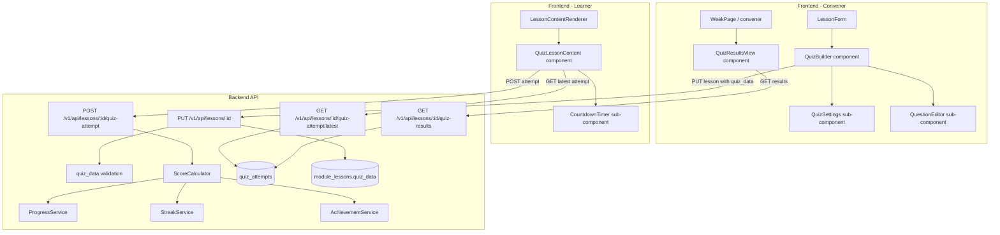

# Design Document: Native Quiz System

## Overview

The Native Quiz System replaces the external-URL quiz lesson type with a fully native quiz authoring and delivery experience built inside Cohortle. The design extends the existing `module_lessons` table with a `quiz_data` JSON column, introduces a new `quiz_attempts` table, adds backend API endpoints for attempt submission and results retrieval, and replaces the convener's URL input with a `QuizBuilder` component and the learner's URL redirect with a fully interactive `QuizLessonContent` component backed by real persistence.

The system integrates with the existing `ProgressService`, `StreakService`, and `AchievementService` so quiz completion flows through the same pipeline as all other lesson types.

---

## Architecture



---

## Components and Interfaces

### Backend

#### QuizData JSON Schema

Stored in `module_lessons.quiz_data`:

```json
{
  "questions": [
    {
      "id": "uuid-string",
      "type": "multiple-choice | true-false | text-input",
      "question": "string",
      "options": ["string"],
      "correctAnswer": "string | number",
      "explanation": "string (optional)"
    }
  ],
  "settings": {
    "passing_score": null,
    "time_limit": null,
    "allow_retakes": true
  }
}
```

- `options` is required for `multiple-choice` (min 2 items); omitted for `true-false` and `text-input`.
- For `multiple-choice`, `correctAnswer` is the zero-based index of the correct option (stored as integer).
- For `true-false`, `correctAnswer` is `"true"` or `"false"`.
- For `text-input`, `correctAnswer` is the expected string (case-insensitive comparison at score time).

#### New API Endpoints

| Method | Path | Auth | Description |
|--------|------|------|-------------|
| POST | `/v1/api/lessons/:lesson_id/quiz-attempt` | student | Submit a quiz attempt |
| GET | `/v1/api/lessons/:lesson_id/quiz-attempt/latest` | student | Get learner's most recent attempt |
| GET | `/v1/api/lessons/:lesson_id/quiz-results` | convener | Get all attempts for a lesson |

#### Modified Endpoints

- `POST /v1/api/modules/:module_id/lessons` — accepts optional `quiz_data` field
- `PUT /v1/api/lessons/:lesson_id` — accepts optional `quiz_data` field; validates JSON structure when type is `quiz`

#### QuizService (new)

```javascript
class QuizService {
  // Validate quiz_data structure; throws ValidationError on failure
  validateQuizData(quizData)

  // Calculate score: round((correct / total) * 100)
  calculateScore(questions, answers)

  // Determine if attempt passes: score >= passing_score (or no passing_score)
  isPassing(score, passingScore)

  // Persist attempt, trigger completion if passing
  submitAttempt(userId, lessonId, cohortId, answers)

  // Fetch most recent attempt for a learner
  getLatestAttempt(userId, lessonId, cohortId)

  // Fetch all attempts for a lesson (convener view)
  getResultsForLesson(lessonId, convenerUserId)
}
```

### Frontend

#### QuizBuilder (convener)

Location: `cohortle-web/src/components/convener/QuizBuilder.tsx`

Props:
```typescript
interface QuizBuilderProps {
  initialData?: QuizData;
  onChange: (data: QuizData) => void;
}
```

Sub-components:
- `QuizSettings` — passing score, time limit, allow-retakes fields
- `QuestionEditor` — add/edit/delete/reorder questions; renders type-specific fields

#### QuizLessonContent (learner) — updated

Location: `cohortle-web/src/components/lessons/QuizLessonContent.tsx` (already exists, needs backend wiring)

New props:
```typescript
interface QuizLessonContentProps {
  lessonId: string;
  cohortId: number;
  title: string;
  quizData: QuizData;
  onQuizComplete?: (score: number) => void;
}
```

New behaviour:
- On mount: fetch latest attempt via `GET /quiz-attempt/latest`; if found, render results view
- On submit: POST to `/quiz-attempt`; on success, call `onQuizComplete`
- Countdown timer when `time_limit` is set

Sub-component: `CountdownTimer` — accepts `minutes`, calls `onExpire` callback

#### QuizResultsView (convener)

Location: `cohortle-web/src/components/convener/QuizResultsView.tsx`

Props:
```typescript
interface QuizResultsViewProps {
  lessonId: string;
}
```

Renders a table of learner attempts with: name, score, passed, attempt count, last submitted.
Expandable row shows per-question answer breakdown.

---

## Data Models

### Migration 1: Add `quiz_data` column to `module_lessons`

```javascript
// cohortle-api/migrations/20260501000000-add-quiz-data-to-module-lessons.js
await queryInterface.addColumn('module_lessons', 'quiz_data', {
  type: Sequelize.JSON,
  allowNull: true,
  defaultValue: null,
});
```

### Migration 2: Create `quiz_attempts` table

```javascript
// cohortle-api/migrations/20260501000001-create-quiz-attempts.js
await queryInterface.createTable('quiz_attempts', {
  id: { type: Sequelize.INTEGER, primaryKey: true, autoIncrement: true },
  lesson_id: { type: Sequelize.INTEGER, allowNull: false,
    references: { model: 'module_lessons', key: 'id' },
    onDelete: 'CASCADE' },
  user_id: { type: Sequelize.INTEGER, allowNull: false,
    references: { model: 'users', key: 'id' },
    onDelete: 'CASCADE' },
  cohort_id: { type: Sequelize.INTEGER, allowNull: false,
    references: { model: 'cohorts', key: 'id' },
    onDelete: 'CASCADE' },
  answers: { type: Sequelize.JSON, allowNull: false },
  score: { type: Sequelize.INTEGER, allowNull: false },
  passed: { type: Sequelize.BOOLEAN, allowNull: false },
  submitted_at: { type: Sequelize.DATE, allowNull: false,
    defaultValue: Sequelize.literal('CURRENT_TIMESTAMP') },
});
// Indexes: (lesson_id, user_id, cohort_id), (lesson_id), (user_id)
```

Note: `lesson_id` here references `module_lessons.id` (integer), not the WLIMP `lessons.id` (UUID). The native quiz system is built on top of the existing `module_lessons` table used by the convener dashboard.

### Sequelize Model: `quiz_attempts`

```javascript
module.exports = (sequelize, DataTypes) => {
  const QuizAttempt = sequelize.define('quiz_attempts', {
    id: { type: DataTypes.INTEGER, primaryKey: true, autoIncrement: true },
    lesson_id: { type: DataTypes.INTEGER, allowNull: false },
    user_id: { type: DataTypes.INTEGER, allowNull: false },
    cohort_id: { type: DataTypes.INTEGER, allowNull: false },
    answers: { type: DataTypes.JSON, allowNull: false },
    score: { type: DataTypes.INTEGER, allowNull: false },
    passed: { type: DataTypes.BOOLEAN, allowNull: false },
    submitted_at: { type: DataTypes.DATE, allowNull: false },
  }, { timestamps: false });
  return QuizAttempt;
};
```

### TypeScript Types (frontend)

```typescript
// cohortle-web/src/types/quiz.ts
export type QuestionType = 'multiple-choice' | 'true-false' | 'text-input';

export interface QuizQuestion {
  id: string;
  type: QuestionType;
  question: string;
  options?: string[];          // multiple-choice only
  correctAnswer: string | number;
  explanation?: string;
}

export interface QuizSettings {
  passing_score: number | null;
  time_limit: number | null;
  allow_retakes: boolean;
}

export interface QuizData {
  questions: QuizQuestion[];
  settings: QuizSettings;
}

export interface QuizAttempt {
  id: number;
  lesson_id: number;
  user_id: number;
  cohort_id: number;
  answers: Record<string, string | number>;
  score: number;
  passed: boolean;
  submitted_at: string;
}
```

---

## Correctness Properties

*A property is a characteristic or behavior that should hold true across all valid executions of a system — essentially, a formal statement about what the system should do. Properties serve as the bridge between human-readable specifications and machine-verifiable correctness guarantees.*

### Property 1: Quiz_Data round-trip

*For any* valid `QuizData` object saved to a quiz lesson via the API, fetching that lesson should return a `quiz_data` field that is deeply equal to the saved value.

**Validates: Requirements 1.6, 1.7, 2.6, 3.1, 3.2, 3.3, 3.4**

---

### Property 2: Multiple-choice question validation

*For any* multiple-choice question, the system should reject saving if the options array has fewer than 2 items, or if no correct answer is designated.

**Validates: Requirements 1.3**

---

### Property 3: True/false question structure invariant

*For any* true/false question in a saved quiz, the rendered question should present exactly two options: "True" and "False".

**Validates: Requirements 1.4**

---

### Property 4: Text-input question requires correct answer

*For any* text-input question, the system should reject saving if the `correctAnswer` field is an empty string or whitespace-only.

**Validates: Requirements 1.5**

---

### Property 5: Question deletion reduces count

*For any* quiz with N questions, deleting one question and saving should result in the persisted quiz having exactly N-1 questions, and the deleted question's id should not appear in the saved data.

**Validates: Requirements 1.8**

---

### Property 6: Question reorder preserves all questions

*For any* quiz with N questions, reordering the questions (any permutation) and saving should result in the persisted quiz having the same N question ids, just in the new order.

**Validates: Requirements 1.9**

---

### Property 7: Passing score range validation

*For any* integer value outside the range [1, 100], the system should reject it as a passing score with a 400 error. For any integer in [1, 100], the system should accept it.

**Validates: Requirements 2.1, 2.4**

---

### Property 8: Time limit positivity validation

*For any* integer value ≤ 0, the system should reject it as a time limit with a 400 error. For any positive integer, the system should accept it.

**Validates: Requirements 2.2, 2.5**

---

### Property 9: Score calculation formula

*For any* set of quiz questions and a corresponding set of answers, the calculated score should equal `round((correct_count / total_questions) × 100)` where `correct_count` is the number of answers that match the `correctAnswer` field (case-insensitive for text-input).

**Validates: Requirements 4.6**

---

### Property 10: Quiz_Attempt round-trip

*For any* submitted quiz attempt (answers, score, passed), fetching the latest attempt for that (lesson_id, user_id, cohort_id) should return a record with the same answers, score, and passed values.

**Validates: Requirements 4.7, 7.1, 7.4**

---

### Property 11: Completion logic correctness

*For any* quiz submission, the lesson should be marked complete if and only if: (a) no `passing_score` is configured, OR (b) the submission's `score` is greater than or equal to `passing_score`. Equivalently, `passed = (passing_score === null || score >= passing_score)`.

**Validates: Requirements 5.1, 5.2, 5.3, 7.2, 7.3**

---

### Property 12: Retake creates new attempt record

*For any* learner who submits a quiz K times, there should be exactly K `quiz_attempts` records for that (lesson_id, user_id, cohort_id) combination.

**Validates: Requirements 6.5, 7.5**

---

### Property 13: Retake button visibility matches allow_retakes

*For any* submitted quiz, the "Retake Quiz" button should be visible if and only if `allow_retakes` is `true`.

**Validates: Requirements 6.1, 6.3, 6.4**

---

### Property 14: Results endpoint scoped to enrolled learners

*For any* quiz results response, every attempt returned should belong to a learner who is enrolled in a cohort associated with the lesson's programme. No attempt from a non-enrolled learner should appear.

**Validates: Requirements 8.5**

---

### Property 15: Unanswered questions block submission

*For any* quiz where at least one question has no answer recorded, the submit action should be blocked and no attempt should be persisted.

**Validates: Requirements 4.9**

---

### Property 16: All questions rendered

*For any* `QuizData` with N questions, the rendered `QuizLessonContent` should contain exactly N question elements.

**Validates: Requirements 4.1**

---

## Error Handling

| Scenario | HTTP Status | Message |
|----------|-------------|---------|
| `quiz_data` is not valid JSON | 400 | "quiz_data must be valid JSON" |
| Quiz has zero questions | 400 | "Quiz must contain at least one question" |
| Multiple-choice question has < 2 options | 400 | "Multiple-choice questions require at least 2 options" |
| Text-input question has empty correctAnswer | 400 | "Text-input questions require a correct answer" |
| Passing score out of range | 400 | "Passing score must be between 1 and 100" |
| Time limit ≤ 0 | 400 | "Time limit must be a positive integer" |
| Attempt submitted with unanswered questions | 400 | "All questions must be answered before submitting" |
| Lesson not found | 404 | "Lesson not found" |
| Lesson is not type quiz | 400 | "Lesson is not a quiz" |
| Unauthorised access | 401/403 | Standard auth error |
| Learner not enrolled in cohort | 403 | "Not enrolled in this cohort" |

Frontend error handling:
- Quiz builder shows inline validation errors per field
- Submission errors shown as a dismissible banner above the quiz
- Timer expiry auto-submits; if submission fails, shows error and allows retry

---

## Testing Strategy

### Unit Tests

Focus on specific examples, edge cases, and error conditions:

- `QuizService.calculateScore` with known inputs (all correct, none correct, partial)
- `QuizService.validateQuizData` with malformed structures (missing fields, wrong types)
- `QuizService.isPassing` with boundary values (score = passing_score, score = passing_score - 1)
- `QuizBuilder` renders correct fields for each question type
- `QuizLessonContent` shows retake button only when `allow_retakes = true`
- `CountdownTimer` calls `onExpire` when time reaches zero

### Property-Based Tests

Use **fast-check** (already used in the codebase) for backend and frontend property tests.

Each property test runs a minimum of **100 iterations**.

Tag format: `Feature: native-quiz-system, Property N: <property_text>`

**Backend property tests** (`cohortle-api/__tests__/native-quiz-system/`):

- `quizDataRoundTrip.pbt.js` — Property 1
- `questionValidation.pbt.js` — Properties 2, 3, 4
- `questionMutation.pbt.js` — Properties 5, 6
- `settingsValidation.pbt.js` — Properties 7, 8
- `scoreCalculation.pbt.js` — Property 9
- `attemptRoundTrip.pbt.js` — Property 10
- `completionLogic.pbt.js` — Property 11
- `retakeAttemptCount.pbt.js` — Property 12
- `resultsAccessControl.pbt.js` — Property 14

**Frontend property tests** (`cohortle-web/__tests__/components/`):

- `QuizLessonContent.pbt.tsx` — Properties 13, 15, 16
