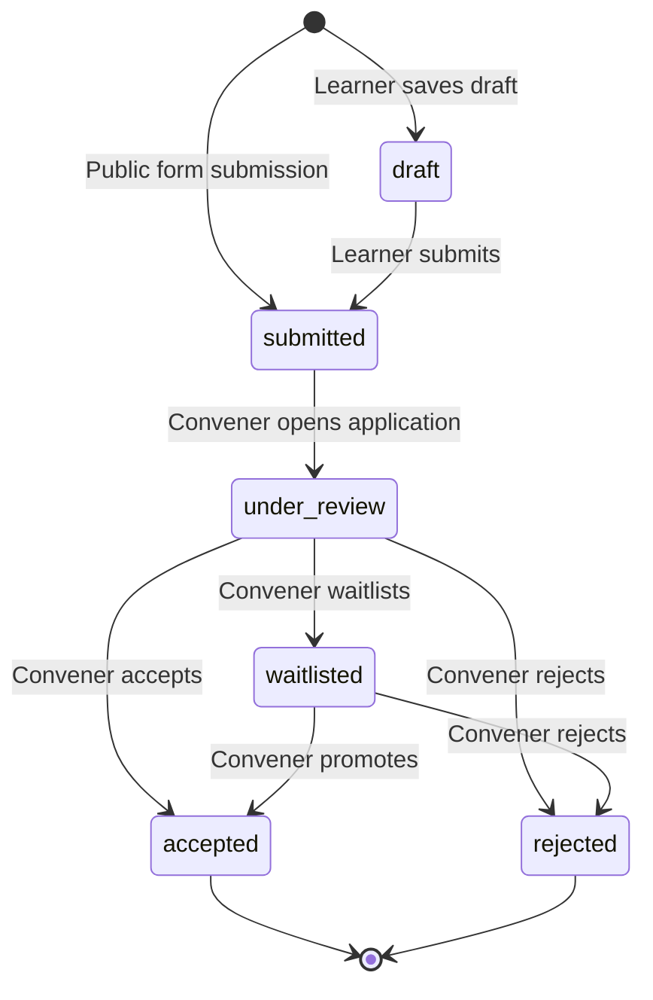

# Design Document: Programme Application Flow

## Overview

This design covers the Apply → Review → Accept → Enroll lifecycle for Cohortle programmes. The feature introduces a new `onboarding_mode` field on programmes (`code` | `application` | `hybrid`), a complete application management system, and an **Organisation Page** concept that allows conveners to surface all their open programmes under a single public URL.

The Organisation Page is the key addition to the original single-programme flow. A convener sets an `organisation_slug` on their profile (e.g., `wecareforng`), which generates a public page at `/org/[slug]` listing all their recruiting programmes. Applicants can browse and apply to multiple programmes from one place. Under the hood, each application remains a separate record scoped to one programme — the organisation page is purely a discovery and navigation layer.

The core principle is **additive design**: new tables, new routes, and new service classes are introduced. The existing `EnrollmentService`, `enrollments` table, and enrollment code routes are extended minimally — only two new columns (`enrollment_source`, `application_id`) are added to `enrollments`.

---

## Architecture

```mermaid
graph TD
    subgraph Public
        OP[Organisation Page<br/>cohortle-web /org/[slug]]
        AF[Application Form Page<br/>cohortle-web /apply/[slug]]
        OP -->|click Apply| AF
    end

    subgraph Learner
        LD[Learner Dashboard<br/>My Applications]
        AL[Acceptance Link<br/>/accept/[token]]
    end

    subgraph Convener
        CD[Convener Dashboard<br/>Programme → Applications Tab]
        XP[Cross-Programme View<br/>All Applications]
        RV[Review Modal]
    end

    subgraph API
        OR[OrgRoutes<br/>/v1/api/org/[slug]]
        AR[ApplicationRoutes<br/>/v1/api/applications/...]
        AS[ApplicationService]
        AHS[ApplicationHistoryService]
        ATS[AcceptanceTokenService]
        ES[EnrollmentService<br/>(extended)]
        RS[ResendService<br/>(existing)]
    end

    subgraph DB
        APP[(applications)]
        AHT[(application_history)]
        ATT[(acceptance_tokens)]
        ENR[(enrollments<br/>+ enrollment_source<br/>+ application_id)]
        PRG[(programmes<br/>+ onboarding_mode<br/>+ application_deadline<br/>+ application_form_slug)]
        USR[(users<br/>+ organisation_slug<br/>+ organisation_name<br/>+ organisation_description)]
        COH[(cohorts<br/>+ max_members already exists)]
    end

    OP -->|GET /v1/api/org/:slug| OR
    AF -->|POST /v1/api/applications| AR
    CD -->|GET/PATCH /v1/api/programmes/:id/applications| AR
    XP -->|GET /v1/api/convener/applications| AR
    RV -->|PATCH /v1/api/applications/:id/status| AR
    LD -->|GET /v1/api/me/applications| AR
    AL -->|POST /v1/api/acceptance-tokens/:token/redeem| AR

    OR --> AS
    AR --> AS
    AS --> AHS
    AS --> ATS
    AS --> ES
    AS --> RS

    AS --> APP
    AHS --> AHT
    ATS --> ATT
    ES --> ENR
    AS --> PRG
    AS --> USR
    AS --> COH
```

---

## Components and Interfaces

### API Routes (`cohortle-api/routes/applications.js`)

All application management endpoints. Registered in `app.js` as `applicationRoutes(app)`.

| Method | Path | Auth | Description |
|--------|------|------|-------------|
| GET | `/v1/api/programmes/:id/application-form` | None | Public form data (programme info + questions) |
| POST | `/v1/api/programmes/:id/applications` | None | Submit an application (public) |
| GET | `/v1/api/programmes/:id/applications` | Convener (owner) | List applications with filters |
| GET | `/v1/api/programmes/:id/applications/counts` | Convener (owner) | Status counts summary |
| GET | `/v1/api/applications/:id` | Convener (owner) | Get single application detail |
| PATCH | `/v1/api/applications/:id/status` | Convener (owner) | Accept / reject / waitlist |
| PATCH | `/v1/api/applications/:id/notes` | Convener (owner) | Add/update reviewer notes |
| POST | `/v1/api/applications/bulk-action` | Convener (owner) | Bulk accept/reject |
| GET | `/v1/api/me/applications` | Student | Learner's own applications |
| PUT | `/v1/api/applications/:id` | Student (owner) | Edit draft application |
| POST | `/v1/api/acceptance-tokens/:token/redeem` | None | Redeem acceptance link |
| GET | `/v1/api/programmes/:id/applications/export` | Convener (owner) | CSV export |
| GET | `/v1/api/convener/applications` | Convener | Cross-programme applications view |

### Organisation Routes (`cohortle-api/routes/org.js`)

New route file for the public organisation page. Registered in `app.js` as `orgRoutes(app)`.

| Method | Path | Auth | Description |
|--------|------|------|-------------|
| GET | `/v1/api/org/:slug` | None | Public org page data (convener info + open programmes) |
| GET | `/v1/api/org/:slug/check` | None | Check if slug exists (for slug availability) |

### Programme Routes (extended)

Two new endpoints added to `cohortle-api/routes/programme.js`:

| Method | Path | Auth | Description |
|--------|------|------|-------------|
| PATCH | `/v1/api/programmes/:id/onboarding-mode` | Convener (owner) | Set onboarding_mode + deadline |
| GET | `/v1/api/programmes/:id/application-template` | Convener (owner) | Get template questions |
| PUT | `/v1/api/programmes/:id/application-template` | Convener (owner) | Create/update template questions |

### ApplicationService (`cohortle-api/services/ApplicationService.js`)

```javascript
class ApplicationService {
  // Submit a new application (public, no auth)
  async submitApplication(programmeId, { name, email, responses }) {}

  // Get applications for a programme with optional filters
  async getProgrammeApplications(programmeId, { status, sort, cohortId, page, limit }) {}

  // Get status counts for a programme
  async getStatusCounts(programmeId) {}

  // Get a single application by ID
  async getApplication(applicationId, requestingUserId) {}

  // Transition application status (accept/reject/waitlist/under_review)
  async transitionStatus(applicationId, newStatus, { reviewerId, cohortId, rejectionReason, notes }) {}

  // Bulk status transition
  async bulkTransition(applicationIds, newStatus, { reviewerId, cohortId, rejectionReason }) {}

  // Add reviewer notes
  async addNotes(applicationId, notes, reviewerId) {}

  // Get learner's own applications
  async getLearnerApplications(userId) {}

  // Update a draft application
  async updateDraftApplication(applicationId, userId, { responses }) {}

  // Redeem an acceptance token (creates enrollment)
  async redeemAcceptanceToken(token, userId) {}

  // Export applications as CSV
  async exportApplicationsCsv(programmeId, requestingUserId) {}
}
```

### ApplicationHistoryService (`cohortle-api/services/ApplicationHistoryService.js`)

```javascript
class ApplicationHistoryService {
  // Record a status transition
  async recordTransition(applicationId, { fromStatus, toStatus, changedBy, notes }) {}

  // Get full history for an application (chronological)
  async getHistory(applicationId) {}
}
```

### AcceptanceTokenService (`cohortle-api/services/AcceptanceTokenService.js`)

```javascript
class AcceptanceTokenService {
  // Create a unique 7-day token for an accepted application
  async createToken(applicationId, cohortId, applicantEmail) {}

  // Validate and retrieve token data (throws if expired/used)
  async validateToken(token) {}

  // Mark token as used
  async consumeToken(token) {}
}
```

### Frontend Components

**New pages (cohortle-web):**

| Path | Component | Description |
|------|-----------|-------------|
| `/org/[slug]` | `OrganisationPage` | Public org page listing all open programmes |
| `/apply/[slug]` | `ApplicationFormPage` | Public application form (per programme) |
| `/apply/confirmation` | `ApplicationConfirmationPage` | Post-submission confirmation (already exists, extend) |
| `/accept/[token]` | `AcceptanceLandingPage` | Acceptance link handler |
| `/convener/programmes/[id]/applications` | `ApplicationsPage` | Convener review dashboard (per programme) |
| `/convener/programmes/[id]/applications/[appId]` | `ApplicationDetailPage` | Single application review |
| `/convener/applications` | `CrossProgrammeApplicationsPage` | All applications across all convener's programmes |
| `/dashboard` (extended) | `MyApplicationsSection` | Learner's application list |

**New API client functions (`cohortle-web/src/lib/api/applications.ts`):**

```typescript
export async function getOrganisationPage(slug: string): Promise<OrganisationPageData>
export async function checkOrganisationSlug(slug: string): Promise<{ available: boolean }>
export async function getApplicationForm(programmeSlug: string): Promise<ApplicationFormData>
export async function submitApplication(programmeId: number, data: ApplicationSubmission): Promise<void>
export async function getProgrammeApplications(programmeId: number, filters: ApplicationFilters): Promise<ApplicationListResponse>
export async function getApplicationCounts(programmeId: number): Promise<StatusCounts>
export async function getApplication(applicationId: string): Promise<ApplicationDetail>
export async function transitionApplicationStatus(applicationId: string, data: StatusTransitionData): Promise<Application>
export async function addApplicationNotes(applicationId: string, notes: string): Promise<Application>
export async function bulkTransitionApplications(applicationIds: string[], data: BulkActionData): Promise<void>
export async function getMyApplications(): Promise<Application[]>
export async function redeemAcceptanceToken(token: string): Promise<RedemptionResult>
export async function exportApplicationsCsv(programmeId: number): Promise<Blob>
export async function getCrossProgammeApplications(filters: CrossProgrammeFilters): Promise<ApplicationListResponse>
```

---

## Data Models

### New Table: `applications`

```sql
CREATE TABLE applications (
  id          UUID PRIMARY KEY DEFAULT uuid_generate_v4(),
  programme_id INT NOT NULL REFERENCES programmes(id),
  cohort_id   INT NULL REFERENCES cohorts(id),  -- set on acceptance
  applicant_name  VARCHAR(255) NOT NULL,
  applicant_email VARCHAR(255) NOT NULL,
  user_id     INT NULL REFERENCES users(id),    -- set if/when account exists
  status      ENUM('draft','submitted','under_review','accepted','rejected','waitlisted') NOT NULL DEFAULT 'submitted',
  responses   JSON NOT NULL DEFAULT '{}',
  reviewer_id INT NULL REFERENCES users(id),
  reviewer_notes TEXT NULL,
  rejection_reason TEXT NULL,
  decision_at TIMESTAMP NULL,
  submitted_at TIMESTAMP NOT NULL DEFAULT NOW(),
  created_at  TIMESTAMP NOT NULL DEFAULT NOW(),
  updated_at  TIMESTAMP NOT NULL DEFAULT NOW(),
  INDEX idx_applications_programme_id (programme_id),
  INDEX idx_applications_email (applicant_email),
  INDEX idx_applications_status (status),
  UNIQUE KEY unique_pending_application (programme_id, applicant_email, status)
    -- Note: enforced at service layer for multi-status uniqueness
);
```

### New Table: `application_history`

```sql
CREATE TABLE application_history (
  id             UUID PRIMARY KEY DEFAULT uuid_generate_v4(),
  application_id UUID NOT NULL REFERENCES applications(id),
  from_status    VARCHAR(50) NULL,
  to_status      VARCHAR(50) NOT NULL,
  changed_by     INT NULL REFERENCES users(id),
  notes          TEXT NULL,
  created_at     TIMESTAMP NOT NULL DEFAULT NOW(),
  INDEX idx_app_history_application_id (application_id)
);
```

### New Table: `acceptance_tokens`

```sql
CREATE TABLE acceptance_tokens (
  id             UUID PRIMARY KEY DEFAULT uuid_generate_v4(),
  token          VARCHAR(128) NOT NULL UNIQUE,
  application_id UUID NOT NULL REFERENCES applications(id),
  cohort_id      INT NOT NULL REFERENCES cohorts(id),
  applicant_email VARCHAR(255) NOT NULL,
  expires_at     TIMESTAMP NOT NULL,
  used_at        TIMESTAMP NULL,
  created_at     TIMESTAMP NOT NULL DEFAULT NOW(),
  INDEX idx_acceptance_tokens_token (token)
);
```

### New Table: `application_template_questions`

```sql
CREATE TABLE application_template_questions (
  id           UUID PRIMARY KEY DEFAULT uuid_generate_v4(),
  programme_id INT NOT NULL REFERENCES programmes(id),
  question_text TEXT NOT NULL,
  question_type ENUM('text','textarea','select','multiselect') NOT NULL DEFAULT 'textarea',
  is_required  BOOLEAN NOT NULL DEFAULT TRUE,
  options      JSON NULL,  -- for select/multiselect types
  order_index  INT NOT NULL DEFAULT 0,
  created_at   TIMESTAMP NOT NULL DEFAULT NOW(),
  updated_at   TIMESTAMP NOT NULL DEFAULT NOW(),
  INDEX idx_template_questions_programme_id (programme_id)
);
```

### Modified Table: `programmes` (migration)

```sql
ALTER TABLE programmes
  ADD COLUMN onboarding_mode ENUM('code','application','hybrid') NOT NULL DEFAULT 'code',
  ADD COLUMN application_deadline TIMESTAMP NULL,
  ADD COLUMN application_form_slug VARCHAR(255) NULL UNIQUE;
```

### Modified Table: `users` (migration)

```sql
ALTER TABLE users
  ADD COLUMN organisation_slug VARCHAR(50) NULL UNIQUE,
  ADD COLUMN organisation_name VARCHAR(255) NULL,
  ADD COLUMN organisation_description TEXT NULL,
  INDEX idx_users_organisation_slug (organisation_slug);
```

The `organisation_slug` is set by the convener on their profile. It must be lowercase alphanumeric + hyphens, 3–50 characters, and globally unique. When set, it activates the `/org/[slug]` public page.

### Modified Table: `enrollments` (migration)

```sql
ALTER TABLE enrollments
  ADD COLUMN enrollment_source ENUM('code','application') NOT NULL DEFAULT 'code',
  ADD COLUMN application_id UUID NULL REFERENCES applications(id);
```

### Sequelize Models

New model files:
- `cohortle-api/models/applications.js`
- `cohortle-api/models/application_history.js`
- `cohortle-api/models/acceptance_tokens.js`
- `cohortle-api/models/application_template_questions.js`

### Application Status State Machine



Valid transitions map:
```javascript
const VALID_TRANSITIONS = {
  draft:        ['submitted'],
  submitted:    ['under_review'],
  under_review: ['accepted', 'rejected', 'waitlisted'],
  waitlisted:   ['accepted', 'rejected'],
  accepted:     [],  // terminal
  rejected:     [],  // terminal (new application required)
};
```

---

## Correctness Properties

A property is a characteristic or behavior that should hold true across all valid executions of a system — essentially, a formal statement about what the system should do. Properties serve as the bridge between human-readable specifications and machine-verifiable correctness guarantees.

### Property 1: Application form URL generated for application/hybrid modes

*For any* programme with `onboarding_mode` set to `application` or `hybrid`, the programme record SHALL have a non-null `application_form_slug` field.

**Validates: Requirements 1.1**

---

### Property 2: Deadline enforcement

*For any* programme with an `application_deadline` in the past, submitting an application SHALL be rejected with an appropriate error.

**Validates: Requirements 1.3**

---

### Property 3: Capacity enforcement

*For any* programme where all associated cohorts have reached `max_members`, submitting an application SHALL be rejected.

**Validates: Requirements 1.4**

---

### Property 4: Required field validation

*For any* application submission missing `applicant_name`, `applicant_email`, or any required template question response, the submission SHALL be rejected with a validation error.

**Validates: Requirements 2.1**

---

### Property 5: Application creation round-trip

*For any* valid application submission to a recruiting programme, querying the created application by ID SHALL return a record with `status = 'submitted'`, the correct `applicant_email`, and all submitted `responses`.

**Validates: Requirements 2.2**

---

### Property 6: Duplicate application rejection

*For any* email address that already has an application in `submitted`, `under_review`, or `accepted` status for a given programme, a second submission from the same email SHALL be rejected.

**Validates: Requirements 2.3**

---

### Property 7: Non-recruiting programme rejection

*For any* programme whose `lifecycle_status` is not `recruiting`, submitting an application SHALL be rejected.

**Validates: Requirements 2.6**

---

### Property 8: Template required before recruiting

*For any* programme in `application` or `hybrid` mode with zero template questions, attempting to set `lifecycle_status` to `recruiting` SHALL be rejected.

**Validates: Requirements 3.1**

---

### Property 9: Template update preserves existing responses

*For any* existing application with responses, updating the programme's application template SHALL NOT modify the `responses` field of that application.

**Validates: Requirements 3.3**

---

### Property 10: Applications list filter correctness

*For any* filter applied to the applications list (by status, date range, or cohort), all returned applications SHALL satisfy the filter criteria and no matching application SHALL be omitted.

**Validates: Requirements 4.1, 4.5, 12.3**

---

### Property 11: Submitted → under_review auto-transition

*For any* application in `submitted` status, when a convener retrieves it via the detail endpoint, the application's status SHALL be `under_review` afterwards.

**Validates: Requirements 4.3**

---

### Property 12: Reviewer notes round-trip

*For any* reviewer note added to an application, querying the application SHALL return the note text, the correct `reviewer_id`, and a non-null `updated_at` timestamp.

**Validates: Requirements 4.4**

---

### Property 13: Bulk action completeness

*For any* set of selected application IDs passed to a bulk action, after the action completes, ALL selected applications SHALL have the new status and each SHALL have `reviewer_id` set to the acting convener.

**Validates: Requirements 4.7**

---

### Property 14: Acceptance state transition invariants

*For any* accepted application, the record SHALL have `status = 'accepted'`, a non-null `reviewer_id`, and a non-null `decision_at` timestamp.

**Validates: Requirements 5.1**

---

### Property 15: Application-sourced enrollment fields

*For any* enrollment created via application acceptance, the enrollment record SHALL have `enrollment_source = 'application'` and a non-null `application_id` matching the source application.

**Validates: Requirements 5.6, 11.4**

---

### Property 16: Cohort capacity guard on acceptance

*For any* cohort that has reached `max_members`, attempting to accept an application into that cohort SHALL be rejected with a capacity error.

**Validates: Requirements 5.7**

---

### Property 17: Acceptance token expiry (edge case)

*For any* acceptance token with `expires_at` in the past, attempting to redeem it SHALL return an expiry error and SHALL NOT create an enrollment.

**Validates: Requirements 5.8**

---

### Property 18: Rejection requires reason

*For any* rejection action submitted without a `rejection_reason`, the request SHALL be rejected with a validation error.

**Validates: Requirements 6.1**

---

### Property 19: Rejection state transition invariants

*For any* rejected application, the record SHALL have `status = 'rejected'` and a non-null `rejection_reason`.

**Validates: Requirements 6.2**

---

### Property 20: Waitlist → accept follows same acceptance flow

*For any* application promoted from `waitlisted` to `accepted`, the resulting state SHALL be identical to a direct `under_review` → `accepted` transition: `status = 'accepted'`, `reviewer_id` set, `decision_at` set, acceptance email triggered, enrollment created.

**Validates: Requirements 6.4**

---

### Property 21: Rejected applicant can reapply

*For any* rejected application, if the programme is still in `recruiting` status, a new submission from the same email SHALL succeed (no duplicate rejection).

**Validates: Requirements 6.5**

---

### Property 22: onboarding_mode persists correctly

*For any* valid `onboarding_mode` value (`code`, `application`, `hybrid`), setting it on a programme and then retrieving the programme SHALL return the same value.

**Validates: Requirements 7.1**

---

### Property 23: code mode blocks application submission

*For any* programme with `onboarding_mode = 'code'`, submitting an application SHALL be rejected.

**Validates: Requirements 7.2**

---

### Property 24: application mode blocks enrollment code join

*For any* programme with `onboarding_mode = 'application'`, attempting to enroll via enrollment code SHALL be rejected.

**Validates: Requirements 7.3**

---

### Property 25: hybrid mode allows both flows

*For any* programme with `onboarding_mode = 'hybrid'`, both enrollment code join AND application submission SHALL succeed independently.

**Validates: Requirements 7.4**

---

### Property 26: New programmes default to code mode

*For any* newly created programme (no explicit `onboarding_mode` provided), the `onboarding_mode` field SHALL be `'code'`.

**Validates: Requirements 7.6**

---

### Property 27: Status transition creates history record

*For any* application status transition, an `application_history` record SHALL be created capturing `from_status`, `to_status`, `changed_by`, and `created_at`.

**Validates: Requirements 8.1**

---

### Property 28: History is chronologically ordered

*For any* application with multiple history records, retrieving the history SHALL return records in ascending `created_at` order.

**Validates: Requirements 8.3**

---

### Property 29: Invalid state machine transitions are rejected

*For any* attempted status transition not present in the valid transitions map (e.g., `accepted` → `submitted`), the request SHALL be rejected with an error describing valid transitions from the current status.

**Validates: Requirements 8.5**

---

### Property 30: Learner sees all their applications

*For any* learner with N applications across different programmes, the `/v1/api/me/applications` endpoint SHALL return exactly N records, each containing `status` and `programme_name`.

**Validates: Requirements 9.1**

---

### Property 31: Draft applications are editable, submitted/under_review are read-only

*For any* application in `draft` status, a PUT request from the owning applicant SHALL succeed. *For any* application in `submitted` or `under_review` status, a PUT request SHALL be rejected.

**Validates: Requirements 9.3, 9.4**

---

### Property 32: Public submission requires no authentication

*For any* valid application submission to a recruiting programme, the request SHALL succeed without an Authorization header.

**Validates: Requirements 10.1**

---

### Property 33: Only programme owner or admin can review

*For any* convener who does not own a programme, attempting to review, accept, or reject applications for that programme SHALL be rejected with a 403 error.

**Validates: Requirements 10.2**

---

### Property 34: Acceptance-link signup assigns learner role

*For any* new user account created via an acceptance link redemption, the user's role SHALL be `learner`.

**Validates: Requirements 10.3**

---

### Property 35: Application enrollment does not change existing role

*For any* existing user enrolled via application acceptance, their system role after enrollment SHALL be identical to their role before enrollment.

**Validates: Requirements 10.4**

---

### Property 36: Content access equivalence

*For any* programme, a learner enrolled via enrollment code and a learner enrolled via application acceptance SHALL receive identical responses from all content access endpoints (weeks, lessons, progress).

**Validates: Requirements 11.3**

---

### Property 37: Status counts are accurate

*For any* programme, the counts returned by `/v1/api/programmes/:id/applications/counts` SHALL equal the actual count of applications in each status when queried directly.

**Validates: Requirements 12.2**

---

### Property 38: Organisation page only shows recruiting programmes

*For any* convener with N programmes, the `/v1/api/org/:slug` endpoint SHALL return only programmes where `onboarding_mode` is `application` or `hybrid` AND `lifecycle_status` is `recruiting`. Programmes in any other state SHALL NOT appear.

**Validates: Requirements 13.1**

---

### Property 39: Organisation slug uniqueness

*For any* two conveners, their `organisation_slug` values SHALL be distinct. Attempting to set a slug already taken by another user SHALL be rejected with a conflict error.

**Validates: Requirements 13.7**

---

### Property 40: Organisation slug format validation

*For any* `organisation_slug` value, it SHALL only be accepted if it matches `^[a-z0-9-]{3,50}$`. Any value containing uppercase letters, spaces, special characters, or outside the length bounds SHALL be rejected.

**Validates: Requirements 13.7**

---

### Property 41: Cross-programme applicant visibility

*For any* applicant who has submitted applications to N programmes owned by the same convener, the cross-programme applications endpoint SHALL return all N applications when queried by that convener.

**Validates: Requirements 13.9, 13.10**

---

## Error Handling

### Application Submission Errors

| Condition | HTTP Status | Error Code |
|-----------|-------------|------------|
| Programme not found | 404 | `PROGRAMME_NOT_FOUND` |
| Programme not in recruiting status | 422 | `PROGRAMME_NOT_RECRUITING` |
| onboarding_mode is `code` | 422 | `APPLICATIONS_NOT_ENABLED` |
| Duplicate application (pending exists) | 409 | `DUPLICATE_APPLICATION` |
| Missing required fields | 400 | `VALIDATION_ERROR` |
| Application deadline passed | 422 | `APPLICATION_DEADLINE_PASSED` |
| All cohorts at capacity | 422 | `PROGRAMME_AT_CAPACITY` |

### Status Transition Errors

| Condition | HTTP Status | Error Code |
|-----------|-------------|------------|
| Invalid transition | 422 | `INVALID_STATUS_TRANSITION` |
| Missing rejection reason | 400 | `REJECTION_REASON_REQUIRED` |
| Missing cohort on acceptance | 400 | `COHORT_REQUIRED_FOR_ACCEPTANCE` |
| Cohort at capacity | 422 | `COHORT_AT_CAPACITY` |
| Not programme owner | 403 | `FORBIDDEN` |

### Acceptance Token Errors

| Condition | HTTP Status | Error Code |
|-----------|-------------|------------|
| Token not found | 404 | `TOKEN_NOT_FOUND` |
| Token expired | 422 | `TOKEN_EXPIRED` |
| Token already used | 422 | `TOKEN_ALREADY_USED` |

---

## Testing Strategy

### Unit Tests

Unit tests cover specific examples, edge cases, and error conditions:

- `ApplicationService` — each status transition, duplicate detection, capacity checks
- `ApplicationHistoryService` — history creation and ordering
- `AcceptanceTokenService` — token creation, expiry validation, consumption
- State machine — all valid and invalid transitions
- Validation — required fields, email format, question response completeness
- `EnrollmentService` — backward compatibility (existing tests must still pass)

### Property-Based Tests

Property-based tests use **fast-check** (already used in the codebase) to validate universal properties across many generated inputs. Each test runs a minimum of 100 iterations.

Each property test is tagged with:
`Feature: programme-application-flow, Property N: <property_text>`

Key property test files:
- `cohortle-api/__tests__/programme-application-flow/applicationSubmissionValidation.pbt.js` — Properties 4, 6, 7
- `cohortle-api/__tests__/programme-application-flow/statusTransitionMachine.pbt.js` — Properties 11, 14, 18, 19, 27, 28, 29
- `cohortle-api/__tests__/programme-application-flow/enrollmentSourceInvariants.pbt.js` — Properties 15, 34, 35, 36
- `cohortle-api/__tests__/programme-application-flow/onboardingModeGuards.pbt.js` — Properties 22, 23, 24, 25, 26
- `cohortle-api/__tests__/programme-application-flow/accessControlEnforcement.pbt.js` — Properties 32, 33
- `cohortle-api/__tests__/programme-application-flow/capacityAndDeadlineGuards.pbt.js` — Properties 2, 3, 16, 17
- `cohortle-api/__tests__/programme-application-flow/applicationListFiltering.pbt.js` — Properties 10, 30, 37

### Integration Tests

- Full Apply → Review → Accept → Enroll flow (new user path)
- Full Apply → Review → Accept → Enroll flow (existing user path)
- Hybrid mode: simultaneous code enrollment and application submission
- Bulk accept/reject with history verification
- CSV export format validation
