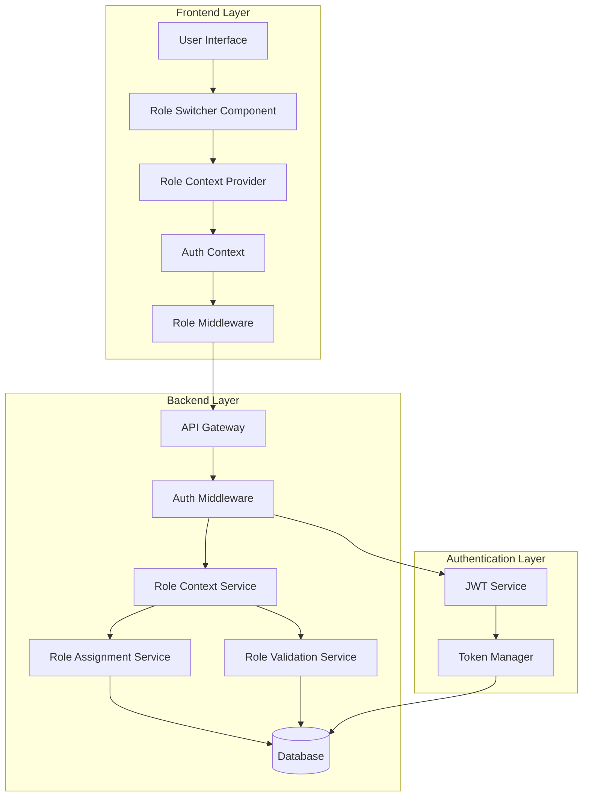

# Design Document: Role Switching and Multi-Role Support

## Overview

This design implements a dual-role system for the Cohortle platform that allows users to hold both Learner and Convener roles simultaneously. Users can switch between "Learner Mode" and "Convener Mode" through a role switcher UI component, enabling them to both create programmes (as conveners) and participate in other programmes (as learners) using a single account.

The system will:
1. Support multiple active role assignments per user (Learner + Convener)
2. Provide a role switcher UI component for toggling between role contexts
3. Maintain separate dashboards and interfaces for each role mode
4. Preserve learner identity and programme history when users are upgraded to convener
5. Update JWT tokens to include active role context
6. Implement role-aware routing and access control based on active role
7. Provide seamless migration for existing single-role users
8. Maintain audit trails for role assignments and context switches

## Architecture

### System Architecture Diagram



### Key Components

1. **Role Context Service (Backend)**: Manages active role context and role switching logic
2. **Enhanced Role Assignment Service (Backend)**: Extended to support multiple active role assignments
3. **Role Switcher Component (Frontend)**: UI component for toggling between role modes
4. **Enhanced Role Context Provider (Frontend)**: Extended to manage active role state
5. **Enhanced JWT Service (Backend)**: Updated to include active role in token payload
6. **Role-Aware Middleware (Frontend/Backend)**: Validates access based on active role context

### Data Flow

1. **Login Flow**: User logs in → System loads all assigned roles → Sets default active role → Issues JWT with active role → Redirects to appropriate dashboard
2. **Role Switch Flow**: User clicks role switcher → Selects new role → System validates role assignment → Updates active role in database → Issues new JWT → Redirects to new dashboard
3. **Access Control Flow**: User accesses resource → Middleware extracts active role from JWT → Validates permissions for active role → Grants/denies access
4. **Role Upgrade Flow**: Admin upgrades learner to convener → System adds convener role assignment → Preserves learner role assignment → Sets convener as default active role → Notifies user

## Components and Interfaces

### Backend Components

#### 1. Role Context Service (New)
```javascript
class RoleContextService {
  /**
   * Get user's active role context
   * @param {number} userId - User ID
   * @returns {Promise<string>} - Active role name
   */
  async getActiveRole(userId) {}

  /**
   * Switch user's active role
   * @param {number} userId - User ID
   * @param {string} newActiveRole - New active role name
   * @returns {Promise<object>} - Switch result with new JWT token
   */
  async switchActiveRole(userId, newActiveRole) {}

  /**
   * Get all assigned roles for user
   * @param {number} userId - User ID
   * @returns {Promise<Array<string>>} - Array of assigned role names
   */
  async getUserRoles(userId) {}

  /**
   * Set default active role for user
   * @param {number} userId - User ID
   * @param {string} roleName - Role to set as default
   * @returns {Promise<boolean>} - Success status
   */
  async setDefaultActiveRole(userId, roleName) {}

  /**
   * Validate role switch request
   * @param {number} userId - User ID
   * @param {string} targetRole - Target role to switch to
   * @returns {Promise<boolean>} - True if switch is valid
   */
  async validateRoleSwitch(userId, targetRole) {}
}
```

#### 2. Enhanced Role Assignment Service
```javascript
class RoleAssignmentService {
  /**
   * Assign additional role to user (for dual-role support)
   * @param {number} userId - User ID
   * @param {string} roleName - Role to add
   * @param {number} assignedBy - Admin ID
   * @param {object} options - Additional options
   * @returns {Promise<object>} - Assignment result
   */
  async addRole(userId, roleName, assignedBy, options = {}) {}

  /**
   * Get all active role assignments for user
   * @param {number} userId - User ID
   * @returns {Promise<Array<object>>} - Array of active assignments
   */
  async getActiveAssignments(userId) {}

  /**
   * Upgrade learner to convener (adds convener role, keeps learner role)
   * @param {number} userId - User ID
   * @param {number} upgradedBy - Admin ID
   * @param {object} options - Additional options
   * @returns {Promise<object>} - Upgrade result
   */
  async upgradeToConvener(userId, upgradedBy, options = {}) {}

  /**
   * Check if user has specific role assigned
   * @param {number} userId - User ID
   * @param {string} roleName - Role name to check
   * @returns {Promise<boolean>} - True if user has role
   */
  async hasRole(userId, roleName) {}
}
```

#### 3. Enhanced JWT Service
```javascript
class JwtService {
  /**
   * Generate JWT token with active role context
   * @param {object} user - User object
   * @param {string} activeRole - Active role name
   * @param {Array<string>} assignedRoles - All assigned roles
   * @returns {string} - JWT token
   */
  generateToken(user, activeRole, assignedRoles) {}

  /**
   * Decode and validate JWT token
   * @param {string} token - JWT token
   * @returns {object} - Decoded payload with active role
   */
  verifyToken(token) {}

  /**
   * Refresh JWT token with new active role
   * @param {string} oldToken - Current JWT token
   * @param {string} newActiveRole - New active role
   * @returns {string} - New JWT token
   */
  refreshTokenWithRole(oldToken, newActiveRole) {}
}
```

### Frontend Components

#### 1. Role Switcher Component
```typescript
interface RoleSwitcherProps {
  className?: string;
  showLabel?: boolean;
}

/**
 * Role Switcher Component
 * Displays current active role and allows switching between assigned roles
 */
export function RoleSwitcher({ className, showLabel }: RoleSwitcherProps) {
  const { user, activeRole, assignedRoles, switchRole, isSwitching } = useRoleContext();
  
  // Only show if user has multiple roles
  if (!assignedRoles || assignedRoles.length <= 1) {
    return null;
  }
  
  return (
    <div className={className}>
      {showLabel && <span>Mode:</span>}
      <Dropdown>
        <DropdownTrigger>
          <Button variant="ghost">
            {getRoleLabel(activeRole)}
            <ChevronDown />
          </Button>
        </DropdownTrigger>
        <DropdownContent>
          {assignedRoles.map(role => (
            <DropdownItem
              key={role}
              onClick={() => switchRole(role)}
              disabled={role === activeRole || isSwitching}
            >
              {getRoleLabel(role)}
              {role === activeRole && <Check />}
            </DropdownItem>
          ))}
        </DropdownContent>
      </Dropdown>
    </div>
  );
}
```

#### 2. Enhanced Role Context Provider
```typescript
interface RoleContextType {
  userRole: string | null; // Deprecated: use activeRole
  activeRole: string | null;
  assignedRoles: string[];
  permissions: string[];
  hasRole: (role: string | string[]) => boolean;
  hasActiveRole: (role: string | string[]) => boolean;
  hasPermission: (permission: string | string[]) => boolean;
  canPerformAction: (action: string, resource?: any) => Promise<boolean>;
  switchRole: (newRole: string) => Promise<void>;
  isSwitching: boolean;
  isLoading: boolean;
}

export function RoleProvider({ children }: RoleProviderProps) {
  const { user } = useAuth();
  const [activeRole, setActiveRole] = useState<string | null>(null);
  const [assignedRoles, setAssignedRoles] = useState<string[]>([]);
  const [isSwitching, setIsSwitching] = useState(false);
  
  // Load user's roles and active role on mount
  useEffect(() => {
    if (user) {
      loadUserRoles();
    }
  }, [user]);
  
  const loadUserRoles = async () => {
    // Fetch assigned roles and active role from API
    const response = await fetch('/api/proxy/v1/api/users/me/roles');
    const data = await response.json();
    setAssignedRoles(data.assignedRoles);
    setActiveRole(data.activeRole);
  };
  
  const switchRole = async (newRole: string) => {
    setIsSwitching(true);
    try {
      // Call API to switch role
      const response = await fetch('/api/proxy/v1/api/users/me/switch-role', {
        method: 'POST',
        headers: { 'Content-Type': 'application/json' },
        body: JSON.stringify({ newRole })
      });
      
      if (response.ok) {
        const data = await response.json();
        setActiveRole(newRole);
        
        // Redirect to appropriate dashboard
        const dashboardUrl = newRole === 'convener' 
          ? '/convener/dashboard' 
          : '/dashboard';
        window.location.href = dashboardUrl;
      }
    } finally {
      setIsSwitching(false);
    }
  };
  
  const hasActiveRole = (role: string | string[]): boolean => {
    if (!activeRole) return false;
    const roles = Array.isArray(role) ? role : [role];
    return roles.includes(activeRole);
  };
  
  // ... rest of implementation
}
```

#### 3. Role Mode Indicator Component
```typescript
/**
 * Role Mode Indicator
 * Displays current role mode with visual styling
 */
export function RoleModeIndicator() {
  const { activeRole } = useRoleContext();
  
  if (!activeRole) return null;
  
  const modeConfig = {
    learner: {
      label: 'Learner Mode',
      icon: <BookOpen />,
      color: 'blue'
    },
    convener: {
      label: 'Convener Mode',
      icon: <Users />,
      color: 'purple'
    },
    administrator: {
      label: 'Admin Mode',
      icon: <Shield />,
      color: 'red'
    }
  };
  
  const config = modeConfig[activeRole] || modeConfig.learner;
  
  return (
    <div className={`role-mode-indicator role-mode-${config.color}`}>
      {config.icon}
      <span>{config.label}</span>
    </div>
  );
}
```

### API Interfaces

#### 1. Role Context API
```
GET    /api/users/me/roles              - Get user's assigned roles and active role
POST   /api/users/me/switch-role        - Switch active role
PUT    /api/users/me/default-role       - Set default active role
GET    /api/users/:id/roles             - Get user's roles (admin only)
POST   /api/users/:id/add-role          - Add role to user (admin only)
POST   /api/users/:id/upgrade-convener  - Upgrade learner to convener (admin only)
```

#### 2. Role Context Switch Logging API
```
GET    /api/users/:id/role-switches     - Get role switch history
POST   /api/users/me/role-switches      - Log role switch (internal)
```

## Data Models

### 1. Enhanced User Role Assignment Model
```javascript
{
  assignment_id: 'uuid',
  user_id: 'uuid',
  role_id: 'uuid',
  assigned_by: 'uuid',
  assigned_at: 'timestamp',
  effective_from: 'timestamp',
  effective_until: 'timestamp|null',
  status: 'string', // 'active', 'inactive'
  is_default: 'boolean', // NEW: Indicates default active role
  notes: 'string|null'
}
```

### 2. Role Context Switch History Model (New)
```javascript
{
  switch_id: 'uuid',
  user_id: 'uuid',
  from_role_id: 'uuid',
  to_role_id: 'uuid',
  switched_at: 'timestamp',
  session_id: 'string|null', // Optional session tracking
  ip_address: 'string|null', // Optional security tracking
  user_agent: 'string|null' // Optional device tracking
}
```

### 3. Enhanced JWT Payload
```javascript
{
  user_id: 'uuid',
  email: 'string',
  active_role: 'string', // NEW: Currently active role
  assigned_roles: ['array_of_strings'], // NEW: All assigned roles
  permissions: ['array_of_strings'], // Permissions for active role
  role_assignment_ids: ['array_of_uuids'], // NEW: All active assignment IDs
  iat: 'number',
  exp: 'number'
}
```

### 4. Enhanced Users Table
```javascript
{
  id: 'uuid',
  email: 'string',
  // ... existing fields ...
  role_id: 'uuid', // Deprecated: kept for backward compatibility
  active_role_id: 'uuid', // NEW: Current active role
  default_role_id: 'uuid', // NEW: Default role for login
  // ... rest of fields ...
}
```

### Database Schema Updates

#### New Tables:
```sql
CREATE TABLE role_context_switches (
  switch_id UUID PRIMARY KEY DEFAULT gen_random_uuid(),
  user_id UUID REFERENCES users(id) ON DELETE CASCADE,
  from_role_id UUID REFERENCES roles(role_id),
  to_role_id UUID REFERENCES roles(role_id) NOT NULL,
  switched_at TIMESTAMP DEFAULT CURRENT_TIMESTAMP,
  session_id VARCHAR(255),
  ip_address VARCHAR(45),
  user_agent TEXT,
  INDEX idx_user_switches (user_id, switched_at DESC)
);
```

#### Updates to Existing Tables:
```sql
-- Add new columns to users table
ALTER TABLE users ADD COLUMN active_role_id UUID REFERENCES roles(role_id);
ALTER TABLE users ADD COLUMN default_role_id UUID REFERENCES roles(role_id);

-- Add new column to user_role_assignments table
ALTER TABLE user_role_assignments ADD COLUMN is_default BOOLEAN DEFAULT FALSE;

-- Remove unique constraint on user_id for active assignments
-- (to allow multiple active roles per user)
ALTER TABLE user_role_assignments 
  DROP CONSTRAINT IF EXISTS user_role_assignments_user_id_key;

-- Add new constraint: user can have at most one assignment per role type
CREATE UNIQUE INDEX idx_user_role_unique 
  ON user_role_assignments(user_id, role_id) 
  WHERE status = 'active';

-- Add index for active role lookups
CREATE INDEX idx_users_active_role ON users(active_role_id);
CREATE INDEX idx_users_default_role ON users(default_role_id);
```

### Migration Strategy

#### Phase 1: Schema Updates
```sql
-- Run schema updates (above)
-- Backfill active_role_id and default_role_id from existing role_id
UPDATE users 
SET active_role_id = role_id, 
    default_role_id = role_id 
WHERE role_id IS NOT NULL;
```

#### Phase 2: Convener User Migration
```sql
-- For existing convener users, add learner role assignment
INSERT INTO user_role_assignments (user_id, role_id, assigned_by, status, is_default)
SELECT 
  u.id,
  (SELECT role_id FROM roles WHERE name = 'learner'),
  u.id, -- Self-assigned during migration
  'active',
  FALSE -- Convener remains default
FROM users u
INNER JOIN roles r ON u.role_id = r.role_id
WHERE r.name = 'convener'
AND NOT EXISTS (
  SELECT 1 FROM user_role_assignments ura
  INNER JOIN roles r2 ON ura.role_id = r2.role_id
  WHERE ura.user_id = u.id AND r2.name = 'learner' AND ura.status = 'active'
);

-- Set is_default flag for existing convener assignments
UPDATE user_role_assignments ura
SET is_default = TRUE
FROM users u
INNER JOIN roles r ON ura.role_id = r.role_id
WHERE ura.user_id = u.id 
AND u.active_role_id = ura.role_id
AND r.name = 'convener';
```

#### Phase 3: Validation
```sql
-- Verify all users have at least one active role
SELECT COUNT(*) FROM users u
WHERE NOT EXISTS (
  SELECT 1 FROM user_role_assignments ura
  WHERE ura.user_id = u.id AND ura.status = 'active'
);
-- Should return 0

-- Verify all conveners have learner role
SELECT COUNT(*) FROM users u
INNER JOIN roles r ON u.active_role_id = r.role_id
WHERE r.name = 'convener'
AND NOT EXISTS (
  SELECT 1 FROM user_role_assignments ura
  INNER JOIN roles r2 ON ura.role_id = r2.role_id
  WHERE ura.user_id = u.id AND r2.name = 'learner' AND ura.status = 'active'
);
-- Should return 0
```

## Correctness Properties

*A property is a characteristic or behavior that should hold true across all valid executions of a system—essentially, a formal statement about what the system should do. Properties serve as the bridge between human-readable specifications and machine-verifiable correctness guarantees.*

Before writing the correctness properties, I need to analyze the acceptance criteria to determine which are testable as properties, examples, or edge cases.


## Property Reflection

After analyzing all acceptance criteria, I've identified the following redundancies and consolidations:

**Redundancies Identified:**
1. Properties 3.2, 3.3, 4.2, 4.3, 13.2, 13.3 all test feature access control based on active role - can be consolidated into one comprehensive property
2. Properties 2.4, 9.1, 9.2, 9.3 all test redirect behavior - can be consolidated
3. Properties 5.1, 5.2, 5.3, 5.4, 5.5 all test data preservation - can be consolidated into one property about learner identity persistence
4. Properties 6.1, 6.2, 6.3, 6.4, 6.5 all test convener-as-learner participation - can be consolidated
5. Properties 8.1, 8.2, 8.3, 8.5 all test JWT token handling - can be consolidated
6. Properties 1.1, 1.2, 1.5 all test dual-role assignment - can be consolidated
7. Properties 11.1, 11.2, 11.3, 11.4 all test migration correctness - can be consolidated
8. Properties 12.1, 12.2, 12.3 all test preference persistence - can be consolidated

**Consolidated Properties:**

### Property 1: Dual Role Assignment Integrity
*For any* user being upgraded from learner to convener, the system must retain the learner role assignment, store both role assignments with active status in the database, and set convener as the default active role.
**Validates: Requirements 1.1, 1.2, 1.3, 5.1, 5.2, 5.3, 5.5**

### Property 2: Role Assignment Constraints
*For any* user, the system must enforce that they can have at most one assignment of each role type (one learner, one convener), and when queried, must return all active role assignments.
**Validates: Requirements 1.4, 1.5**

### Property 3: Active Role Context Enforcement
*For any* user with multiple roles, when they are in a specific role mode (learner or convener), the system must grant access only to features appropriate for that active role, deny access to features exclusive to other roles, and validate all permissions based on the active role context.
**Validates: Requirements 3.2, 3.3, 4.2, 4.3, 9.4, 9.5, 13.1, 13.2, 13.3, 13.4**

### Property 4: Role Switch and Redirect Consistency
*For any* role switch operation, the system must update the active role context, issue a new JWT token with the updated active role, and redirect to the appropriate dashboard (learner dashboard for learner mode, convener dashboard for convener mode).
**Validates: Requirements 2.4, 2.5, 9.1, 9.2, 9.3**

### Property 5: Learner Identity Persistence
*For any* user being upgraded to convener or switching between roles, the system must preserve all learner data (programme enrollments, lesson completions, community participation history) and ensure this data remains accessible when in learner mode.
**Validates: Requirements 5.1, 5.2, 5.3, 5.4, 5.5**

### Property 6: Convener as Learner Participation
*For any* convener switching to learner mode, the system must allow them to join cohorts using enrollment codes, enroll them with only learner permissions for those programmes, and accumulate learner programme history independently of their convener role.
**Validates: Requirements 6.1, 6.2, 6.3, 6.4, 6.5**

### Property 7: JWT Token Role Consistency
*For any* authentication or role switch operation, the JWT token must include the active role, all assigned roles, and permissions for the active role, and when validated, the system must verify the active role matches one of the user's assigned roles.
**Validates: Requirements 8.1, 8.2, 8.3, 8.5**

### Property 8: Token Invalidation on Role Change
*For any* change to a user's role assignments (adding or removing roles), the system must invalidate all existing JWT tokens for that user and require re-authentication.
**Validates: Requirements 8.4**

### Property 9: Role Switcher Visibility
*For any* user, the role switcher component must be visible if and only if the user has multiple active role assignments.
**Validates: Requirements 2.2, 7.2**

### Property 10: Default Active Role Selection
*For any* user logging in with multiple roles, the system must set their active role to their stored preference if available, otherwise default to convener if assigned, otherwise learner.
**Validates: Requirements 2.1, 12.2, 12.4**

### Property 11: Role Switch Audit Trail
*For any* role assignment, upgrade, or context switch operation, the system must create an audit log entry with timestamp, user ID, administrator ID (if applicable), previous role, new role, and reason.
**Validates: Requirements 10.1, 10.2, 10.3, 10.4**

### Property 12: Migration Idempotency and Correctness
*For any* execution of the migration script, the system must ensure all existing learner-only users have learner role assignments, all existing convener users have both learner and convener role assignments with convener as default, all users have at least one role assignment, and running the migration multiple times produces the same result.
**Validates: Requirements 11.1, 11.2, 11.3, 11.4, 11.5**

### Property 13: Active Role Preference Persistence
*For any* role switch operation, the system must store the new active role as the user's preference in the database and load this preference on subsequent logins.
**Validates: Requirements 12.1, 12.2, 12.3, 12.5**

### Property 14: Administrator Full Access
*For any* administrator user, the system must grant access to all learner and convener features without requiring role switching, and must not display the role switcher component.
**Validates: Requirements 15.1, 15.3, 15.5**

### Property 15: Route Protection Middleware
*For any* protected route access attempt, the middleware must validate the user's active role and deny access if the active role lacks the required permissions.
**Validates: Requirements 13.5**

## Error Handling

### Error Categories

#### 1. Role Switch Validation Errors (400 Bad Request)
- **Cause**: User attempts to switch to a role they don't have assigned
- **Response**: HTTP 400 with clear error message
- **Example**: `{ "error": true, "message": "Cannot switch to role 'convener': Role not assigned to user", "code": "INVALID_ROLE_SWITCH", "assigned_roles": ["learner"] }`
- **Logging**: Application log with user ID and attempted role

#### 2. Duplicate Role Assignment Errors (409 Conflict)
- **Cause**: Attempt to assign a role the user already has
- **Response**: HTTP 409 with conflict details
- **Example**: `{ "error": true, "message": "User already has role 'learner' assigned", "code": "DUPLICATE_ROLE_ASSIGNMENT" }`
- **Logging**: Application log with user ID and role

#### 3. Token Validation Errors (401 Unauthorized)
- **Cause**: JWT token contains active role not in assigned roles
- **Response**: HTTP 401 with token error details
- **Example**: `{ "error": true, "message": "Active role in token does not match assigned roles", "code": "INVALID_ACTIVE_ROLE" }`
- **Logging**: Security audit log with user ID and token details

#### 4. Access Control Errors (403 Forbidden)
- **Cause**: User attempts to access feature not available in current active role
- **Response**: HTTP 403 with role context information
- **Example**: `{ "error": true, "message": "Feature not available in Learner Mode", "code": "ROLE_CONTEXT_DENIED", "active_role": "learner", "required_role": "convener", "suggestion": "Switch to Convener Mode to access this feature" }`
- **Logging**: Security audit log with user ID, active role, and attempted action

#### 5. Migration Errors (500 Internal Server Error)
- **Cause**: Migration script encounters data inconsistency
- **Response**: HTTP 500 with migration error details
- **Example**: `{ "error": true, "message": "Migration failed: User has no role assignments", "code": "MIGRATION_ERROR", "user_id": "123" }`
- **Logging**: Error log with full stack trace and affected user IDs

### Error Recovery Strategies

#### 1. Automatic Role Fallback
- When active role validation fails, automatically fall back to default role
- Example: If active role in token is invalid, set active role to user's default role

#### 2. Token Refresh on Role Mismatch
- When JWT token active role doesn't match database, automatically refresh token
- Implement silent token refresh to avoid disrupting user experience

#### 3. Graceful Degradation for Single-Role Users
- If role switcher fails to load, hide component and continue with current role
- Ensure core functionality works even if role switching is temporarily unavailable

#### 4. Migration Rollback
- If migration fails, provide rollback script to restore previous state
- Implement transaction-based migration to ensure atomicity

### Error Response Format

All error responses follow a consistent format:
```json
{
  "error": true,
  "message": "Human-readable error message",
  "code": "ERROR_CODE_FOR_PROGRAMMATIC_HANDLING",
  "details": {
    "active_role": "learner",
    "assigned_roles": ["learner", "convener"],
    "suggestion": "Switch to Convener Mode to access this feature"
  },
  "timestamp": "2024-01-15T10:30:00Z"
}
```

## Testing Strategy

### Dual Testing Approach

The system employs a comprehensive testing strategy combining both unit tests and property-based tests:

1. **Unit Tests**: Verify specific examples, edge cases, and error conditions
2. **Property Tests**: Verify universal properties across all inputs through randomization

Both approaches are complementary and necessary for comprehensive coverage.

### Test Categories

#### 1. Unit Tests (Specific Examples)

**Role Assignment Unit Tests:**
- Test specific dual-role assignment scenarios
- Verify error messages for duplicate role assignments
- Test edge cases (null roles, invalid role names)
- Test single-role to dual-role upgrade

**Role Switch Unit Tests:**
- Test specific role switch scenarios (learner to convener, convener to learner)
- Verify redirect URLs for each role
- Test role switch with invalid target role
- Test role switch for single-role users (should fail)

**JWT Token Unit Tests:**
- Test token generation with active role
- Test token validation with valid and invalid active roles
- Test token refresh on role switch
- Test token invalidation on role assignment change

**UI Component Unit Tests:**
- Test role switcher rendering for dual-role users
- Test role switcher hidden for single-role users
- Test role mode indicator displays correct mode
- Test dropdown shows correct available roles

#### 2. Property-Based Tests (Universal Properties)

**Property Test Configuration:**
- Minimum 100 iterations per property test
- Comprehensive input generation covering edge cases
- Clear counterexample reporting for failures

**Property Test Implementation:**

Each of the 15 consolidated properties should be implemented as a property-based test:

```javascript
// Example: Property 1 - Dual Role Assignment Integrity
describe('Dual Role Assignment Integrity Property', () => {
  it('should retain learner role when upgrading to convener', () => {
    fc.assert(
      fc.property(
        fc.record({
          userId: fc.uuid(),
          adminId: fc.uuid(),
          reason: fc.string()
        }),
        async (testCase) => {
          // Arrange: Create user with learner role
          const user = await createUserWithRole(testCase.userId, 'learner');
          await createProgrammeEnrollments(testCase.userId, 3);
          await createLessonCompletions(testCase.userId, 5);
          
          // Act: Upgrade to convener
          const result = await roleAssignmentService.upgradeToConvener(
            testCase.userId,
            testCase.adminId,
            { reason: testCase.reason }
          );
          
          // Assert: Both roles exist, convener is default
          const assignments = await roleAssignmentService.getActiveAssignments(testCase.userId);
          const roleNames = assignments.map(a => a.role.name);
          
          return result.success &&
                 roleNames.includes('learner') &&
                 roleNames.includes('convener') &&
                 assignments.every(a => a.status === 'active') &&
                 user.default_role_id === (await getRoleId('convener'));
        }
      ),
      { numRuns: 100 }
    );
  });
});

// Example: Property 3 - Active Role Context Enforcement
describe('Active Role Context Enforcement Property', () => {
  it('should enforce feature access based on active role', () => {
    fc.assert(
      fc.property(
        fc.record({
          userId: fc.uuid(),
          activeRole: fc.oneof(fc.constant('learner'), fc.constant('convener')),
          feature: fc.oneof(
            fc.constant('join_cohort'),
            fc.constant('create_programme'),
            fc.constant('view_lessons'),
            fc.constant('manage_cohorts')
          )
        }),
        async (testCase) => {
          // Arrange: Create dual-role user
          await createDualRoleUser(testCase.userId);
          await setActiveRole(testCase.userId, testCase.activeRole);
          
          // Define feature-role mapping
          const featureRoles = {
            'join_cohort': ['learner', 'convener'],
            'create_programme': ['convener'],
            'view_lessons': ['learner', 'convener'],
            'manage_cohorts': ['convener']
          };
          
          // Act: Attempt to access feature
          const canAccess = await roleValidationService.canPerformAction(
            testCase.userId,
            testCase.feature
          );
          
          // Assert: Access granted only if active role allows feature
          const expectedAccess = featureRoles[testCase.feature].includes(testCase.activeRole);
          return canAccess === expectedAccess;
        }
      ),
      { numRuns: 100 }
    );
  });
});

// Example: Property 7 - JWT Token Role Consistency
describe('JWT Token Role Consistency Property', () => {
  it('should include active role and assigned roles in JWT token', () => {
    fc.assert(
      fc.property(
        fc.record({
          userId: fc.uuid(),
          email: fc.emailAddress(),
          activeRole: fc.oneof(fc.constant('learner'), fc.constant('convener')),
          assignedRoles: fc.constant(['learner', 'convener'])
        }),
        async (testCase) => {
          // Arrange: Create user with roles
          const user = await createUserWithRoles(
            testCase.userId,
            testCase.email,
            testCase.assignedRoles
          );
          await setActiveRole(testCase.userId, testCase.activeRole);
          
          // Act: Generate JWT token
          const token = await jwtService.generateToken(
            user,
            testCase.activeRole,
            testCase.assignedRoles
          );
          
          // Assert: Token contains correct role information
          const decoded = await jwtService.verifyToken(token);
          
          return decoded.user_id === testCase.userId &&
                 decoded.active_role === testCase.activeRole &&
                 decoded.assigned_roles.length === testCase.assignedRoles.length &&
                 decoded.assigned_roles.every(r => testCase.assignedRoles.includes(r));
        }
      ),
      { numRuns: 100 }
    );
  });
});
```

### Testing Best Practices

1. **Unit tests focus on**:
   - Specific examples that demonstrate correct behavior
   - Integration points between components
   - Edge cases and error conditions
   - UI component rendering and interaction

2. **Property tests focus on**:
   - Universal properties that hold for all inputs
   - Comprehensive input coverage through randomization
   - Data integrity across operations
   - Consistency between related operations

3. **Test Organization**:
   - Group tests by feature area (role assignment, role switching, JWT tokens, UI components)
   - Use descriptive test names that reference requirements
   - Tag property tests with feature name and property number
   - Maintain separate test files for unit and property tests

4. **Test Data Management**:
   - Use factories for creating test users with various role configurations
   - Clean up test data after each test
   - Use transactions for database tests to ensure isolation
   - Generate realistic test data for property tests

## Implementation Notes

### Phase 1: Backend Infrastructure (Week 1)
1. Update database schema (add new tables and columns)
2. Implement Role Context Service
3. Extend Role Assignment Service for dual-role support
4. Update JWT Service to include active role
5. Implement migration script
6. Write backend unit and property tests

### Phase 2: Frontend Infrastructure (Week 2)
1. Update Role Context Provider
2. Implement Role Switcher Component
3. Implement Role Mode Indicator Component
4. Update authentication flow to handle active role
5. Write frontend unit and property tests

### Phase 3: Integration and Testing (Week 3)
1. Integrate role switcher into navigation
2. Update routing logic for role-aware redirects
3. Update access control middleware
4. End-to-end testing of role switching flow
5. Performance testing with dual-role users

### Phase 4: Migration and Deployment (Week 4)
1. Run migration script on staging environment
2. Validate migration results
3. Deploy to production
4. Monitor for issues
5. Provide user communication and documentation

### Security Considerations

1. **Token Security**: Ensure JWT tokens are properly signed and validated
2. **Role Validation**: Always validate active role against assigned roles on every request
3. **Audit Logging**: Log all role switches and assignment changes for security monitoring
4. **Permission Isolation**: Ensure conveners enrolled as learners don't get elevated permissions
5. **Token Invalidation**: Properly invalidate tokens when role assignments change

### Performance Considerations

1. **Database Queries**: Optimize queries for fetching user roles (use indexes on active_role_id)
2. **Token Size**: Keep JWT token size reasonable (don't include excessive role data)
3. **Caching**: Cache user role assignments to reduce database queries
4. **Role Switch Speed**: Optimize role switch operation to complete in <500ms
5. **Migration Performance**: Ensure migration script can handle large user bases efficiently

### Backward Compatibility

1. **Deprecated Fields**: Keep `role_id` field in users table for backward compatibility
2. **API Versioning**: Maintain v1 API endpoints that work with single-role model
3. **Gradual Migration**: Allow gradual rollout of dual-role feature
4. **Fallback Logic**: Provide fallback to single-role behavior if dual-role fails
5. **Documentation**: Clearly document breaking changes and migration path
