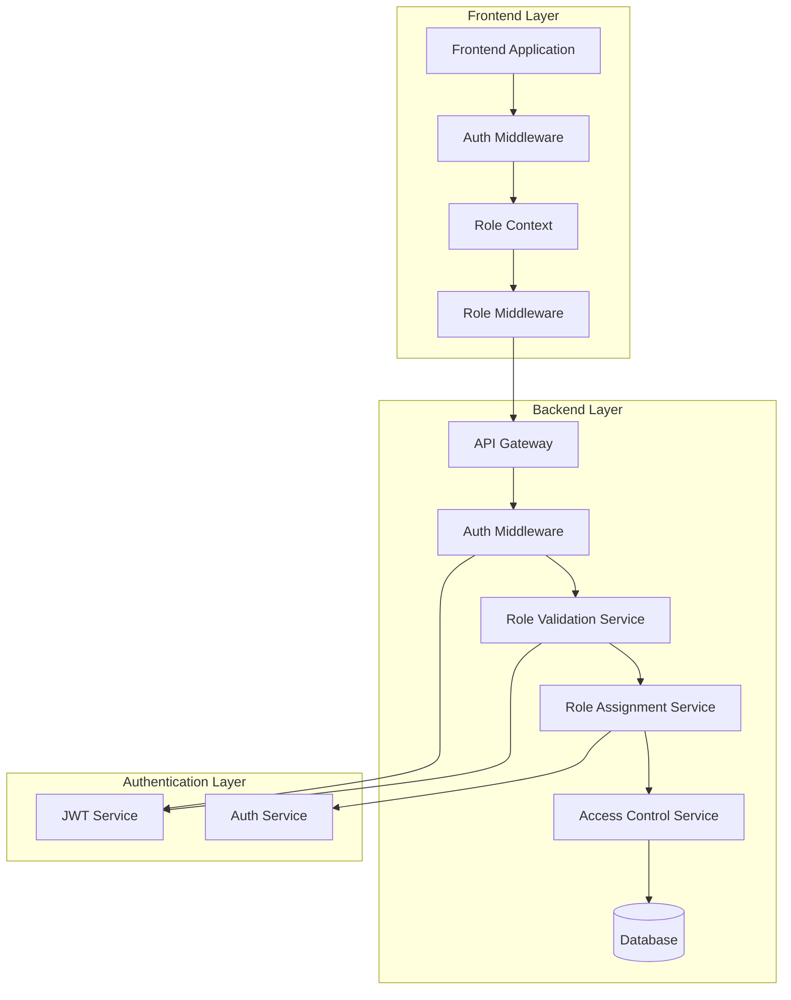

# Design Document: Role Validation and Assignment Logic

## Overview

This design implements a comprehensive role validation and assignment system for the Cohortle platform. Cohortle is infrastructure for running cohort-based programmes such as fellowships, incubators, bootcamps, NGO training programmes, and leadership development cohorts. The system provides robust role management, validation, and access control that aligns with programme operations rather than just course content delivery.

The system will:
1. Define and manage user roles (Learner, Convener, Administrator)
2. Assign Learner role by default to all new users
3. Provide admin-controlled role upgrades (Learner → Convener)
4. Validate roles during user actions and resource access
5. Integrate seamlessly with existing JWT-based authentication
6. Enforce access control at both route and resource levels
7. Support programme lifecycle states (Draft, Recruiting, Active, Completed, Archived)
8. Separate role assignment logic from cohort enrollment logic
9. Maintain persistent learner identity across programmes
10. Prepare architecture for future learner application workflows

## Core Architectural Principles

### 1. Programme-Centric Hierarchy
The system enforces this core structure:
```
Programme → Cohort → Learners
```

- **Programme**: Defines learning structure and content
- **Cohort**: Specific run of a programme with a group of learners
- **Learners**: Participants with persistent platform identity

### 2. Role Assignment vs. Enrollment
**Critical Separation:**
- **Role Assignment**: System-level access control (Learner, Convener, Admin)
  - Managed by administrators
  - NOT assigned via invitation codes
  - Persistent across programmes
  
- **Cohort Enrollment**: Programme-specific participation
  - Uses enrollment codes
  - Validates against cohort entity only
  - Learners join specific cohorts

### 3. Learner Identity Model
Learners have persistent platform identity that accumulates programme history:
```
Learner Profile
├── Programmes Completed
│   ├── WECARE Leadership Programme
│   ├── Startup Zaria Incubator
│   └── Digital Skills Fellowship
├── Current Enrollments
└── Learning Portfolio
```

### 4. Future Organisation Layer
The system is designed to support future organisation structure:
```
Organisation → Programmes → Cohorts → Learners
```
Currently, a convener effectively represents a single organisation. The architecture remains flexible for this future enhancement without major refactoring.

## Architecture

### System Architecture Diagram



### Key Components

1. **Role Validation Service (Backend)**: Central service for validating user roles against actions and resources
2. **Role Assignment Service (Backend)**: Manages role assignment, modification, and validation
3. **Access Control Service (Backend)**: Enforces role-based permissions at resource level
4. **Role Context (Frontend)**: React context providing role information and validation utilities
5. **Role Middleware (Frontend)**: Next.js middleware for route-level role validation
6. **Role-Aware Auth Middleware (Backend)**: Enhanced authentication middleware with role validation

### Data Flow

1. **Authentication Flow**: User logs in → JWT token generated with role claim → Token stored in httpOnly cookie
2. **Role Validation Flow**: Request made → Middleware extracts role from JWT → Role validated against required permissions → Access granted/denied
3. **Role Assignment Flow**: Admin assigns role → System validates assignment → Role updated in database → JWT token refreshed if needed
4. **Access Control Flow**: User accesses resource → System checks user role → System verifies role has required permissions → Resource returned or access denied

## Components and Interfaces

### Backend Components

#### 1. Role Validation Service
```javascript
class RoleValidationService {
  /**
   * Validate if a user can perform an action
   * @param {string} userId - User ID
   * @param {string} action - Action to perform
   * @param {object} resource - Resource being accessed (optional)
   * @returns {boolean} - True if user can perform action
   */
  async canPerformAction(userId, action, resource = null) {}

  /**
   * Get user's role
   * @param {string} userId - User ID
   * @returns {string} - User's role
   */
  async getUserRole(userId) {}

  /**
   * Validate role transition
   * @param {string} currentRole - Current role
   * @param {string} newRole - New role
   * @param {string} adminId - Admin making the change
   * @returns {boolean} - True if transition is valid
   */
  async validateRoleTransition(currentRole, newRole, adminId) {}
}
```

#### 2. Role Assignment Service
```javascript
class RoleAssignmentService {
  /**
   * Assign role to user
   * @param {string} userId - User ID
   * @param {string} role - Role to assign
   * @param {string} assignedBy - Admin ID making assignment
   * @returns {object} - Assignment result
   */
  async assignRole(userId, role, assignedBy) {}

  /**
   * Update user role
   * @param {string} userId - User ID
   * @param {string} newRole - New role
   * @param {string} updatedBy - Admin ID making update
   * @returns {object} - Update result
   */
  async updateUserRole(userId, newRole, updatedBy) {}

  /**
   * Get role assignment history
   * @param {string} userId - User ID
   * @returns {Array} - Role assignment history
   */
  async getRoleAssignmentHistory(userId) {}
}
```

#### 3. Access Control Service
```javascript
class AccessControlService {
  /**
   * Check if user can access resource
   * @param {string} userId - User ID
   * @param {string} resourceType - Type of resource
   * @param {string} resourceId - Resource ID
   * @param {string} action - Action being performed
   * @returns {boolean} - True if access granted
   */
  async canAccessResource(userId, resourceType, resourceId, action) {}

  /**
   * Get user permissions
   * @param {string} userId - User ID
   * @returns {Array} - List of permissions
   */
  async getUserPermissions(userId) {}

  /**
   * Validate resource ownership
   * @param {string} userId - User ID
   * @param {string} resourceType - Type of resource
   * @param {string} resourceId - Resource ID
   * @returns {boolean} - True if user owns resource
   */
  async validateResourceOwnership(userId, resourceType, resourceId) {}
}
```

### Frontend Components

#### 1. Role Context
```typescript
interface RoleContextType {
  userRole: string | null;
  hasRole: (role: string) => boolean;
  hasPermission: (permission: string) => boolean;
  canPerformAction: (action: string, resource?: any) => Promise<boolean>;
  isLoading: boolean;
}

// Usage in components:
const { hasRole, canPerformAction } = useRole();
if (hasRole('convener')) {
  // Show convener features
}
```

#### 2. Role-Aware Components
- `RoleGuard`: Component that conditionally renders children based on role
- `PermissionGuard`: Component that conditionally renders based on permissions
- `RoleRedirect`: Component that redirects based on user role

#### 3. Role Middleware
Enhanced Next.js middleware that validates roles at route level:
```typescript
// Extended middleware with role validation
const roleMiddleware = (request: NextRequest, requiredRole: string) => {
  const token = extractToken(request);
  const role = decodeRoleFromToken(token);
  
  if (!hasRequiredRole(role, requiredRole)) {
    return NextResponse.redirect('/unauthorized');
  }
  
  return NextResponse.next();
};
```

### API Interfaces

#### 1. Role Management API
```
GET    /api/roles                    - List all roles and permissions
GET    /api/users/:id/role           - Get user's role
PUT    /api/users/:id/role           - Update user's role
GET    /api/users/with-role/:role    - List users with specific role
POST   /api/roles/:role/permissions  - Add permission to role
DELETE /api/roles/:role/permissions  - Remove permission from role
```

#### 2. Role Validation API
```
POST   /api/validate/role            - Validate if user can perform action
GET    /api/permissions              - Get user's permissions
POST   /api/validate/access          - Validate resource access
```

## Data Models

### 1. Role Definition Model
```javascript
{
  role_id: 'uuid',
  name: 'string', // 'learner', 'convener', 'administrator'
  description: 'string',
  permissions: ['array_of_strings'], // ['create_programme', 'manage_users', ...]
  hierarchy_level: 'number', // 1: learner, 2: convener, 3: administrator
  created_at: 'timestamp',
  updated_at: 'timestamp'
}
```

**Note**: Role names updated to reflect programme-centric terminology:
- `student` → `learner` (emphasizes persistent identity across programmes)
- Convener and Administrator remain unchanged

### 2. User Role Assignment Model
```javascript
{
  assignment_id: 'uuid',
  user_id: 'uuid',
  role_id: 'uuid',
  assigned_by: 'uuid', // Admin who assigned the role
  assigned_at: 'timestamp',
  effective_from: 'timestamp',
  effective_until: 'timestamp|null', // For temporary role assignments
  status: 'string', // 'active', 'inactive', 'pending'
  notes: 'string|null'
}
```

### 3. Role Assignment History Model
```javascript
{
  history_id: 'uuid',
  user_id: 'uuid',
  previous_role_id: 'uuid|null',
  new_role_id: 'uuid',
  changed_by: 'uuid',
  changed_at: 'timestamp',
  reason: 'string|null',
  metadata: 'json' // Additional context about the change
}
```

### 4. Permission Model
```javascript
{
  permission_id: 'uuid',
  name: 'string', // e.g., 'create_programme'
  description: 'string',
  resource_type: 'string', // 'programme', 'user', 'cohort', etc.
  action: 'string', // 'create', 'read', 'update', 'delete', 'manage'
  scope: 'string', // 'own', 'all', 'assigned'
  created_at: 'timestamp'
}
```

### 5. Role-Permission Mapping Model
```javascript
{
  mapping_id: 'uuid',
  role_id: 'uuid',
  permission_id: 'uuid',
  granted_at: 'timestamp',
  granted_by: 'uuid'
}
```

### 6. Enhanced JWT Payload
```javascript
{
  user_id: 'uuid',
  email: 'string',
  role: 'string', // Current role ('learner', 'convener', 'administrator')
  permissions: ['array_of_strings'], // User's permissions
  role_assignment_id: 'uuid', // Current role assignment ID
  iat: 'number', // Issued at
  exp: 'number' // Expiration
}
```

### 7. Programme Lifecycle Model (New)
```javascript
{
  programme_id: 'uuid',
  lifecycle_status: 'string', // 'draft', 'recruiting', 'active', 'completed', 'archived'
  status_changed_at: 'timestamp',
  status_changed_by: 'uuid', // Convener or admin who changed status
  onboarding_mode: 'string', // 'code' (join with code) or 'application' (apply to join)
  created_at: 'timestamp',
  updated_at: 'timestamp'
}
```

**Lifecycle States:**
- **Draft**: Programme structure being created, full editing allowed
- **Recruiting**: Learners can apply or join cohorts
- **Active**: Programme running, structural changes restricted
- **Completed**: Programme finished, read-only for learners
- **Archived**: Programme retained for history, read-only

**Onboarding Modes:**
- **code**: Learners join directly with enrollment code
- **application**: Learners submit application for convener review (future feature)

### Database Schema Updates

#### New Tables:
```sql
CREATE TABLE roles (
  role_id UUID PRIMARY KEY DEFAULT gen_random_uuid(),
  name VARCHAR(50) UNIQUE NOT NULL,
  description TEXT,
  hierarchy_level INTEGER NOT NULL DEFAULT 1,
  created_at TIMESTAMP DEFAULT CURRENT_TIMESTAMP,
  updated_at TIMESTAMP DEFAULT CURRENT_TIMESTAMP
);

CREATE TABLE permissions (
  permission_id UUID PRIMARY KEY DEFAULT gen_random_uuid(),
  name VARCHAR(100) UNIQUE NOT NULL,
  description TEXT,
  resource_type VARCHAR(50) NOT NULL,
  action VARCHAR(50) NOT NULL,
  scope VARCHAR(20) NOT NULL DEFAULT 'own',
  created_at TIMESTAMP DEFAULT CURRENT_TIMESTAMP
);

CREATE TABLE role_permissions (
  mapping_id UUID PRIMARY KEY DEFAULT gen_random_uuid(),
  role_id UUID REFERENCES roles(role_id) ON DELETE CASCADE,
  permission_id UUID REFERENCES permissions(permission_id) ON DELETE CASCADE,
  granted_at TIMESTAMP DEFAULT CURRENT_TIMESTAMP,
  granted_by UUID REFERENCES users(id),
  UNIQUE(role_id, permission_id)
);

CREATE TABLE user_role_assignments (
  assignment_id UUID PRIMARY KEY DEFAULT gen_random_uuid(),
  user_id UUID REFERENCES users(id) ON DELETE CASCADE,
  role_id UUID REFERENCES roles(role_id) ON DELETE CASCADE,
  assigned_by UUID REFERENCES users(id),
  assigned_at TIMESTAMP DEFAULT CURRENT_TIMESTAMP,
  effective_from TIMESTAMP DEFAULT CURRENT_TIMESTAMP,
  effective_until TIMESTAMP,
  status VARCHAR(20) DEFAULT 'active',
  notes TEXT,
  UNIQUE(user_id) WHERE status = 'active' -- One active role per user
);

CREATE TABLE role_assignment_history (
  history_id UUID PRIMARY KEY DEFAULT gen_random_uuid(),
  user_id UUID REFERENCES users(id) ON DELETE CASCADE,
  previous_role_id UUID REFERENCES roles(role_id),
  new_role_id UUID REFERENCES roles(role_id) NOT NULL,
  changed_by UUID REFERENCES users(id) NOT NULL,
  changed_at TIMESTAMP DEFAULT CURRENT_TIMESTAMP,
  reason TEXT,
  metadata JSONB
);
```

#### Updates to Existing Tables:
```sql
-- Add role_id to users table (denormalized for performance)
ALTER TABLE users ADD COLUMN role_id UUID REFERENCES roles(role_id);

-- Add programme lifecycle fields
ALTER TABLE programmes ADD COLUMN lifecycle_status VARCHAR(20) DEFAULT 'draft';
ALTER TABLE programmes ADD COLUMN status_changed_at TIMESTAMP DEFAULT CURRENT_TIMESTAMP;
ALTER TABLE programmes ADD COLUMN status_changed_by UUID REFERENCES users(id);
ALTER TABLE programmes ADD COLUMN onboarding_mode VARCHAR(20) DEFAULT 'code';

-- Add index for performance
CREATE INDEX idx_users_role_id ON users(role_id);
CREATE INDEX idx_user_role_assignments_user_id ON user_role_assignments(user_id);
CREATE INDEX idx_user_role_assignments_status ON user_role_assignments(status);
CREATE INDEX idx_role_assignment_history_user_id ON role_assignment_history(user_id);
CREATE INDEX idx_programmes_lifecycle_status ON programmes(lifecycle_status);

-- Add constraint for valid lifecycle statuses
ALTER TABLE programmes ADD CONSTRAINT chk_lifecycle_status 
  CHECK (lifecycle_status IN ('draft', 'recruiting', 'active', 'completed', 'archived'));

-- Add constraint for valid onboarding modes
ALTER TABLE programmes ADD CONSTRAINT chk_onboarding_mode 
  CHECK (onboarding_mode IN ('code', 'application'));
```

**Migration Notes:**
- Existing programmes will default to 'draft' status
- Existing programmes will default to 'code' onboarding mode
- Enrollment codes remain validated against cohort entity only

### Initial Data Population

#### Default Roles:
```sql
INSERT INTO roles (name, description, hierarchy_level) VALUES
  ('learner', 'Participant enrolled in programmes. Default role for all new users. Can join programmes, complete lessons, participate in community discussions, and build learning portfolio across multiple programmes. Identity persists across all programmes.', 1),
  ('convener', 'Programme creator and facilitator. Assigned by administrators. Can create and manage educational programmes, organize content, manage cohorts and enrollments, monitor programme analytics, and facilitate community discussions within their programmes.', 2),
  ('administrator', 'Platform governance role. Can assign or upgrade users to convener role, manage platform-level configurations, oversee all programmes and users, and handle platform governance.', 3);
```

**Note**: All new users are automatically assigned the 'learner' role. Convener access requires admin approval.

#### Default Permissions:
```sql
-- Learner permissions (default for all users)
INSERT INTO permissions (name, description, resource_type, action, scope) VALUES
  ('view_dashboard', 'View learner dashboard', 'dashboard', 'read', 'own'),
  ('join_cohort', 'Join cohorts using enrollment code', 'cohort', 'create', 'all'),
  ('view_lessons', 'View lesson content', 'lesson', 'read', 'enrolled'),
  ('complete_lessons', 'Mark lessons as complete', 'lesson', 'update', 'own'),
  ('participate_community', 'Participate in community discussions', 'community', 'create', 'enrolled'),
  ('build_portfolio', 'Accumulate learning history across programmes', 'profile', 'update', 'own');

-- Convener permissions (includes all learner permissions plus...)
INSERT INTO permissions (name, description, resource_type, action, scope) VALUES
  ('create_programme', 'Create new programmes', 'programme', 'create', 'all'),
  ('manage_cohorts', 'Manage programme cohorts', 'cohort', 'manage', 'own'),
  ('manage_lessons', 'Create and edit lessons', 'lesson', 'manage', 'own'),
  ('view_analytics', 'View programme analytics', 'analytics', 'read', 'own'),
  ('manage_enrollments', 'Manage programme enrollments', 'enrollment', 'manage', 'own'),
  ('manage_programme_lifecycle', 'Change programme lifecycle states', 'programme', 'update', 'own');

-- Administrator permissions (includes all permissions)
INSERT INTO permissions (name, description, resource_type, action, scope) VALUES
  ('manage_users', 'Manage all users', 'user', 'manage', 'all'),
  ('assign_roles', 'Assign and upgrade user roles', 'role', 'manage', 'all'),
  ('system_settings', 'Manage system settings', 'system', 'manage', 'all'),
  ('view_all_analytics', 'View all analytics', 'analytics', 'read', 'all'),
  ('manage_all_content', 'Manage all content', 'content', 'manage', 'all');
```

**Key Changes:**
- `enroll_programme` → `join_cohort` (clarifies cohort-level enrollment)
- Added `build_portfolio` permission for learners
- Added `manage_programme_lifecycle` for conveners
- Added `assign_roles` for administrators (separate from general user management)

#### Role-Permission Mappings:
```sql
-- Map permissions to roles based on hierarchy
-- Note: Higher-level roles inherit permissions from lower-level roles
```
## Correctness Properties

*A property is a characteristic or behavior that should hold true across all valid executions of a system—essentially, a formal statement about what the system should do. Properties serve as the bridge between human-readable specifications and machine-verifiable correctness guarantees.*

### Property-Based Testing Overview

Property-based testing (PBT) validates software correctness by testing universal properties across many generated inputs. Each property is a formal specification that should hold for all valid inputs.

### Core Principles

1. **Universal Quantification**: Every property must contain an explicit "for all" statement
2. **Requirements Traceability**: Each property must reference the requirements it validates
3. **Executable Specifications**: Properties must be implementable as automated tests
4. **Comprehensive Coverage**: Properties should cover all testable acceptance criteria

### Property Creation Process

Based on the prework analysis and property reflection, we have identified the following core properties that eliminate redundancy while maintaining comprehensive coverage:

#### Property 1: Role Definition Consistency
*For any* role definition in the system, if it specifies a hierarchy level, then all roles with higher hierarchy levels must inherit permissions from lower-level roles.
**Validates: Requirements 1.3**

#### Property 2: Role Assignment Validation
*For any* user registration attempt, the system must assign a role that is appropriate for the registration context (email domain, invitation code, or special process), and must reject invalid role assignment parameters with clear error messages.
**Validates: Requirements 2.1, 2.2, 2.3, 2.4, 2.5**

#### Property 3: Access Control Enforcement
*For any* user attempting to perform an action or access a resource, the system must validate that the user has the required role, and must return a "403 Forbidden" error with a clear message if the user lacks the required role.
**Validates: Requirements 3.1, 3.2, 3.3, 3.4, 3.5, 6.1, 6.2, 6.3**

#### Property 4: Role Transition Integrity
*For any* role change attempt, the system must validate that the administrator has permission to make the change, must properly revoke old permissions and grant new ones, must log the change with complete audit information, and must reject changes that would leave the system without any administrators.
**Validates: Requirements 4.1, 4.2, 4.3, 4.4**

#### Property 5: JWT Token Role Consistency
*For any* JWT token issued by the system, the token must include the user's current role, and when the token is validated, the system must extract and verify the role information. If role information in the token conflicts with database records, the system must revalidate and update the token if necessary.
**Validates: Requirements 5.1, 5.2, 5.4**

#### Property 6: Permission Inheritance
*For any* role with a higher hierarchy level than another role, the higher-level role must have at least all the permissions of the lower-level role.
**Validates: Requirements 1.3**

#### Property 7: Multi-Level Access Control
*For any* access control check in the system, the system must validate permissions at both the route level (for initial access) and the resource level (for specific operations on resources).
**Validates: Requirements 6.4**

#### Property 8: Role Management Authorization
*For any* call to role management API endpoints, the system must validate that the caller has the necessary permissions to perform the requested operation.
**Validates: Requirements 7.5**

#### Property 9: Error Handling Consistency
*For any* failed role validation, role assignment, or access attempt, the system must return appropriate error messages (clear "Insufficient permissions" for authorization failures, specific validation errors for invalid parameters) and must log all failures for security auditing.
**Validates: Requirements 8.1, 8.2, 8.5**

#### Property 10: Role Definition Modification Safety
*For any* modification to a role definition, the system must validate that existing user assignments remain valid with the modified role definition.
**Validates: Requirements 1.4**

### Property Implementation Notes

Each property should be implemented as a property-based test with the following characteristics:

1. **Minimum 100 iterations** per property test due to randomization
2. **Comprehensive input generation** covering edge cases and boundary conditions
3. **Clear failure reporting** with counterexamples that help diagnose issues
4. **Requirements traceability** through test annotations and documentation

### Example Property Test Implementation

```javascript
// Example: Property 3 - Access Control Enforcement
describe('Access Control Enforcement Property', () => {
  it('should validate user roles before allowing actions', () => {
    fc.assert(
      fc.property(
        fc.record({
          userId: fc.uuid(),
          userRole: fc.oneof(
            fc.constant('student'),
            fc.constant('convener'), 
            fc.constant('administrator')
          ),
          action: fc.oneof(
            fc.constant('access_convener_dashboard'),
            fc.constant('create_programme'),
            fc.constant('enroll_in_programme'),
            fc.constant('modify_system_settings')
          ),
          requiredRole: fc.oneof(
            fc.constant('convener'),
            fc.constant('administrator'),
            fc.constant('student')
          )
        }),
        async (testCase) => {
          // Arrange
          const { userId, userRole, action, requiredRole } = testCase;
          
          // Act
          const canPerform = await roleValidationService.canPerformAction(
            userId, 
            action, 
            { userRole }
          );
          
          // Assert
          const hasRequiredRole = userRole === requiredRole || 
            (requiredRole === 'convener' && userRole === 'administrator') ||
            (requiredRole === 'student' && (userRole === 'convener' || userRole === 'administrator'));
          
          return canPerform === hasRequiredRole;
        }
      ),
      { numRuns: 100 }
    );
  });
});
```
## Error Handling

### Error Categories

#### 1. Authorization Errors (403 Forbidden)
- **Cause**: User lacks required role or permissions
- **Response**: HTTP 403 with clear error message
- **Example**: `{ "error": true, "message": "Insufficient permissions. Required role: convener", "code": "ROLE_REQUIRED" }`
- **Logging**: Security audit log with user ID, attempted action, required role

#### 2. Role Assignment Errors (400 Bad Request)
- **Cause**: Invalid role assignment parameters
- **Response**: HTTP 400 with specific validation errors
- **Example**: `{ "error": true, "message": "Invalid role assignment", "details": { "role": "Role must be one of: student, convener, administrator" }, "code": "INVALID_ROLE_ASSIGNMENT" }`
- **Logging**: Application log with validation details

#### 3. Role Transition Errors (409 Conflict)
- **Cause**: Role change would violate system constraints
- **Response**: HTTP 409 with constraint violation details
- **Example**: `{ "error": true, "message": "Cannot change role: System would be left without administrators", "code": "ROLE_TRANSITION_VIOLATION" }`
- **Logging**: Security audit log with constraint details

#### 4. Token Validation Errors (401 Unauthorized)
- **Cause**: JWT token missing, expired, or with invalid role
- **Response**: HTTP 401 with token error details
- **Example**: `{ "error": true, "message": "Invalid or expired token", "code": "TOKEN_INVALID" }`
- **Logging**: Security audit log (without sensitive token data)

#### 5. Resource Access Errors (404 Not Found or 403 Forbidden)
- **Cause**: User cannot access specific resource due to role restrictions
- **Response**: HTTP 404 (to avoid information leakage) or 403 with resource-specific error
- **Example**: `{ "error": true, "message": "Resource not found or access denied", "code": "RESOURCE_ACCESS_DENIED" }`
- **Logging**: Security audit log with resource ID and access attempt

### Error Recovery Strategies

#### 1. Graceful Degradation
- When role validation fails for non-critical features, provide limited functionality
- Example: Student trying to access convener dashboard → Redirect to student dashboard with informative message

#### 2. Token Refresh
- When JWT token role conflicts with database → Automatically refresh token with updated role
- Implement silent token refresh to avoid disrupting user experience

#### 3. User Guidance
- Provide clear guidance on how to obtain required roles
- Example: "To access this feature, you need convener role. Contact an administrator or use a convener invitation code during registration."

#### 4. Audit Trail
- All authorization failures logged with complete context
- Enable security monitoring and anomaly detection

### Error Response Format

All error responses follow a consistent format:
```json
{
  "error": true,
  "message": "Human-readable error message",
  "code": "ERROR_CODE_FOR_PROGRAMMATIC_HANDLING",
  "details": {
    "required_role": "convener",
    "user_role": "student",
    "suggestion": "Contact an administrator to request convener role"
  },
  "timestamp": "2024-01-15T10:30:00Z"
}
```

## Testing Strategy

### Dual Testing Approach

The system employs a comprehensive testing strategy combining both unit tests and property-based tests:

1. **Unit Tests**: Verify specific examples, edge cases, and error conditions
2. **Property Tests**: Verify universal properties across all inputs through randomization

### Test Categories

#### 1. Unit Tests (Specific Examples)

**Role Validation Unit Tests:**
- Test specific role validation scenarios
- Verify error messages for unauthorized access
- Test edge cases (null roles, invalid role strings)

**Role Assignment Unit Tests:**
- Test specific registration scenarios (student email, convener code)
- Verify role assignment during user creation
- Test role modification by administrators

**API Endpoint Unit Tests:**
- Test each role management API endpoint
- Verify request validation and error responses
- Test authentication and authorization

#### 2. Property-Based Tests (Universal Properties)

**Property Test Configuration:**
- Minimum 100 iterations per property test
- Comprehensive input generation covering edge cases
- Clear counterexample reporting for failures

**Property Test Implementation:**
```javascript
// Property test for role inheritance
describe('Role Permission Inheritance Property', () => {
  it('should ensure higher-level roles inherit permissions from lower-level roles', () => {
    fc.assert(
      fc.property(
        fc.record({
          lowerRole: fc.record({
            name: fc.constant('student'),
            permissions: fc.array(fc.string({ minLength: 1 }), { minLength: 1 })
          }),
          higherRole: fc.record({
            name: fc.constant('convener'),
            permissions: fc.array(fc.string({ minLength: 1 }), { minLength: 1 })
          })
        }),
        (testCase) => {
          // Higher role should have all permissions of lower role
          const allLowerPermissionsInHigher = testCase.lowerRole.permissions.every(
            perm => testCase.higherRole.permissions.includes(perm)
          );
          return allLowerPermissionsInHigher;
        }
      ),
      { 
        numRuns: 100,
        examples: [
          // Edge case examples
          {
            lowerRole: { name: 'student', permissions: ['view_lessons'] },
            higherRole: { name: 'convener', permissions: ['view_lessons', 'create_programme'] }
          }
        ]
      }
    );
  });
});
```

#### 3. Integration Tests

**End-to-End Role Workflows:**
- Complete user registration with role assignment
- Role modification by administrators
- Access control across different user roles

**API Integration Tests:**
- Test complete API flows with authentication
- Verify role-based access to protected endpoints
- Test error handling and response formats

#### 4. Security Tests

**Authorization Bypass Tests:**
- Attempt to access protected resources without proper role
- Test role escalation attempts
- Verify proper error responses for unauthorized access

**Token Validation Tests:**
- Test JWT token role validation
- Verify token refresh when roles change
- Test token expiration and renewal

### Test Data Management

#### Test Data Generation
- Use property-based testing libraries for comprehensive input generation
- Generate realistic test scenarios covering all role combinations
- Include edge cases and boundary conditions

#### Test Fixtures
- Predefined test users with different roles
- Test programmes and resources for access control testing
- Mock authentication tokens for testing

### Test Execution Strategy

#### 1. Development Testing
- Run unit tests on every code change
- Run property tests during feature development
- Continuous integration with automated test execution

#### 2. Regression Testing
- Comprehensive test suite run before releases
- Property tests to catch regressions in universal properties
- Integration tests to verify end-to-end functionality

#### 3. Performance Testing
- Load testing for role validation endpoints
- Performance testing for JWT token validation with roles
- Scalability testing for role-based access control

### Test Coverage Goals

#### Code Coverage:
- 90%+ line coverage for role validation logic
- 85%+ branch coverage for access control decisions
- 100% coverage for security-critical code paths

#### Requirement Coverage:
- All testable acceptance criteria covered by tests
- Each property test maps to specific requirements
- Comprehensive negative test cases for error conditions

### Test Environment

#### Development Environment:
- Local database with test data
- Mock authentication services
- Isolated test execution

#### CI/CD Environment:
- Automated test execution on pull requests
- Test result reporting and analysis
- Coverage reporting and requirements traceability

#### Production-like Environment:
- Integration testing with production-like configuration
- Performance and load testing
- Security penetration testing

### Test Maintenance

#### Test Documentation:
- Clear documentation of test purposes and scenarios
- Requirements traceability matrix
- Test data management guidelines

#### Test Refactoring:
- Regular review and refactoring of test code
- Update tests when requirements change
- Maintain test readability and maintainability

### Testing Tools and Libraries

#### Backend (Node.js):
- **Jest**: Unit testing framework
- **Fast-check**: Property-based testing library
- **Supertest**: API testing library
- **Jest-extended**: Additional Jest matchers

#### Frontend (TypeScript/React):
- **Jest**: Unit testing framework
- **React Testing Library**: Component testing
- **Fast-check**: Property-based testing
- **MSW**: Mock Service Worker for API mocking

#### Integration Testing:
- **Cypress**: End-to-end testing
- **Postman**: API testing and documentation
- **Newman**: Postman collection runner

### Test Tagging and Organization

#### Test Tags:
- `@unit`: Unit tests
- `@property`: Property-based tests  
- `@integration`: Integration tests
- `@security`: Security tests
- `@api`: API tests
- `@ui`: UI/component tests

#### Test Organization:
- Tests organized by feature/module
- Clear separation of unit, property, and integration tests
- Consistent naming conventions for test files

### Continuous Testing

#### CI/CD Pipeline:
- Automated test execution on code changes
- Test result reporting and notifications
- Quality gates based on test results

#### Test Reporting:
- Detailed test execution reports
- Coverage reports with requirements mapping
- Security test results and vulnerability reports

### Property-Based Testing Configuration

Each property test should be configured with:
```javascript
{
  numRuns: 100,                    // Minimum 100 iterations
  verbose: true,                   // Detailed output
  endOnFailure: false,            // Continue after failures
  examples: [/* edge cases */],   // Specific examples to test
  seed: Date.now(),               // Random seed for reproducibility
  path: "Feature: role-validation, Property: 3" // Requirements traceability
}
```