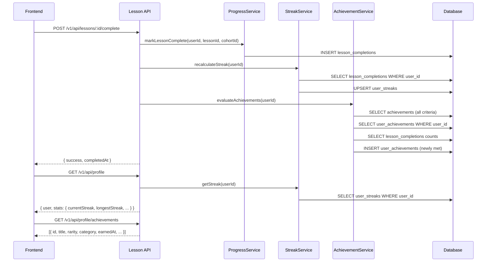

# Design Document: Streaks and Achievements

## Overview

This feature makes the streaks counter and achievements system fully functional end-to-end. The work falls into three areas:

1. **Streak calculation** — a new `StreakService` that computes consecutive-day streaks from `lesson_completions`, persists them in a new `user_streaks` table, and is called whenever a lesson is marked complete.
2. **Achievement system** — schema migrations to add `rarity` and `category` to the `achievements` table, a database seeder with default achievement definitions, and an `AchievementService` that evaluates criteria and awards badges automatically on lesson completion.
3. **Frontend wiring** — connecting the `LearnerNavBar`'s `StreakCounter` to real API data, and ensuring the profile page passes `rarity`/`category` fields through to the badge components.

No new API routes are needed. The existing `/v1/api/profile` and `/v1/api/profile/achievements` endpoints are updated to return real data, and the existing lesson completion endpoint is extended to trigger streak + achievement evaluation.

---

## Architecture



### Key Design Decisions

**Streak stored, not computed on read**: Streak values are computed on write (lesson completion) and stored in `user_streaks`. This keeps the profile GET fast — it's a single row lookup rather than a full aggregation over `lesson_completions`. The trade-off is that streaks are only updated when a lesson is completed, not on every profile load. This is acceptable because a streak can only change when a lesson is completed.

**Achievement evaluation is synchronous but fault-tolerant**: Achievement evaluation runs in the same request as lesson completion, after the streak update. Errors in achievement evaluation are caught and logged but do not fail the lesson completion response. This keeps the critical path (marking a lesson complete) reliable.

**No new API routes**: All data flows through existing endpoints. The lesson completion route gains two side-effect calls; the profile route reads from `user_streaks` instead of returning zeros.

---

## Components and Interfaces

### 1. `StreakService` (new — `cohortle-api/services/StreakService.js`)

```javascript
class StreakService {
  /**
   * Get stored streak values for a user.
   * Returns { currentStreak: 0, longestStreak: 0 } if no row exists.
   */
  async getStreak(userId) { ... }

  /**
   * Recompute streak from lesson_completions and persist to user_streaks.
   * Called after every lesson completion.
   */
  async recalculateStreak(userId) { ... }

  /**
   * Pure function: given an array of UTC date strings (YYYY-MM-DD),
   * compute { currentStreak, longestStreak }.
   * Exported separately for unit testing.
   */
  computeStreakFromDates(dates) { ... }
}
```

**`computeStreakFromDates` algorithm:**
1. Deduplicate dates and sort descending.
2. Determine "anchor" — today's UTC date. If today has a completion, start counting from today. If yesterday has a completion (but not today), start counting from yesterday. Otherwise `currentStreak = 0`.
3. Walk backwards from the anchor, incrementing `currentStreak` for each consecutive day present.
4. Walk the full sorted list to find the longest consecutive run for `longestStreak`.

### 2. `AchievementService` (new — `cohortle-api/services/AchievementService.js`)

```javascript
class AchievementService {
  /**
   * Evaluate all achievement criteria for a user and award any newly met achievements.
   * Errors are caught per-achievement and logged; they do not propagate.
   */
  async evaluateAchievements(userId) { ... }

  /**
   * Award a single achievement to a user (idempotent — uses findOrCreate).
   */
  async awardAchievement(userId, achievementId) { ... }

  /**
   * Pure function: given a criteria object and user stats, return true if met.
   * Exported separately for unit testing.
   */
  isCriteriaMet(criteria, stats) { ... }
}
```

**`isCriteriaMet` logic:**

```javascript
function isCriteriaMet(criteria, stats) {
  switch (criteria.type) {
    case 'first_lesson':       return stats.totalLessons >= 1;
    case 'lessons_completed':  return stats.totalLessons >= criteria.threshold;
    case 'streak_days':        return stats.currentStreak >= criteria.threshold;
    case 'programmes_completed': return stats.completedProgrammes >= criteria.threshold;
    case 'days_active':        return stats.distinctActiveDays >= criteria.threshold;
    default:                   return false;
  }
}
```

### 3. `ProfileService` updates

- `_calculateLearningStats(userId)`: replace hardcoded `currentStreak = 0` / `longestStreak = 0` with a call to `StreakService.getStreak(userId)`.

### 4. Lesson completion route update (`cohortle-api/routes/lesson.js` or equivalent)

After `ProgressService.markLessonComplete(...)` succeeds:
```javascript
// Fire-and-forget with error isolation
try {
  await StreakService.recalculateStreak(userId);
  await AchievementService.evaluateAchievements(userId);
} catch (err) {
  console.error('[LessonComplete] Post-completion side effects failed:', err);
  // Do not re-throw — lesson completion itself succeeded
}
```

### 5. `LearnerNavBar.tsx` update

Fetch profile data (already available via `useAuth` or a profile hook) and pass `currentStreak` to `StreakCounter`:

```tsx
// Replace hardcoded streakDays={0}
<StreakCounter streakDays={profile?.stats?.currentStreak ?? 0} />
```

The profile data is fetched on the profile page already. For the nav bar, a lightweight hook `useStreakData` can call `/v1/api/profile` and cache the result, or the existing auth context can be extended to include streak data.

---

## Data Models

### New table: `user_streaks`

```sql
CREATE TABLE user_streaks (
  id           INT AUTO_INCREMENT PRIMARY KEY,
  user_id      INT NOT NULL UNIQUE,
  current_streak  INT NOT NULL DEFAULT 0,
  longest_streak  INT NOT NULL DEFAULT 0,
  last_activity_date DATE NULL,
  updated_at   DATETIME NOT NULL DEFAULT CURRENT_TIMESTAMP ON UPDATE CURRENT_TIMESTAMP,
  FOREIGN KEY (user_id) REFERENCES users(id) ON DELETE CASCADE,
  INDEX idx_user_streaks_user_id (user_id)
);
```

### Updated table: `achievements`

Two new columns added via migration:

```sql
ALTER TABLE achievements
  ADD COLUMN rarity   ENUM('common', 'rare', 'epic', 'legendary') NOT NULL DEFAULT 'common',
  ADD COLUMN category VARCHAR(100) NULL;
```

### Default achievement definitions (seeder)

| Name | Category | Rarity | Criteria |
|---|---|---|---|
| First Step | `first` | `common` | `{ "type": "first_lesson", "threshold": 1 }` |
| Getting Started | `learning` | `common` | `{ "type": "lessons_completed", "threshold": 5 }` |
| On a Roll | `learning` | `common` | `{ "type": "lessons_completed", "threshold": 10 }` |
| Dedicated Learner | `learning` | `rare` | `{ "type": "lessons_completed", "threshold": 25 }` |
| Century Club | `milestone` | `epic` | `{ "type": "lessons_completed", "threshold": 100 }` |
| 3-Day Streak | `streak` | `common` | `{ "type": "streak_days", "threshold": 3 }` |
| Week Warrior | `streak` | `rare` | `{ "type": "streak_days", "threshold": 7 }` |
| Month Master | `streak` | `epic` | `{ "type": "streak_days", "threshold": 30 }` |
| Consistent Learner | `consistency` | `rare` | `{ "type": "days_active", "threshold": 14 }` |
| Programme Graduate | `completion` | `rare` | `{ "type": "programmes_completed", "threshold": 1 }` |
| Double Graduate | `completion` | `epic` | `{ "type": "programmes_completed", "threshold": 2 }` |
| Legend | `milestone` | `legendary` | `{ "type": "lessons_completed", "threshold": 500 }` |

---

## Correctness Properties

*A property is a characteristic or behavior that should hold true across all valid executions of a system — essentially, a formal statement about what the system should do. Properties serve as the bridge between human-readable specifications and machine-verifiable correctness guarantees.*

### Property 1: Streak is a pure function of completion dates

*For any* set of lesson completion timestamps, `computeStreakFromDates` SHALL produce the same `{ currentStreak, longestStreak }` regardless of the order in which the dates are provided.

**Validates: Requirements 1.2, 1.3**

---

### Property 2: Current streak is bounded by longest streak

*For any* set of lesson completion timestamps, the `currentStreak` returned by `computeStreakFromDates` SHALL always be less than or equal to `longestStreak`.

**Validates: Requirements 1.5**

---

### Property 3: Empty completions yield zero streaks

*For any* call to `computeStreakFromDates` with an empty array, both `currentStreak` and `longestStreak` SHALL equal 0.

**Validates: Requirements 1.7**

---

### Property 4: Achievement criteria evaluation is a pure function

*For any* criteria object and stats object, `isCriteriaMet(criteria, stats)` SHALL return the same boolean regardless of how many times it is called with the same inputs.

**Validates: Requirements 6.4**

---

### Property 5: Achievement awarding is idempotent

*For any* user and achievement, calling `awardAchievement(userId, achievementId)` multiple times SHALL result in exactly one `user_achievements` row for that pair.

**Validates: Requirements 6.3**

---

### Property 6: Streak recalculation is idempotent

*For any* user, calling `recalculateStreak(userId)` multiple times without any new lesson completions SHALL produce the same stored streak values each time.

**Validates: Requirements 1.6, 2.5**

---

### Property 7: Achievement response includes rarity and category

*For any* achievement returned by `getUserAchievements`, the response object SHALL contain both a `rarity` field (one of `common`, `rare`, `epic`, `legendary`) and a `category` field (a non-empty string).

**Validates: Requirements 4.3, 7.1**

---

## Error Handling

**`StreakService.recalculateStreak` failure**: Caught in the lesson completion route. The lesson completion response is still returned successfully. The streak will be recalculated on the next lesson completion.

**`AchievementService.evaluateAchievements` failure**: Caught per-achievement inside `evaluateAchievements`. Individual achievement evaluation errors are logged and skipped; the method never throws. The lesson completion response is unaffected.

**`user_streaks` row missing on profile GET**: `StreakService.getStreak` returns `{ currentStreak: 0, longestStreak: 0 }` when no row exists. No error is thrown.

**`achievements` table empty (seeder not run)**: `getUserAchievements` returns an empty array. `evaluateAchievements` fetches zero achievement definitions and returns immediately.

**Unknown criteria type**: `isCriteriaMet` returns `false` for unknown `criteria.type` values. The achievement is not awarded and no error is thrown.

---

## Testing Strategy

### Dual Testing Approach

Both unit tests and property-based tests are required. Unit tests cover specific examples and edge cases; property tests verify universal correctness across all inputs.

### Property-Based Testing Library

Use **fast-check** for all property-based tests in the backend (`npm install --save-dev fast-check`). Each property test runs a minimum of 100 iterations.

Tag format: `Feature: streaks-and-achievements, Property {N}: {property_text}`

### Property Tests

**Property 1** — Generate arbitrary arrays of ISO date strings (with duplicates, out of order). Assert `computeStreakFromDates` returns the same result regardless of input order.
`// Feature: streaks-and-achievements, Property 1: streak is a pure function of completion dates`

**Property 2** — Generate arbitrary arrays of ISO date strings. Assert `currentStreak <= longestStreak` always holds.
`// Feature: streaks-and-achievements, Property 2: current streak is bounded by longest streak`

**Property 3** — Assert `computeStreakFromDates([])` returns `{ currentStreak: 0, longestStreak: 0 }`.
`// Feature: streaks-and-achievements, Property 3: empty completions yield zero streaks`

**Property 4** — Generate arbitrary criteria objects and stats objects. Assert `isCriteriaMet` returns the same value on repeated calls with the same inputs.
`// Feature: streaks-and-achievements, Property 4: achievement criteria evaluation is a pure function`

**Property 5** — For any user/achievement pair, call `awardAchievement` twice and assert the `user_achievements` table contains exactly one row for that pair.
`// Feature: streaks-and-achievements, Property 5: achievement awarding is idempotent`

**Property 6** — Call `recalculateStreak` twice for the same user without adding completions. Assert the stored values are identical after both calls.
`// Feature: streaks-and-achievements, Property 6: streak recalculation is idempotent`

**Property 7** — Generate arbitrary achievement objects with `rarity` and `category` fields. Assert `getUserAchievements` response objects always contain both fields.
`// Feature: streaks-and-achievements, Property 7: achievement response includes rarity and category`

### Unit Tests

- `computeStreakFromDates` with a single date today → `{ currentStreak: 1, longestStreak: 1 }`
- `computeStreakFromDates` with 7 consecutive days ending today → `{ currentStreak: 7, longestStreak: 7 }`
- `computeStreakFromDates` with a gap two days ago → `currentStreak: 0` (gap breaks streak)
- `computeStreakFromDates` with completions only yesterday → `currentStreak: 1`
- `isCriteriaMet` for each criterion type at threshold boundary (threshold - 1 = false, threshold = true)
- `AchievementService.evaluateAchievements` does not throw when an individual criterion evaluation errors
- Seeder is idempotent: running twice does not duplicate rows
- `ProfileService._calculateLearningStats` returns real streak values (not zeros) after `StreakService` integration
