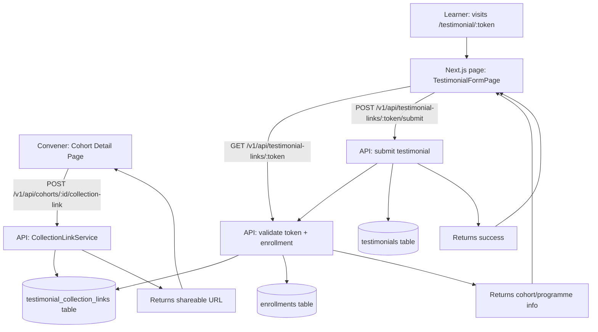

# Design Document: Testimonial Collection Link

## Overview

This feature adds a token-based testimonial collection flow to Cohortle. A convener generates a shareable link scoped to a specific cohort. Enrolled learners follow the link, authenticate (or are identified via their existing session), and submit a testimonial that feeds directly into the existing `testimonials` table. The design reuses the existing `acceptance_tokens` pattern for token generation and the existing `testimonials` CRUD infrastructure in `cohortle-api/routes/org.js`.

## Architecture

## Components and Interfaces

### Backend (cohortle-api)

#### New: `testimonial_collection_links` table (migration)
Stores one record per cohort collection link.

#### New: `cohortle-api/models/testimonial_collection_links.js`
Sequelize model for the table above.

#### New: `cohortle-api/services/CollectionLinkService.js`
Business logic for generating, validating, and revoking collection links, and for processing testimonial submissions.

#### New: `cohortle-api/routes/testimonial_links.js`
Express routes mounted in `app.js`:
- `POST /v1/api/cohorts/:cohort_id/collection-link` — convener generates/fetches link
- `PUT /v1/api/cohorts/:cohort_id/collection-link` — convener updates settings (auto_approve, expires_at)
- `DELETE /v1/api/cohorts/:cohort_id/collection-link` — convener revokes link
- `POST /v1/api/cohorts/:cohort_id/collection-link/regenerate` — convener regenerates token
- `GET /v1/api/convener/collection-links` — convener lists all their links
- `GET /v1/api/testimonial-links/:token` — public: validate token, return cohort/programme info
- `POST /v1/api/testimonial-links/:token/submit` — authenticated learner submits testimonial

### Frontend (cohortle-web)

#### New: `cohortle-web/src/app/testimonial/[token]/page.tsx`
Public-facing Next.js page. Renders the submission form or an error state depending on token validity and learner eligibility.

#### New: `cohortle-web/src/components/testimonial/TestimonialSubmissionForm.tsx`
Form component: quote textarea, star rating selector, optional display name override, submit button.

#### New: `cohortle-web/src/components/convener/TestimonialCollectionLinkSection.tsx`
UI section embedded in the cohort detail page. Shows current link status, generate/regenerate/revoke controls, auto_approve toggle, and copy-to-clipboard button.

#### Updated: `cohortle-web/src/lib/api/convener.ts`
New API functions: `getCollectionLink`, `createCollectionLink`, `updateCollectionLink`, `revokeCollectionLink`, `regenerateCollectionLink`, `listCollectionLinks`.

#### Updated: `cohortle-web/src/app/convener/programmes/[id]/cohorts/[cohortId]/page.tsx`
Embed `TestimonialCollectionLinkSection` in the cohort detail page.

## Data Models

### `testimonial_collection_links`

| Column | Type | Notes |
|---|---|---|
| `id` | UUID (PK) | UUIDV4 |
| `token` | VARCHAR(128) | Unique, cryptographically random (32 bytes hex) |
| `cohort_id` | INTEGER (FK → cohorts) | Scopes the link to one cohort |
| `convener_user_id` | INTEGER (FK → users) | Owner of the link |
| `auto_approve` | BOOLEAN | Default `false`. When `true`, submitted testimonials get `is_featured = true` |
| `expires_at` | DATETIME | Nullable. If set, submissions after this date are rejected |
| `revoked_at` | DATETIME | Nullable. If set, the link is inactive |
| `created_at` | DATETIME | Auto |
| `updated_at` | DATETIME | Auto |

Unique constraint: `(cohort_id, convener_user_id)` — one active link per cohort per convener.

### `testimonial_submissions` (deduplication guard)

| Column | Type | Notes |
|---|---|---|
| `id` | UUID (PK) | UUIDV4 |
| `collection_link_id` | UUID (FK → testimonial_collection_links) | |
| `learner_user_id` | INTEGER (FK → users) | |
| `testimonial_id` | INTEGER (FK → testimonials) | The created testimonial |
| `submitted_at` | DATETIME | Auto |

Unique constraint: `(collection_link_id, learner_user_id)` — one submission per learner per link.

### Existing `testimonials` table (no schema changes)
Submissions populate: `user_id` (convener), `learner_name`, `learner_avatar`, `programme_name`, `quote`, `rating`, `is_featured`.

## API Design

### `POST /v1/api/cohorts/:cohort_id/collection-link`
Auth: convener JWT.
- Verifies convener owns the cohort.
- If a non-revoked link already exists for this cohort, returns it (idempotent).
- Otherwise creates a new link with a fresh token.
- Returns `{ error: false, link: CollectionLink, url: string }`.

### `PUT /v1/api/cohorts/:cohort_id/collection-link`
Auth: convener JWT.
Body: `{ auto_approve?: boolean, expires_at?: string | null }`.
- Updates settings on the existing link.

### `DELETE /v1/api/cohorts/:cohort_id/collection-link`
Auth: convener JWT.
- Sets `revoked_at = NOW()`.

### `POST /v1/api/cohorts/:cohort_id/collection-link/regenerate`
Auth: convener JWT.
- Sets `revoked_at = NOW()` on the current link.
- Creates a new link with a fresh token.
- Returns the new link and URL.

### `GET /v1/api/convener/collection-links`
Auth: convener JWT.
- Returns all links for the convener with cohort name, programme name, submission count, status.

### `GET /v1/api/testimonial-links/:token`
Auth: none (public).
- Looks up the token.
- Returns 404 if not found or revoked.
- Returns 410 if expired.
- Returns `{ error: false, cohort_name, programme_name, auto_approve }`.

### `POST /v1/api/testimonial-links/:token/submit`
Auth: learner JWT (cookie).
Body: `{ quote: string, rating: number, display_name?: string }`.
- Validates token (404/410).
- Verifies learner is enrolled in the cohort (403).
- Checks for duplicate submission (409).
- Validates quote length ≥ 10 chars, rating 1–5 (400).
- Creates testimonial record.
- Creates testimonial_submission record.
- Returns `{ error: false, testimonial_id }`.

## Correctness Properties

*A property is a characteristic or behavior that should hold true across all valid executions of a system — essentially, a formal statement about what the system should do. Properties serve as the bridge between human-readable specifications and machine-verifiable correctness guarantees.*

Property 1: Token uniqueness
*For any* two collection links generated for different cohorts (or after a regeneration), the tokens SHALL be distinct.
**Validates: Requirements 1.1, 1.6**

Property 2: Idempotent link creation
*For any* cohort that already has a non-revoked collection link, calling the create endpoint again SHALL return the same token without creating a new record.
**Validates: Requirements 1.3**

Property 3: Revoked token rejection
*For any* collection link that has been revoked, submitting via its token SHALL return a 404 response.
**Validates: Requirements 2.4, 3.2**

Property 4: Expired token rejection
*For any* collection link whose `expires_at` is in the past, submitting via its token SHALL return a 410 response.
**Validates: Requirements 1.5, 3.3**

Property 5: Enrollment gate
*For any* learner who is not enrolled in the cohort associated with a collection link, submitting via that link SHALL return a 403 response.
**Validates: Requirements 3.4**

Property 6: Duplicate submission rejection
*For any* learner who has already submitted a testimonial via a given collection link, a second submission attempt SHALL return a 409 response.
**Validates: Requirements 3.5**

Property 7: Auto-approve flag propagation
*For any* collection link with `auto_approve = true`, every testimonial created through that link SHALL have `is_featured = true`. *For any* collection link with `auto_approve = false`, every testimonial created through that link SHALL have `is_featured = false`.
**Validates: Requirements 4.2, 4.3**

Property 8: Testimonial field population
*For any* valid submission, the created testimonial record SHALL have `learner_name` equal to the submitting learner's profile name and `programme_name` equal to the programme associated with the cohort.
**Validates: Requirements 4.4**

Property 9: Quote and rating validation
*For any* submission with a quote shorter than 10 characters or a rating outside 1–5, the API SHALL return a 400 response and no testimonial record SHALL be created.
**Validates: Requirements 4.5, 4.6**

Property 10: Ownership enforcement
*For any* convener attempting to generate or manage a collection link for a cohort they do not own, the API SHALL return a 403 response.
**Validates: Requirements 1.2**

## Error Handling

| Scenario | HTTP Status | Response |
|---|---|---|
| Token not found or revoked | 404 | `{ error: true, code: 'LINK_NOT_FOUND' }` |
| Token expired | 410 | `{ error: true, code: 'LINK_EXPIRED' }` |
| Learner not enrolled | 403 | `{ error: true, code: 'NOT_ENROLLED' }` |
| Duplicate submission | 409 | `{ error: true, code: 'ALREADY_SUBMITTED' }` |
| Invalid quote/rating | 400 | `{ error: true, code: 'VALIDATION_ERROR', message }` |
| Convener does not own cohort | 403 | `{ error: true, code: 'FORBIDDEN' }` |
| Unauthenticated submission attempt | 401 | `{ error: true, code: 'UNAUTHORIZED' }` |

All errors are returned as JSON. The frontend maps error codes to user-friendly messages.

## Testing Strategy

### Unit tests
- `CollectionLinkService`: test token generation produces unique values, test revocation logic, test expiry enforcement.
- Validation: test quote length boundary (9 chars → reject, 10 chars → accept), test rating boundaries (0 → reject, 1 → accept, 5 → accept, 6 → reject).
- `TestimonialSubmissionForm`: test that the form disables submit when quote is empty, test star rating selection.

### Property-based tests
Use `fast-check` (already used in the project for other PBT suites).

Each property test runs a minimum of 100 iterations.

- **Feature: testimonial-collection-link, Property 1: Token uniqueness** — generate N random cohort IDs, assert all tokens are distinct.
- **Feature: testimonial-collection-link, Property 2: Idempotent link creation** — for any cohort with an existing link, calling create again returns the same token.
- **Feature: testimonial-collection-link, Property 3: Revoked token rejection** — for any revoked link, submission returns 404.
- **Feature: testimonial-collection-link, Property 4: Expired token rejection** — for any link with `expires_at` in the past, submission returns 410.
- **Feature: testimonial-collection-link, Property 5: Enrollment gate** — for any user not in the enrollments table for the cohort, submission returns 403.
- **Feature: testimonial-collection-link, Property 6: Duplicate submission rejection** — for any learner who has already submitted, a second attempt returns 409.
- **Feature: testimonial-collection-link, Property 7: Auto-approve flag propagation** — for any link, `is_featured` on the created testimonial equals `auto_approve` on the link.
- **Feature: testimonial-collection-link, Property 9: Quote and rating validation** — for any quote with length < 10 or rating outside [1,5], submission returns 400.
- **Feature: testimonial-collection-link, Property 10: Ownership enforcement** — for any cohort not owned by the requesting convener, link management returns 403.
