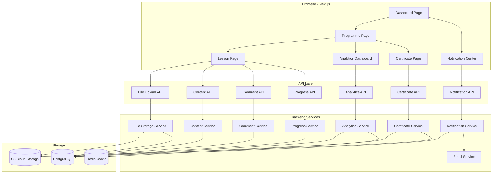

# Design Document: WLIMP Enhanced Features (V2)

## Overview

The WLIMP Enhanced Features (V2) transforms the platform from a basic content delivery system into a comprehensive learning management system. Building on V1's foundation of code-based enrollment, weekly lesson structure, and mobile-optimized experience, V2 adds seven major capability areas: file uploads, rich text editing, analytics, comments, progress tracking, certificates, and notifications.

This design maintains V1's core principles of simplicity, mobile-first design, and low-bandwidth optimization while introducing engagement and tracking features that enhance the learning experience. The architecture extends V1's data models and components rather than replacing them, ensuring backward compatibility and gradual feature adoption.

### Design Principles

1. **Build on V1**: Extend, don't replace. Maintain backward compatibility.
2. **Progressive Enhancement**: V2 features enhance but don't require changes to existing content.
3. **Mobile-First**: All new features work reliably on mobile devices with limited bandwidth.
4. **Self-Service**: Conveners manage all features without developer intervention.
5. **Privacy-Focused**: Protect learner data while providing useful analytics.
6. **Performance**: Maintain V1's speed and reliability standards.

## Architecture

### System Components




### Data Flow Patterns

**File Upload Flow**:
1. Convener selects file in lesson editor
2. Frontend validates file type and size
3. Frontend requests signed upload URL from API
4. Frontend uploads file directly to cloud storage
5. Frontend notifies API of successful upload
6. Backend creates file attachment record
7. Learners access files via signed download URLs

**Rich Content Creation Flow**:
1. Convener writes content in rich text editor
2. Editor converts to structured JSON format
3. Frontend saves content via Content API
4. Backend stores structured content in database
5. Learners view rendered HTML from structured content

**Progress Tracking Flow**:
1. Learner marks lesson complete
2. Frontend calls Progress API
3. Backend records completion with timestamp
4. Backend calculates programme completion percentage
5. Backend checks if programme is complete
6. If complete, trigger certificate generation
7. Frontend updates UI with new progress state

**Analytics Aggregation Flow**:
1. Learner activities generate event logs
2. Background job aggregates events hourly
3. Analytics service calculates metrics
4. Results cached in Redis for fast access
5. Convener requests analytics dashboard
6. API returns cached aggregated data

**Comment and Notification Flow**:
1. Learner posts comment on lesson
2. Backend creates comment record
3. Backend identifies notification recipients
4. Backend queues notification jobs
5. Notification service batches and sends emails
6. In-app notifications appear in notification center

## Components and Interfaces

### Frontend Components

#### 1. File Upload Component

**Purpose**: Allow conveners to upload files to lessons.

**Component Structure**:
```typescript
interface FileUploadProps {
  lessonId: string;
  existingFiles: FileAttachment[];
  onUploadComplete: (file: FileAttachment) => void;
  onDeleteFile: (fileId: string) => void;
}

interface FileAttachment {
  id: string;
  filename: string;
  fileType: string;
  fileSize: number;
  uploadedAt: Date;
  downloadUrl: string;
}
```

**Behavior**:
- Drag-and-drop or click to select files
- Client-side validation (type, size)
- Progress bar during upload
- List of uploaded files with delete option
- Mobile-friendly file picker integration


#### 2. Rich Text Editor Component

**Purpose**: Enable conveners to create formatted lesson content.

**Component Structure**:
```typescript
interface RichTextEditorProps {
  initialContent: RichContent;
  onSave: (content: RichContent) => void;
  onPreview: () => void;
}

interface RichContent {
  type: 'doc';
  content: ContentNode[];
}

interface ContentNode {
  type: 'paragraph' | 'heading' | 'bulletList' | 'orderedList' | 'image' | 'blockquote';
  attrs?: Record<string, any>;
  content?: ContentNode[];
  text?: string;
  marks?: Mark[];
}

interface Mark {
  type: 'bold' | 'italic' | 'underline' | 'strikethrough' | 'link';
  attrs?: Record<string, any>;
}
```

**Behavior**:
- Toolbar with formatting buttons
- Keyboard shortcuts (Ctrl+B, Ctrl+I, etc.)
- Preview mode toggle
- Auto-save draft every 30 seconds
- Mobile-optimized toolbar
- Image upload integration
- Link insertion dialog

**Library**: Use TipTap or similar React-based rich text editor

#### 3. Analytics Dashboard Component

**Purpose**: Display engagement and completion metrics to conveners.

**Component Structure**:
```typescript
interface AnalyticsDashboardProps {
  programmeId: string;
  cohortId?: string;
}

interface AnalyticsData {
  enrollmentCount: number;
  completionRate: number;
  averageTimePerLesson: number;
  lessonMetrics: LessonMetric[];
  engagementTrend: DataPoint[];
}

interface LessonMetric {
  lessonId: string;
  lessonTitle: string;
  viewCount: number;
  completionCount: number;
  completionRate: number;
  averageTimeSpent: number;
}

interface DataPoint {
  date: string;
  value: number;
}
```

**Behavior**:
- Summary cards for key metrics
- Bar chart for lesson completion rates
- Line chart for engagement trends
- Table view of lesson-level metrics
- Cohort filter dropdown
- Date range picker
- Export buttons (CSV, PDF)
- Responsive layout for mobile

**Charting Library**: Use Recharts or Chart.js

#### 4. Comments Section Component

**Purpose**: Enable learners and conveners to discuss lesson content.

**Component Structure**:
```typescript
interface CommentsSectionProps {
  lessonId: string;
  currentUserId: string;
  isConvener: boolean;
}

interface Comment {
  id: string;
  authorId: string;
  authorName: string;
  content: string;
  createdAt: Date;
  replies: Comment[];
  canDelete: boolean;
}
```

**Behavior**:
- Text area for new comments (2000 char limit)
- Character counter
- Submit button with loading state
- Threaded display of comments and replies
- Reply button on each comment
- Delete button for own comments (learners) or all comments (conveners)
- Pagination (20 comments per page)
- Real-time updates via polling or WebSocket
- Mobile-optimized layout


#### 5. Progress Tracking Components

**Purpose**: Display and manage lesson completion status.

**Component Structure**:
```typescript
interface ProgressBarProps {
  completedCount: number;
  totalCount: number;
}

interface CompletionButtonProps {
  lessonId: string;
  isCompleted: boolean;
  onToggle: (lessonId: string, completed: boolean) => void;
}

interface LessonProgressIndicator {
  lessonId: string;
  isCompleted: boolean;
  timeSpent: number;
}
```

**Behavior**:
- Progress bar on programme page showing percentage
- Checkmark icons on completed lessons
- "Mark as Complete" button on lesson page
- "Mark as Incomplete" option if already completed
- Visual highlight of next incomplete lesson
- Time tracking via page visibility API
- Persist progress across devices

#### 6. Certificate Display Component

**Purpose**: Show and download completion certificates.

**Component Structure**:
```typescript
interface CertificateDisplayProps {
  programmeId: string;
  learnerId: string;
}

interface Certificate {
  id: string;
  learnerName: string;
  programmeName: string;
  completionDate: Date;
  verificationCode: string;
  downloadUrl: string;
}
```

**Behavior**:
- Certificate preview image
- Download PDF button
- Verification code display
- Share buttons (LinkedIn, Twitter)
- Print-friendly layout
- Mobile-responsive design

#### 7. Notification Center Component

**Purpose**: Display in-app notifications to learners.

**Component Structure**:
```typescript
interface NotificationCenterProps {
  userId: string;
}

interface Notification {
  id: string;
  type: 'new_lesson' | 'comment_reply' | 'certificate' | 'milestone';
  title: string;
  message: string;
  createdAt: Date;
  isRead: boolean;
  actionUrl?: string;
}
```

**Behavior**:
- Bell icon with unread count badge
- Dropdown panel with notification list
- Mark as read on click
- Mark all as read button
- Link to notification settings
- Real-time updates via polling
- Mobile-friendly dropdown

### API Endpoints

#### File Upload API

**POST /api/v1/files/upload-url**

Request:
```typescript
{
  lessonId: string;
  filename: string;
  fileType: string;
  fileSize: number;
}
```

Response:
```typescript
{
  uploadUrl: string;
  fileId: string;
  expiresAt: string;
}
```

**POST /api/v1/files/confirm-upload**

Request:
```typescript
{
  fileId: string;
  lessonId: string;
}
```

Response:
```typescript
{
  file: FileAttachment;
}
```

**DELETE /api/v1/files/:fileId**

Response:
```typescript
{
  success: boolean;
}
```

**GET /api/v1/files/:fileId/download-url**

Response:
```typescript
{
  downloadUrl: string;
  expiresAt: string;
}
```


#### Content API

**PUT /api/v1/lessons/:id/content**

Request:
```typescript
{
  richContent: RichContent;
  contentMode: 'rich' | 'external';
}
```

Response:
```typescript
{
  lesson: Lesson;
}
```

**GET /api/v1/lessons/:id/content**

Response:
```typescript
{
  richContent: RichContent | null;
  externalUrl: string | null;
  contentMode: 'rich' | 'external';
  attachments: FileAttachment[];
}
```

#### Analytics API

**GET /api/v1/programmes/:id/analytics**

Query Parameters:
```typescript
{
  cohortId?: string;
  startDate?: string;
  endDate?: string;
}
```

Response:
```typescript
{
  enrollmentCount: number;
  completionRate: number;
  averageTimePerLesson: number;
  lessonMetrics: LessonMetric[];
  engagementTrend: DataPoint[];
}
```

**GET /api/v1/programmes/:id/analytics/export**

Query Parameters:
```typescript
{
  format: 'csv' | 'pdf';
  cohortId?: string;
}
```

Response: File download

#### Comment API

**GET /api/v1/lessons/:id/comments**

Query Parameters:
```typescript
{
  page?: number;
  limit?: number;
}
```

Response:
```typescript
{
  comments: Comment[];
  totalCount: number;
  hasMore: boolean;
}
```

**POST /api/v1/lessons/:id/comments**

Request:
```typescript
{
  content: string;
  parentCommentId?: string;
}
```

Response:
```typescript
{
  comment: Comment;
}
```

**DELETE /api/v1/comments/:id**

Response:
```typescript
{
  success: boolean;
}
```

#### Progress API

**POST /api/v1/lessons/:id/complete**

Request:
```typescript
{
  completed: boolean;
}
```

Response:
```typescript
{
  progress: LessonProgress;
  programmeProgress: ProgrammeProgress;
  certificateGenerated: boolean;
}
```

**GET /api/v1/programmes/:id/progress**

Response:
```typescript
{
  completedLessons: string[];
  totalLessons: number;
  completionPercentage: number;
  timeSpent: Record<string, number>;
  nextLesson: string | null;
}
```

**POST /api/v1/lessons/:id/track-time**

Request:
```typescript
{
  timeSpent: number; // seconds
}
```

Response:
```typescript
{
  success: boolean;
}
```


#### Certificate API

**GET /api/v1/programmes/:id/certificate**

Response:
```typescript
{
  certificate: Certificate | null;
  isEligible: boolean;
  completionPercentage: number;
}
```

**POST /api/v1/programmes/:id/certificate/generate**

Response:
```typescript
{
  certificate: Certificate;
}
```

**GET /api/v1/certificates/verify/:code**

Response:
```typescript
{
  valid: boolean;
  learnerName: string;
  programmeName: string;
  completionDate: string;
}
```

#### Notification API

**GET /api/v1/notifications**

Query Parameters:
```typescript
{
  unreadOnly?: boolean;
  page?: number;
  limit?: number;
}
```

Response:
```typescript
{
  notifications: Notification[];
  unreadCount: number;
  hasMore: boolean;
}
```

**PUT /api/v1/notifications/:id/read**

Response:
```typescript
{
  success: boolean;
}
```

**PUT /api/v1/notifications/read-all**

Response:
```typescript
{
  success: boolean;
}
```

**GET /api/v1/notifications/preferences**

Response:
```typescript
{
  emailNewLesson: boolean;
  emailCommentReply: boolean;
  emailCertificate: boolean;
  emailMilestone: boolean;
}
```

**PUT /api/v1/notifications/preferences**

Request:
```typescript
{
  emailNewLesson?: boolean;
  emailCommentReply?: boolean;
  emailCertificate?: boolean;
  emailMilestone?: boolean;
}
```

Response:
```typescript
{
  preferences: NotificationPreferences;
}
```

### Backend Services

#### 1. File Storage Service

**Responsibilities**:
- Generate signed upload URLs
- Validate file types and sizes
- Store files in cloud storage (S3/GCS)
- Generate signed download URLs
- Delete files and revoke access
- Compress images before storage

**Key Methods**:
```typescript
class FileStorageService {
  async generateUploadUrl(filename: string, fileType: string, fileSize: number): Promise<UploadUrl>;
  async confirmUpload(fileId: string, lessonId: string): Promise<FileAttachment>;
  async generateDownloadUrl(fileId: string): Promise<string>;
  async deleteFile(fileId: string): Promise<void>;
  async compressImage(fileBuffer: Buffer): Promise<Buffer>;
  validateFileType(fileType: string): boolean;
  validateFileSize(fileSize: number): boolean;
}
```

**Storage Strategy**:
- Use cloud storage (AWS S3 or Google Cloud Storage)
- Organize files by: `programmes/{programmeId}/lessons/{lessonId}/{fileId}-{filename}`
- Generate signed URLs with 1-hour expiration
- Implement automatic cleanup of orphaned files


#### 2. Content Service

**Responsibilities**:
- Store and retrieve rich content
- Sanitize HTML to prevent XSS
- Convert rich content to HTML for rendering
- Manage content versioning
- Handle content mode switching (rich vs external)

**Key Methods**:
```typescript
class ContentService {
  async saveRichContent(lessonId: string, content: RichContent): Promise<void>;
  async getRichContent(lessonId: string): Promise<RichContent | null>;
  async sanitizeContent(content: RichContent): Promise<RichContent>;
  async renderToHtml(content: RichContent): Promise<string>;
  async setContentMode(lessonId: string, mode: 'rich' | 'external'): Promise<void>;
}
```

**Content Storage**:
- Store rich content as JSON in database
- Use PostgreSQL JSONB column for efficient querying
- Implement content versioning for rollback capability
- Sanitize on save and render

#### 3. Analytics Service

**Responsibilities**:
- Aggregate learner activity data
- Calculate completion rates and engagement metrics
- Generate reports and exports
- Cache aggregated data for performance

**Key Methods**:
```typescript
class AnalyticsService {
  async getAnalytics(programmeId: string, filters: AnalyticsFilters): Promise<AnalyticsData>;
  async aggregateMetrics(programmeId: string): Promise<void>;
  async exportToCsv(programmeId: string, filters: AnalyticsFilters): Promise<Buffer>;
  async exportToPdf(programmeId: string, filters: AnalyticsFilters): Promise<Buffer>;
  async trackEvent(event: AnalyticsEvent): Promise<void>;
}
```

**Aggregation Strategy**:
- Run hourly background job to aggregate events
- Store aggregated metrics in separate tables
- Cache results in Redis with 5-minute TTL
- Use database views for complex queries

#### 4. Comment Service

**Responsibilities**:
- Create and retrieve comments
- Handle threaded discussions
- Moderate and delete comments
- Trigger notifications on new comments

**Key Methods**:
```typescript
class CommentService {
  async createComment(lessonId: string, userId: string, content: string, parentId?: string): Promise<Comment>;
  async getComments(lessonId: string, pagination: Pagination): Promise<CommentPage>;
  async deleteComment(commentId: string, userId: string, isConvener: boolean): Promise<void>;
  async getCommentThread(commentId: string): Promise<Comment[]>;
}
```

**Threading Strategy**:
- Use parent_comment_id for one-level threading
- Limit thread depth to 1 (replies to replies become top-level)
- Order by created_at DESC
- Implement soft delete for moderation audit trail

#### 5. Progress Service

**Responsibilities**:
- Track lesson completion
- Calculate programme progress
- Track time spent on lessons
- Trigger certificate generation

**Key Methods**:
```typescript
class ProgressService {
  async markLessonComplete(userId: string, lessonId: string, completed: boolean): Promise<LessonProgress>;
  async getProgrammeProgress(userId: string, programmeId: string): Promise<ProgrammeProgress>;
  async trackTimeSpent(userId: string, lessonId: string, seconds: number): Promise<void>;
  async getNextLesson(userId: string, programmeId: string): Promise<string | null>;
  async checkProgrammeCompletion(userId: string, programmeId: string): Promise<boolean>;
}
```

**Time Tracking Strategy**:
- Use Page Visibility API on frontend
- Send time updates every 30 seconds while page is visible
- Aggregate time in database
- Cap maximum time per session at 2 hours (prevent idle tracking)


#### 6. Certificate Service

**Responsibilities**:
- Generate PDF certificates
- Store certificate metadata
- Provide verification
- Customize certificate templates

**Key Methods**:
```typescript
class CertificateService {
  async generateCertificate(userId: string, programmeId: string): Promise<Certificate>;
  async getCertificate(userId: string, programmeId: string): Promise<Certificate | null>;
  async verifyCertificate(code: string): Promise<CertificateVerification>;
  async renderCertificatePdf(certificate: Certificate): Promise<Buffer>;
  generateVerificationCode(): string;
}
```

**Certificate Generation**:
- Use PDF generation library (PDFKit or Puppeteer)
- Store PDF in cloud storage
- Generate unique verification code (12 alphanumeric characters)
- Include QR code linking to verification page
- Support custom templates per programme

#### 7. Notification Service

**Responsibilities**:
- Queue and send notifications
- Batch email notifications
- Manage notification preferences
- Track notification delivery

**Key Methods**:
```typescript
class NotificationService {
  async createNotification(userId: string, type: NotificationType, data: NotificationData): Promise<Notification>;
  async getNotifications(userId: string, filters: NotificationFilters): Promise<NotificationPage>;
  async markAsRead(notificationId: string): Promise<void>;
  async markAllAsRead(userId: string): Promise<void>;
  async sendEmailNotification(userId: string, notification: Notification): Promise<void>;
  async batchNotifications(): Promise<void>;
}
```

**Notification Strategy**:
- Create in-app notification immediately
- Queue email notifications for batching
- Run batch job every hour to send emails
- Group multiple notifications into single email
- Respect user preferences
- Include unsubscribe link in all emails

#### 8. Email Service

**Responsibilities**:
- Send transactional emails
- Render email templates
- Track email delivery
- Handle bounces and unsubscribes

**Key Methods**:
```typescript
class EmailService {
  async sendEmail(to: string, subject: string, html: string): Promise<void>;
  async renderTemplate(template: string, data: Record<string, any>): Promise<string>;
  async trackDelivery(emailId: string, status: EmailStatus): Promise<void>;
  async handleUnsubscribe(userId: string, notificationType: string): Promise<void>;
}
```

**Email Provider**: Use SendGrid, AWS SES, or similar service

## Data Models

### Database Schema Extensions

#### File Attachments Table
```sql
CREATE TABLE file_attachments (
  id UUID PRIMARY KEY DEFAULT gen_random_uuid(),
  lesson_id UUID REFERENCES lessons(id) ON DELETE CASCADE,
  filename VARCHAR(255) NOT NULL,
  file_type VARCHAR(50) NOT NULL,
  file_size INTEGER NOT NULL,
  storage_path TEXT NOT NULL,
  uploaded_by UUID NOT NULL,
  uploaded_at TIMESTAMP DEFAULT NOW(),
  deleted_at TIMESTAMP NULL
);

CREATE INDEX idx_file_attachments_lesson ON file_attachments(lesson_id);
```

#### Lesson Content Table (extends lessons)
```sql
ALTER TABLE lessons ADD COLUMN rich_content JSONB NULL;
ALTER TABLE lessons ADD COLUMN content_mode VARCHAR(20) DEFAULT 'external';

CREATE INDEX idx_lessons_content_mode ON lessons(content_mode);
```

#### Comments Table
```sql
CREATE TABLE comments (
  id UUID PRIMARY KEY DEFAULT gen_random_uuid(),
  lesson_id UUID REFERENCES lessons(id) ON DELETE CASCADE,
  user_id UUID NOT NULL,
  parent_comment_id UUID REFERENCES comments(id) ON DELETE CASCADE NULL,
  content TEXT NOT NULL,
  created_at TIMESTAMP DEFAULT NOW(),
  deleted_at TIMESTAMP NULL
);

CREATE INDEX idx_comments_lesson ON comments(lesson_id);
CREATE INDEX idx_comments_parent ON comments(parent_comment_id);
CREATE INDEX idx_comments_user ON comments(user_id);
```


#### Lesson Progress Table
```sql
CREATE TABLE lesson_progress (
  id UUID PRIMARY KEY DEFAULT gen_random_uuid(),
  user_id UUID NOT NULL,
  lesson_id UUID REFERENCES lessons(id) ON DELETE CASCADE,
  completed BOOLEAN DEFAULT FALSE,
  completed_at TIMESTAMP NULL,
  time_spent INTEGER DEFAULT 0, -- seconds
  last_viewed_at TIMESTAMP DEFAULT NOW(),
  UNIQUE(user_id, lesson_id)
);

CREATE INDEX idx_lesson_progress_user ON lesson_progress(user_id);
CREATE INDEX idx_lesson_progress_lesson ON lesson_progress(lesson_id);
CREATE INDEX idx_lesson_progress_completed ON lesson_progress(completed);
```

#### Certificates Table
```sql
CREATE TABLE certificates (
  id UUID PRIMARY KEY DEFAULT gen_random_uuid(),
  user_id UUID NOT NULL,
  programme_id UUID REFERENCES programmes(id) ON DELETE CASCADE,
  learner_name VARCHAR(255) NOT NULL,
  programme_name VARCHAR(255) NOT NULL,
  completion_date DATE NOT NULL,
  verification_code VARCHAR(12) UNIQUE NOT NULL,
  pdf_url TEXT NOT NULL,
  generated_at TIMESTAMP DEFAULT NOW(),
  UNIQUE(user_id, programme_id)
);

CREATE INDEX idx_certificates_user ON certificates(user_id);
CREATE INDEX idx_certificates_verification ON certificates(verification_code);
```

#### Notifications Table
```sql
CREATE TABLE notifications (
  id UUID PRIMARY KEY DEFAULT gen_random_uuid(),
  user_id UUID NOT NULL,
  type VARCHAR(50) NOT NULL,
  title VARCHAR(255) NOT NULL,
  message TEXT NOT NULL,
  action_url TEXT NULL,
  is_read BOOLEAN DEFAULT FALSE,
  created_at TIMESTAMP DEFAULT NOW()
);

CREATE INDEX idx_notifications_user ON notifications(user_id);
CREATE INDEX idx_notifications_read ON notifications(is_read);
CREATE INDEX idx_notifications_created ON notifications(created_at DESC);
```

#### Notification Preferences Table
```sql
CREATE TABLE notification_preferences (
  id UUID PRIMARY KEY DEFAULT gen_random_uuid(),
  user_id UUID UNIQUE NOT NULL,
  email_new_lesson BOOLEAN DEFAULT TRUE,
  email_comment_reply BOOLEAN DEFAULT TRUE,
  email_certificate BOOLEAN DEFAULT TRUE,
  email_milestone BOOLEAN DEFAULT TRUE,
  updated_at TIMESTAMP DEFAULT NOW()
);

CREATE INDEX idx_notification_preferences_user ON notification_preferences(user_id);
```

#### Analytics Events Table
```sql
CREATE TABLE analytics_events (
  id UUID PRIMARY KEY DEFAULT gen_random_uuid(),
  user_id UUID NOT NULL,
  programme_id UUID NOT NULL,
  lesson_id UUID NULL,
  event_type VARCHAR(50) NOT NULL, -- 'view', 'complete', 'comment', 'download'
  event_data JSONB NULL,
  created_at TIMESTAMP DEFAULT NOW()
);

CREATE INDEX idx_analytics_events_programme ON analytics_events(programme_id);
CREATE INDEX idx_analytics_events_lesson ON analytics_events(lesson_id);
CREATE INDEX idx_analytics_events_type ON analytics_events(event_type);
CREATE INDEX idx_analytics_events_created ON analytics_events(created_at);
```

#### Analytics Aggregates Table
```sql
CREATE TABLE analytics_aggregates (
  id UUID PRIMARY KEY DEFAULT gen_random_uuid(),
  programme_id UUID NOT NULL,
  cohort_id UUID NULL,
  lesson_id UUID NULL,
  metric_type VARCHAR(50) NOT NULL, -- 'completion_rate', 'avg_time', 'view_count'
  metric_value DECIMAL(10, 2) NOT NULL,
  aggregated_at TIMESTAMP DEFAULT NOW(),
  period_start TIMESTAMP NOT NULL,
  period_end TIMESTAMP NOT NULL
);

CREATE INDEX idx_analytics_aggregates_programme ON analytics_aggregates(programme_id);
CREATE INDEX idx_analytics_aggregates_lesson ON analytics_aggregates(lesson_id);
CREATE INDEX idx_analytics_aggregates_type ON analytics_aggregates(metric_type);
```

### TypeScript Interfaces

```typescript
interface FileAttachment {
  id: string;
  lessonId: string;
  filename: string;
  fileType: string;
  fileSize: number;
  storagePath: string;
  uploadedBy: string;
  uploadedAt: Date;
  deletedAt: Date | null;
}

interface RichContent {
  type: 'doc';
  content: ContentNode[];
}

interface Comment {
  id: string;
  lessonId: string;
  userId: string;
  parentCommentId: string | null;
  content: string;
  createdAt: Date;
  deletedAt: Date | null;
  authorName: string;
  replies: Comment[];
}

interface LessonProgress {
  id: string;
  userId: string;
  lessonId: string;
  completed: boolean;
  completedAt: Date | null;
  timeSpent: number;
  lastViewedAt: Date;
}

interface Certificate {
  id: string;
  userId: string;
  programmeId: string;
  learnerName: string;
  programmeName: string;
  completionDate: Date;
  verificationCode: string;
  pdfUrl: string;
  generatedAt: Date;
}

interface Notification {
  id: string;
  userId: string;
  type: NotificationType;
  title: string;
  message: string;
  actionUrl: string | null;
  isRead: boolean;
  createdAt: Date;
}

type NotificationType = 'new_lesson' | 'comment_reply' | 'certificate' | 'milestone';

interface NotificationPreferences {
  id: string;
  userId: string;
  emailNewLesson: boolean;
  emailCommentReply: boolean;
  emailCertificate: boolean;
  emailMilestone: boolean;
  updatedAt: Date;
}

interface AnalyticsEvent {
  id: string;
  userId: string;
  programmeId: string;
  lessonId: string | null;
  eventType: 'view' | 'complete' | 'comment' | 'download';
  eventData: Record<string, any> | null;
  createdAt: Date;
}
```


## Correctness Properties

A property is a characteristic or behavior that should hold true across all valid executions of a system—essentially, a formal statement about what the system should do. Properties serve as the bridge between human-readable specifications and machine-verifiable correctness guarantees.

### File Upload and Management Properties

Property 1: File Type Validation
*For any* file upload attempt, only files with types PDF, DOC, DOCX, PNG, JPG, or JPEG should be accepted, and all other file types should be rejected with an error.
**Validates: Requirements 1.2**

Property 2: Multiple File Attachments
*For any* lesson and any number N of valid files, uploading N files should result in exactly N file attachment records associated with that lesson.
**Validates: Requirements 1.4**

Property 3: Unique File URLs
*For any* uploaded file, the system should generate a unique access URL that differs from all other file URLs.
**Validates: Requirements 1.5**

Property 4: File Access Authorization
*For any* uploaded file and any user not enrolled in the programme, attempting to access the file URL should result in an authorization error.
**Validates: Requirements 1.6**

Property 5: File Metadata Display
*For any* lesson with file attachments, the rendered lesson page should contain the filename, file type, and file size for each attachment.
**Validates: Requirements 1.7**

Property 6: File Deletion Cleanup
*For any* deleted file, attempting to access its URL should return a 404 error, and the file should not appear in the lesson's attachment list.
**Validates: Requirements 1.9, 1.10**

### Rich Text Content Properties

Property 7: Rich Content Round Trip
*For any* valid rich content structure (with headings, formatting, lists, links, images), saving then retrieving the content should produce an equivalent structure with all elements preserved.
**Validates: Requirements 2.2, 2.3, 2.4, 2.5, 2.7**

Property 8: Content Rendering Completeness
*For any* rich content with formatted elements, the rendered HTML should contain corresponding HTML tags for each element (h1-h3 for headings, strong for bold, em for italic, ul/ol for lists, a for links, img for images).
**Validates: Requirements 2.8**

Property 9: XSS Prevention
*For any* rich content containing script tags or javascript: URLs, the sanitized content should have these malicious elements removed or neutralized.
**Validates: Requirements 2.9, 9.7**

### Analytics Properties

Property 10: Enrollment Count Accuracy
*For any* programme and cohort, the analytics enrollment count should equal the number of enrollment records for that cohort.
**Validates: Requirements 3.2**

Property 11: Completion Rate Calculation
*For any* lesson, the completion rate should equal (number of users who completed / total enrolled users) × 100.
**Validates: Requirements 3.3**

Property 12: Average Time Calculation
*For any* lesson with time tracking data, the average time spent should equal the sum of all users' time spent divided by the number of users who viewed it.
**Validates: Requirements 3.4**

Property 13: View Count Accuracy
*For any* lesson, the view count in analytics should equal the number of distinct users who viewed that lesson.
**Validates: Requirements 3.5**

Property 14: Analytics Filtering
*For any* analytics query with cohort and date range filters, the results should only include data from that cohort within the specified date range.
**Validates: Requirements 3.6**

### Comments and Discussions Properties

Property 15: Comment Character Limit
*For any* comment text, comments with 2000 or fewer characters should be accepted, and comments exceeding 2000 characters should be rejected.
**Validates: Requirements 4.2**

Property 16: Comment Metadata Preservation
*For any* posted comment, retrieving it should return the same content along with the author's name and a timestamp.
**Validates: Requirements 4.3**

Property 17: Comment Threading
*For any* comment reply, the reply should be associated with its parent comment and retrievable as part of the parent's thread.
**Validates: Requirements 4.4, 4.5**

Property 18: Comment Cascade Deletion
*For any* comment with replies, deleting the parent comment should also delete all its replies.
**Validates: Requirements 4.6, 4.7**

Property 19: Comment Ordering
*For any* lesson with multiple comments, retrieving comments should return them ordered by creation timestamp in descending order (newest first).
**Validates: Requirements 4.8**

Property 20: Comment Pagination
*For any* lesson with more than 20 comments, the API should paginate results with a maximum of 20 comments per page.
**Validates: Requirements 4.9**

Property 21: Comment Notification Creation
*For any* new comment or reply, the system should create a notification for relevant users (lesson author for top-level comments, comment author for replies).
**Validates: Requirements 4.10**


### Progress Tracking Properties

Property 22: Completion Recording
*For any* lesson and learner, marking the lesson as complete should create or update a progress record with a completion timestamp.
**Validates: Requirements 5.2**

Property 23: Completion Toggle
*For any* completed lesson, unmarking it as complete should update the progress record to incomplete, and marking it again should restore completion status (idempotent operations).
**Validates: Requirements 5.3**

Property 24: Progress Percentage Calculation
*For any* programme and learner, the completion percentage should equal (number of completed lessons / total lessons in programme) × 100.
**Validates: Requirements 5.4, 5.6, 5.9**

Property 25: Time Tracking Accumulation
*For any* lesson and learner, tracking time spent multiple times should accumulate the total time (sum of all tracking events).
**Validates: Requirements 5.7**

Property 26: Next Incomplete Lesson Identification
*For any* programme and learner, the next incomplete lesson should be the first lesson (by order) that is not marked as complete.
**Validates: Requirements 5.8**

Property 27: Progress Persistence
*For any* learner's progress data, saving progress then retrieving it should return the same completion status and time spent values.
**Validates: Requirements 5.10**

### Certificate Generation Properties

Property 28: Automatic Certificate Generation
*For any* learner who completes 100% of lessons in a programme, a certificate should be automatically generated.
**Validates: Requirements 6.1**

Property 29: Certificate Content Completeness
*For any* generated certificate, it should contain the learner's full name, programme name, and completion date.
**Validates: Requirements 6.2**

Property 30: Certificate Verification Code Uniqueness
*For any* two certificates, their verification codes should be different (unique across all certificates).
**Validates: Requirements 6.3**

Property 31: Certificate Verification
*For any* valid verification code, the verification endpoint should return the correct learner name, programme name, and completion date.
**Validates: Requirements 6.7, 6.8**

Property 32: Certificate Notification
*For any* generated certificate, a notification should be created for the learner.
**Validates: Requirements 6.9**

### Notification System Properties

Property 33: New Lesson Notifications
*For any* new lesson published in a programme, notifications should be created for all learners enrolled in that programme.
**Validates: Requirements 7.1**

Property 34: Comment Reply Notifications
*For any* reply to a comment, a notification should be created for the original comment's author.
**Validates: Requirements 7.2**

Property 35: Programme Completion Notifications
*For any* learner who completes a programme, a congratulatory notification with certificate link should be created.
**Validates: Requirements 7.3**

Property 36: Notification Read Status
*For any* notification, marking it as read should update its status, and subsequent retrievals should reflect the read status.
**Validates: Requirements 7.6**

Property 37: Notification Preferences Persistence
*For any* learner's notification preferences, saving preferences then retrieving them should return the same settings.
**Validates: Requirements 7.7**

Property 38: Milestone Notifications
*For any* learner reaching 25%, 50%, or 75% completion, a milestone notification should be created.
**Validates: Requirements 7.9**

Property 39: Email Unsubscribe Links
*For any* email notification content, it should contain an unsubscribe link.
**Validates: Requirements 7.10**


### Security and Privacy Properties

Property 40: Signed URL Expiration
*For any* signed file access URL with an expiration time, attempting to access it after expiration should result in an error.
**Validates: Requirements 9.2**

Property 41: Unenrolled User Access Restriction
*For any* learner who is unenrolled from a programme, they should not be able to access programme content, but their progress data should still exist in the database.
**Validates: Requirements 9.3**

Property 42: Analytics Privacy
*For any* analytics data exposed to conveners, it should not contain individual learner identifiable information, only aggregated metrics.
**Validates: Requirements 9.4, 9.5**

Property 43: File Access Logging
*For any* file access attempt, an access log entry should be created with user ID, file ID, and timestamp.
**Validates: Requirements 9.6**

Property 44: Comment Rate Limiting
*For any* user attempting to post more than 10 comments within one minute, the 11th and subsequent comments should be rejected until the rate limit window resets.
**Validates: Requirements 9.8**

Property 45: File Upload Rate Limiting
*For any* user attempting to upload more than 5 files within one minute, the 6th and subsequent uploads should be rejected until the rate limit window resets.
**Validates: Requirements 9.9**

### Backward Compatibility Properties

Property 46: External Link Support
*For any* lesson with an external content URL (Zoom, Drive, YouTube, PDF), the lesson should be accessible and render the external link correctly.
**Validates: Requirements 10.1**

Property 47: Content Mode Rendering
*For any* lesson with content_mode set to 'external' and no rich content, the system should render it using V1 rendering logic.
**Validates: Requirements 10.2**

Property 48: V1 Functionality Preservation
*For any* programme not using V2 features, all V1 functionality (enrollment, viewing, navigation) should work identically to V1.
**Validates: Requirements 10.5**

Property 49: Content Mode Switching
*For any* lesson, switching between 'external' and 'rich' content modes should preserve the respective content and render appropriately.
**Validates: Requirements 10.7**

Property 50: V1 API Compatibility
*For any* V1 API endpoint, it should continue to accept V1 request formats and return V1 response formats.
**Validates: Requirements 10.8**

Property 51: Feature Flag Control
*For any* programme with V2 features disabled via feature flags, V2 features should not be accessible, and the programme should behave like V1.
**Validates: Requirements 10.9, 10.10**

## Error Handling

### File Upload Errors

**Invalid File Type**:
- Validate file type on client and server
- Return 400 Bad Request with message: "File type not supported. Please upload PDF, DOC, DOCX, PNG, JPG, or JPEG files."

**File Too Large**:
- Validate file size on client and server
- Return 413 Payload Too Large with message: "File size exceeds 10MB limit. Please upload a smaller file."

**Upload Failed**:
- Return 500 Internal Server Error with message: "File upload failed. Please try again."
- Log error details for debugging
- Clean up partial uploads

**Storage Quota Exceeded**:
- Return 507 Insufficient Storage with message: "Storage limit reached. Please contact support."

**Unauthorized File Access**:
- Return 403 Forbidden with message: "You do not have permission to access this file."


### Rich Content Errors

**Invalid Content Structure**:
- Validate content structure on server
- Return 400 Bad Request with message: "Invalid content format. Please check your content structure."

**XSS Detected**:
- Sanitize content automatically
- Log security event
- Return sanitized content with warning: "Some content was removed for security reasons."

**Content Too Large**:
- Limit content size to 1MB
- Return 413 Payload Too Large with message: "Content size exceeds limit. Please reduce content size."

### Analytics Errors

**Invalid Date Range**:
- Validate date range on server
- Return 400 Bad Request with message: "Invalid date range. End date must be after start date."

**Export Failed**:
- Return 500 Internal Server Error with message: "Export failed. Please try again."
- Log error details

**No Data Available**:
- Return 200 OK with empty data set
- Include message: "No analytics data available for the selected filters."

### Comment Errors

**Comment Too Long**:
- Validate length on client and server
- Return 400 Bad Request with message: "Comment exceeds 2000 character limit."

**Rate Limit Exceeded**:
- Return 429 Too Many Requests with message: "You are posting comments too quickly. Please wait a moment and try again."
- Include Retry-After header

**Comment Not Found**:
- Return 404 Not Found with message: "Comment not found."

**Unauthorized Deletion**:
- Return 403 Forbidden with message: "You do not have permission to delete this comment."

### Progress Tracking Errors

**Lesson Not Found**:
- Return 404 Not Found with message: "Lesson not found."

**Invalid Progress Data**:
- Return 400 Bad Request with message: "Invalid progress data."

**Time Tracking Failed**:
- Log error but don't fail the request
- Return 200 OK to avoid disrupting user experience

### Certificate Errors

**Not Eligible**:
- Return 400 Bad Request with message: "You have not completed all lessons. Complete {remaining} more lessons to earn your certificate."

**Generation Failed**:
- Return 500 Internal Server Error with message: "Certificate generation failed. Please try again or contact support."
- Log error details

**Invalid Verification Code**:
- Return 404 Not Found with message: "Certificate not found. Please check the verification code."

### Notification Errors

**Notification Not Found**:
- Return 404 Not Found with message: "Notification not found."

**Email Delivery Failed**:
- Log error
- Retry up to 3 times with exponential backoff
- Mark notification as failed after retries exhausted

**Invalid Preferences**:
- Return 400 Bad Request with message: "Invalid notification preferences."

## Testing Strategy

### Dual Testing Approach

This feature requires both unit tests and property-based tests for comprehensive coverage:

**Unit Tests** focus on:
- Specific examples of file uploads, content creation, and progress tracking
- Edge cases (empty content, boundary file sizes, rate limits)
- Error conditions (invalid inputs, unauthorized access, failed operations)
- Integration points (file storage, email service, database)

**Property Tests** focus on:
- Universal properties across all inputs (see Correctness Properties above)
- Data integrity (round trips, associations, calculations)
- Security properties (sanitization, authorization, rate limiting)
- Comprehensive input coverage through randomization

### Property-Based Testing Configuration

**Framework**: Use `fast-check` for TypeScript/JavaScript property-based testing

**Test Configuration**:
- Minimum 100 iterations per property test
- Each test must reference its design document property
- Tag format: `Feature: wlimp-enhanced-features-v2, Property {number}: {property_text}`


### Unit Test Coverage

**File Upload Flow**:
- Valid file upload succeeds
- Invalid file type rejected
- File size over limit rejected
- Multiple files upload correctly
- File deletion removes file and revokes URL
- Unauthorized access blocked

**Rich Content Flow**:
- Content with various formatting saves and renders correctly
- XSS attempts are sanitized
- Content mode switching works
- Preview mode displays correctly
- Mobile editor functions properly

**Analytics Flow**:
- Enrollment count matches actual enrollments
- Completion rates calculated correctly
- Time averages calculated correctly
- Filters work correctly
- CSV export contains expected data
- PDF export generates successfully

**Comments Flow**:
- Comment posting succeeds
- Reply threading works
- Comment deletion cascades to replies
- Pagination works correctly
- Rate limiting blocks excessive comments
- Notifications created on comments

**Progress Tracking Flow**:
- Marking complete records timestamp
- Unmarking complete works
- Progress percentage calculated correctly
- Time tracking accumulates
- Next lesson identified correctly
- Certificate generated at 100% completion

**Certificate Flow**:
- Certificate generated with correct data
- Verification code is unique
- Verification returns correct data
- PDF download works
- Notification sent on generation

**Notification Flow**:
- Notifications created for events
- Mark as read updates status
- Preferences saved and respected
- Email batching works
- Unsubscribe links included

### Integration Testing

**End-to-End Flows**:
1. Convener uploads file → learner downloads file
2. Convener creates rich content → learner views formatted content
3. Learner completes lessons → progress updates → certificate generated
4. Learner posts comment → convener replies → notifications sent
5. Convener views analytics → exports report

**Performance Testing**:
- File upload completes within 10 seconds for 10MB file
- Analytics dashboard loads within 3 seconds
- Comments load within 2 seconds
- Progress updates within 1 second
- Certificate generation within 5 seconds

**Mobile Testing**:
- All V2 features render correctly at 320px width
- Touch targets are at least 44x44px
- File upload works with mobile file picker
- Rich text editor works with touch input
- Comments section usable on mobile

**Security Testing**:
- XSS attempts blocked
- Unauthorized file access blocked
- Rate limiting enforced
- SQL injection attempts blocked
- CSRF protection works

### Test Data Generators

**For Property-Based Tests**:
```typescript
// File generator
const fileGen = fc.record({
  filename: fc.string({ minLength: 1, maxLength: 255 }),
  fileType: fc.constantFrom('application/pdf', 'application/msword', 'image/png', 'image/jpeg'),
  fileSize: fc.integer({ min: 1, max: 10 * 1024 * 1024 }),
});

// Rich content generator
const richContentGen = fc.record({
  type: fc.constant('doc'),
  content: fc.array(contentNodeGen, { minLength: 1, maxLength: 20 }),
});

const contentNodeGen = fc.oneof(
  fc.record({ type: fc.constant('paragraph'), content: fc.array(textNodeGen) }),
  fc.record({ type: fc.constantFrom('heading'), attrs: fc.record({ level: fc.integer({ min: 1, max: 3 }) }), content: fc.array(textNodeGen) }),
  fc.record({ type: fc.constantFrom('bulletList', 'orderedList'), content: fc.array(listItemGen) }),
);

// Comment generator
const commentGen = fc.record({
  content: fc.string({ minLength: 1, maxLength: 2000 }),
  parentCommentId: fc.option(fc.uuid(), { nil: null }),
});

// Progress generator
const progressGen = fc.record({
  completed: fc.boolean(),
  timeSpent: fc.integer({ min: 0, max: 7200 }), // 0 to 2 hours
});

// Certificate generator
const certificateGen = fc.record({
  learnerName: fc.string({ minLength: 1, maxLength: 255 }),
  programmeName: fc.string({ minLength: 1, maxLength: 255 }),
  completionDate: fc.date({ min: new Date('2020-01-01'), max: new Date('2030-12-31') }),
});

// Notification generator
const notificationGen = fc.record({
  type: fc.constantFrom('new_lesson', 'comment_reply', 'certificate', 'milestone'),
  title: fc.string({ minLength: 1, maxLength: 255 }),
  message: fc.string({ minLength: 1, maxLength: 1000 }),
});
```

### Continuous Integration

**Pre-commit Checks**:
- Run all unit tests
- Run linting and type checking
- Verify no console errors
- Check for security vulnerabilities

**CI Pipeline**:
- Run all unit tests
- Run all property-based tests (100 iterations each)
- Run integration tests
- Check code coverage (target: 80%+)
- Run security scans
- Build and deploy to staging

**Staging Validation**:
- Manual testing on mobile devices
- Performance testing on 3G connection
- Accessibility testing with screen readers
- Security penetration testing
- Load testing with concurrent users

## Migration Strategy

### Database Migrations

**Phase 1: Schema Extensions**
```sql
-- Add new columns to lessons table
ALTER TABLE lessons ADD COLUMN rich_content JSONB NULL;
ALTER TABLE lessons ADD COLUMN content_mode VARCHAR(20) DEFAULT 'external';

-- Create new tables
CREATE TABLE file_attachments (...);
CREATE TABLE comments (...);
CREATE TABLE lesson_progress (...);
CREATE TABLE certificates (...);
CREATE TABLE notifications (...);
CREATE TABLE notification_preferences (...);
CREATE TABLE analytics_events (...);
CREATE TABLE analytics_aggregates (...);
```

**Phase 2: Data Migration**
- Set content_mode = 'external' for all existing lessons
- Create default notification preferences for all users
- No data transformation needed (backward compatible)

**Phase 3: Feature Rollout**
- Enable V2 features per programme via feature flags
- Monitor performance and errors
- Gradually enable for all programmes

### Rollback Plan

If issues arise:
1. Disable V2 features via feature flags
2. System reverts to V1 behavior
3. V2 data remains in database (no data loss)
4. Fix issues and re-enable

### Performance Considerations

**Caching Strategy**:
- Cache analytics aggregates in Redis (5-minute TTL)
- Cache programme structure (10-minute TTL)
- Cache user notification preferences (1-hour TTL)

**Database Optimization**:
- Add indexes on foreign keys
- Add indexes on frequently queried columns
- Use database views for complex analytics queries
- Implement query result pagination

**File Storage Optimization**:
- Use CDN for file delivery
- Compress images before storage
- Generate thumbnails for image previews
- Implement lazy loading for file lists

**Frontend Optimization**:
- Code split V2 features
- Lazy load rich text editor
- Lazy load analytics charts
- Implement virtual scrolling for long comment lists
- Use optimistic UI updates for progress tracking
