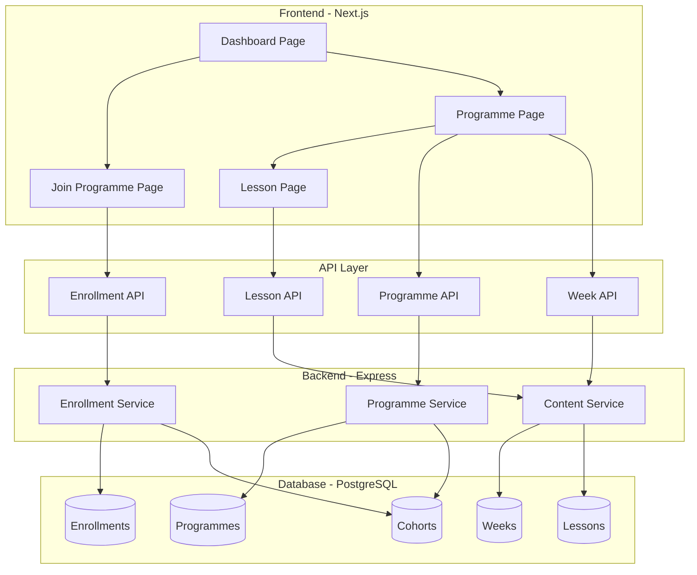

# Design Document: WLIMP Programme Rollout

## Overview

The WLIMP Programme Rollout feature enables learners to join the Workforce Leadership & Impact Mentorship Programme through code-based enrollment and access weekly structured content through a mobile-optimized web interface. This design leverages Cohortle's existing authentication, programme structure, and component library while introducing new concepts for weekly content organization, code-based enrollment, and progressive content delivery.

The system prioritizes simplicity, speed, and reliability over feature richness. It provides conveners with self-service content management capabilities and learners with a calm, focused learning experience that works reliably on mobile devices with limited bandwidth.

### Design Principles

1. **Simplicity First**: No unnecessary features. Focus on core learning access.
2. **Mobile-Optimized**: Responsive design with progressive loading for low-bandwidth scenarios.
3. **Self-Service**: Conveners manage content without developer intervention.
4. **Calm Experience**: Clear structure, minimal distractions, reliable performance.
5. **Leverage Existing**: Build on Cohortle's existing patterns and components.

## Architecture

### System Components



### Data Flow

**Enrollment Flow**:
1. Learner enters enrollment code on Join page
2. Frontend validates code format
3. API validates code and checks for existing enrollment
4. Backend creates enrollment record
5. Frontend redirects to programme page

**Content Access Flow**:
1. Learner navigates to programme page
2. Frontend fetches programme metadata and weeks
3. System determines current week based on programme start date
4. Frontend renders weeks with lessons grouped
5. Learner clicks lesson to view content
6. Frontend renders lesson with embedded/linked external content

**Content Management Flow**:
1. Convener creates/edits programme structure
2. Convener creates weeks and assigns order
3. Convener creates lessons with external content links
4. Convener assigns lessons to weeks
5. Changes are immediately visible to enrolled learners

## Components and Interfaces

### Frontend Components

#### 1. Join Programme Page (`/join`)

**Purpose**: Allow learners to enroll using a programme code.

**Component Structure**:
```typescript
interface JoinProgrammePageProps {}

interface JoinFormState {
  code: string;
  isSubmitting: boolean;
  error: string | null;
}
```

**Behavior**:
- Input field for enrollment code
- Client-side validation (format: WORD-YEAR)
- Submit button with loading state
- Error display for invalid codes
- Redirect to programme page on success

#### 2. Enhanced Dashboard (`/dashboard`)

**Purpose**: Show enrolled programmes with current week indicator.

**Component Structure**:
```typescript
interface ProgrammeCardProps {
  programme: {
    id: string;
    name: string;
    description: string;
    currentWeek: number;
    totalWeeks: number;
  };
}
```

**Behavior**:
- Display programme cards for enrolled programmes
- Show "Week X of Y" indicator
- "Join with Code" CTA in empty state
- Link to programme page

#### 3. Programme Page (`/programmes/[id]`)

**Purpose**: Display programme structure organized by weeks.

**Component Structure**:
```typescript
interface ProgrammePageProps {
  programmeId: string;
}

interface WeekSection {
  weekNumber: number;
  title: string;
  isCurrent: boolean;
  lessons: LessonCard[];
}
```

**Behavior**:
- Programme header with title and description
- Current week indicator badge
- Weeks displayed in chronological order
- Lessons grouped under each week
- Responsive grid layout for lesson cards
- Progressive loading (structure first, then content)

#### 4. Lesson Card Component

**Purpose**: Display lesson preview in programme page.

**Component Structure**:
```typescript
interface LessonCardProps {
  lesson: {
    id: string;
    title: string;
    description: string;
    contentType: 'video' | 'link' | 'pdf';
    thumbnailUrl?: string;
  };
  weekNumber: number;
}
```

**Behavior**:
- Display lesson title and description
- Show content type icon
- "View lesson" CTA button
- Link to lesson page

#### 5. Lesson Page (`/lessons/[id]`)

**Purpose**: Display lesson content with external resources.

**Component Structure**:
```typescript
interface LessonPageProps {
  lessonId: string;
}

interface LessonContent {
  id: string;
  title: string;
  description: string;
  contentType: 'video' | 'link' | 'pdf';
  contentUrl: string;
  weekNumber: number;
  programmeId: string;
}
```

**Behavior**:
- Lesson header with title and description
- Embedded YouTube player for video content
- Clickable link for Drive/PDF content
- Back link to programme page
- Lazy loading for embedded content

### API Endpoints

#### 1. Enrollment API

**POST /api/v1/programmes/enroll**

Request:
```typescript
{
  code: string; // e.g., "WLIMP-2026"
}
```

Response:
```typescript
{
  success: boolean;
  programmeId: string;
  programmeName: string;
  cohortId: string;
}
```

Errors:
- 400: Invalid code format
- 404: Code not found
- 409: Already enrolled

#### 2. Programme API

**GET /api/v1/programmes/:id**

Response:
```typescript
{
  id: string;
  name: string;
  description: string;
  startDate: string; // ISO 8601
  currentWeek: number;
  totalWeeks: number;
}
```

**GET /api/v1/programmes/:id/weeks**

Response:
```typescript
{
  weeks: Array<{
    weekNumber: number;
    title: string;
    startDate: string;
    isCurrent: boolean;
    lessons: Array<{
      id: string;
      title: string;
      description: string;
      contentType: string;
      order: number;
    }>;
  }>;
}
```

#### 3. Lesson API

**GET /api/v1/lessons/:id**

Response:
```typescript
{
  id: string;
  title: string;
  description: string;
  contentType: 'video' | 'link' | 'pdf';
  contentUrl: string;
  weekNumber: number;
  programmeId: string;
  programmeName: string;
}
```

### Backend Services

#### 1. Enrollment Service

**Responsibilities**:
- Validate enrollment codes
- Check for duplicate enrollments
- Create enrollment records
- Link learners to cohorts

**Key Methods**:
```typescript
class EnrollmentService {
  async validateCode(code: string): Promise<Cohort>;
  async checkExistingEnrollment(userId: string, cohortId: string): Promise<boolean>;
  async enrollLearner(userId: string, cohortId: string): Promise<Enrollment>;
}
```

#### 2. Programme Service

**Responsibilities**:
- Fetch programme metadata
- Calculate current week based on start date
- Retrieve programme structure with weeks

**Key Methods**:
```typescript
class ProgrammeService {
  async getProgrammeById(id: string): Promise<Programme>;
  async getCurrentWeek(programmeId: string): Promise<number>;
  async getProgrammeWeeks(programmeId: string): Promise<Week[]>;
}
```

#### 3. Content Service

**Responsibilities**:
- Manage weeks and lessons
- Handle lesson ordering
- Retrieve lesson content

**Key Methods**:
```typescript
class ContentService {
  async getWeekLessons(weekId: string): Promise<Lesson[]>;
  async getLessonById(id: string): Promise<Lesson>;
  async createWeek(programmeId: string, weekData: WeekData): Promise<Week>;
  async createLesson(weekId: string, lessonData: LessonData): Promise<Lesson>;
  async updateLessonOrder(weekId: string, lessonIds: string[]): Promise<void>;
}
```

## Data Models

### Database Schema

#### Programmes Table
```sql
CREATE TABLE programmes (
  id UUID PRIMARY KEY DEFAULT gen_random_uuid(),
  name VARCHAR(255) NOT NULL,
  description TEXT,
  start_date DATE NOT NULL,
  created_at TIMESTAMP DEFAULT NOW(),
  updated_at TIMESTAMP DEFAULT NOW()
);
```

#### Cohorts Table
```sql
CREATE TABLE cohorts (
  id UUID PRIMARY KEY DEFAULT gen_random_uuid(),
  programme_id UUID REFERENCES programmes(id) ON DELETE CASCADE,
  name VARCHAR(255) NOT NULL,
  enrollment_code VARCHAR(50) UNIQUE NOT NULL,
  start_date DATE NOT NULL,
  created_at TIMESTAMP DEFAULT NOW(),
  updated_at TIMESTAMP DEFAULT NOW()
);

CREATE INDEX idx_cohorts_enrollment_code ON cohorts(enrollment_code);
```

#### Weeks Table
```sql
CREATE TABLE weeks (
  id UUID PRIMARY KEY DEFAULT gen_random_uuid(),
  programme_id UUID REFERENCES programmes(id) ON DELETE CASCADE,
  week_number INTEGER NOT NULL,
  title VARCHAR(255) NOT NULL,
  start_date DATE NOT NULL,
  created_at TIMESTAMP DEFAULT NOW(),
  updated_at TIMESTAMP DEFAULT NOW(),
  UNIQUE(programme_id, week_number)
);

CREATE INDEX idx_weeks_programme ON weeks(programme_id);
```

#### Lessons Table
```sql
CREATE TABLE lessons (
  id UUID PRIMARY KEY DEFAULT gen_random_uuid(),
  week_id UUID REFERENCES weeks(id) ON DELETE CASCADE,
  title VARCHAR(255) NOT NULL,
  description TEXT,
  content_type VARCHAR(50) NOT NULL, -- 'video', 'link', 'pdf'
  content_url TEXT NOT NULL,
  order_index INTEGER NOT NULL,
  created_at TIMESTAMP DEFAULT NOW(),
  updated_at TIMESTAMP DEFAULT NOW()
);

CREATE INDEX idx_lessons_week ON lessons(week_id);
```

#### Enrollments Table
```sql
CREATE TABLE enrollments (
  id UUID PRIMARY KEY DEFAULT gen_random_uuid(),
  user_id UUID NOT NULL,
  cohort_id UUID REFERENCES cohorts(id) ON DELETE CASCADE,
  enrolled_at TIMESTAMP DEFAULT NOW(),
  UNIQUE(user_id, cohort_id)
);

CREATE INDEX idx_enrollments_user ON enrollments(user_id);
CREATE INDEX idx_enrollments_cohort ON enrollments(cohort_id);
```

### TypeScript Interfaces

```typescript
interface Programme {
  id: string;
  name: string;
  description: string;
  startDate: Date;
  createdAt: Date;
  updatedAt: Date;
}

interface Cohort {
  id: string;
  programmeId: string;
  name: string;
  enrollmentCode: string;
  startDate: Date;
  createdAt: Date;
  updatedAt: Date;
}

interface Week {
  id: string;
  programmeId: string;
  weekNumber: number;
  title: string;
  startDate: Date;
  createdAt: Date;
  updatedAt: Date;
}

interface Lesson {
  id: string;
  weekId: string;
  title: string;
  description: string;
  contentType: 'video' | 'link' | 'pdf';
  contentUrl: string;
  orderIndex: number;
  createdAt: Date;
  updatedAt: Date;
}

interface Enrollment {
  id: string;
  userId: string;
  cohortId: string;
  enrolledAt: Date;
}
```

### Current Week Calculation

The current week is calculated based on the cohort start date:

```typescript
function getCurrentWeek(cohortStartDate: Date): number {
  const now = new Date();
  const startDate = new Date(cohortStartDate);
  
  // Calculate days since start
  const daysSinceStart = Math.floor(
    (now.getTime() - startDate.getTime()) / (1000 * 60 * 60 * 24)
  );
  
  // Calculate week number (1-indexed)
  const weekNumber = Math.floor(daysSinceStart / 7) + 1;
  
  // Return at least week 1
  return Math.max(1, weekNumber);
}
```


## Correctness Properties

A property is a characteristic or behavior that should hold true across all valid executions of a system—essentially, a formal statement about what the system should do. Properties serve as the bridge between human-readable specifications and machine-verifiable correctness guarantees.

### Property 1: Programme Creation Round Trip

*For any* valid programme data (name, description, start date), creating a programme and then retrieving it should return an equivalent programme with all fields preserved.

**Validates: Requirements 1.1**

### Property 2: Multiple Cohorts Per Programme

*For any* programme, creating multiple cohorts with unique enrollment codes should result in all cohorts being associated with that programme and retrievable via programme ID.

**Validates: Requirements 1.2**

### Property 3: Week Organization Preservation

*For any* programme with multiple weeks, the weeks should be retrievable in order by week number, and each week should maintain its association with the programme.

**Validates: Requirements 1.3**

### Property 4: Lesson-Week Association

*For any* week and lesson data, creating a lesson assigned to that week should result in the lesson being retrievable via the week ID with the correct association.

**Validates: Requirements 1.4**

### Property 5: External Content URL Storage

*For any* valid URL (YouTube, Drive, PDF, Zoom), creating a lesson with that URL should preserve the exact URL string when retrieved.

**Validates: Requirements 1.5**

### Property 6: Lesson Reordering Preservation

*For any* week with multiple lessons, reordering the lessons should result in the new order being preserved when lessons are retrieved, with no lessons lost or duplicated.

**Validates: Requirements 1.6**

### Property 7: Enrollment Idempotency

*For any* learner and valid enrollment code, enrolling multiple times with the same code should result in exactly one enrollment record, and subsequent enrollment attempts should return the existing enrollment without error.

**Validates: Requirements 2.1, 2.7**

### Property 8: Invalid Code Rejection

*For any* enrollment code that doesn't match the format WORD-YEAR or doesn't exist in the database, enrollment attempts should fail with a clear error message and no enrollment record should be created.

**Validates: Requirements 2.4, 2.6**

### Property 9: Current Week Calculation

*For any* cohort with a start date, the current week number should be calculated as: floor((days since start) / 7) + 1, with a minimum value of 1, regardless of how far in the past or future the start date is.

**Validates: Requirements 3.2**

### Property 10: Programme Page Structure

*For any* programme with weeks and lessons, the programme page data should include the programme title and description, weeks grouped by week number, and each lesson should include title, description, and a view action.

**Validates: Requirements 3.1, 3.3, 3.4**

### Property 11: Week Visibility Filtering

*For any* programme, only weeks where week_number <= current_week should be included in the programme page response, ensuring future weeks are not displayed.

**Validates: Requirements 3.5**

### Property 12: Lesson Content Rendering

*For any* lesson with a content URL, the lesson page should include the lesson title, description, and either an embedded player (for YouTube URLs) or a clickable link (for other URLs), determined by the content type.

**Validates: Requirements 4.1, 4.2, 4.3, 4.4**

### Property 13: Dashboard Programme Cards

*For any* learner enrolled in programmes, the dashboard should display a card for each enrolled programme containing the programme title and current week indicator.

**Validates: Requirements 5.1, 5.2, 5.3**

### Property 14: Content Immediate Visibility

*For any* newly created week or lesson, querying for programme content immediately after creation should include the new content without requiring cache invalidation or delays.

**Validates: Requirements 7.3**

### Property 15: Lesson Order Preservation on Addition

*For any* week with existing lessons, adding a new lesson with a higher order index should not change the order indices of existing lessons.

**Validates: Requirements 7.4**

### Property 16: Lesson Update Round Trip

*For any* existing lesson, updating its title, description, or content URL and then retrieving it should return the lesson with the updated values.

**Validates: Requirements 7.5**

### Property 17: Session Persistence Across Navigation

*For any* authenticated learner, navigating from dashboard to programme page to lesson page should maintain the authentication session, with the user ID remaining consistent across all requests.

**Validates: Requirements 8.3**

## Error Handling

### Enrollment Errors

**Invalid Code Format**:
- Validate code format on client and server
- Return 400 Bad Request with message: "Invalid code format. Use format: PROGRAMME-YEAR"

**Code Not Found**:
- Return 404 Not Found with message: "Enrollment code not found. Please check the code and try again."

**Duplicate Enrollment**:
- Return 200 OK with existing enrollment data (idempotent behavior)
- Include message: "You are already enrolled in this programme"

**Server Errors**:
- Return 500 Internal Server Error with message: "Enrollment failed. Please try again."
- Log error details for debugging

### Content Access Errors

**Programme Not Found**:
- Return 404 Not Found with message: "Programme not found"
- Redirect to dashboard

**Unauthorized Access**:
- Return 403 Forbidden if learner is not enrolled
- Redirect to join page with programme code hint

**Lesson Not Found**:
- Return 404 Not Found with message: "Lesson not found"
- Provide link back to programme page

**Network Errors**:
- Display retry button with message: "Failed to load content. Please check your connection and try again."
- Implement exponential backoff for retries

### Content Management Errors

**Invalid Week Number**:
- Return 400 Bad Request with message: "Week number must be positive and unique within the programme"

**Invalid Lesson Order**:
- Return 400 Bad Request with message: "Lesson order must be a positive integer"

**Invalid Content URL**:
- Validate URL format on client and server
- Return 400 Bad Request with message: "Invalid URL format"

**Duplicate Enrollment Code**:
- Return 409 Conflict with message: "Enrollment code already exists. Please choose a different code."

## Testing Strategy

### Dual Testing Approach

This feature requires both unit tests and property-based tests for comprehensive coverage:

**Unit Tests** focus on:
- Specific examples of enrollment flows
- Edge cases (empty states, first week, last week)
- Error conditions (invalid codes, unauthorized access)
- Integration points (auth, database, external content)

**Property Tests** focus on:
- Universal properties across all inputs (see Correctness Properties above)
- Data integrity (round trips, associations, ordering)
- Idempotency (duplicate enrollments, multiple updates)
- Comprehensive input coverage through randomization

### Property-Based Testing Configuration

**Framework**: Use `fast-check` for TypeScript/JavaScript property-based testing

**Test Configuration**:
- Minimum 100 iterations per property test
- Each test must reference its design document property
- Tag format: `Feature: wlimp-programme-rollout, Property {number}: {property_text}`

**Example Property Test Structure**:
```typescript
import fc from 'fast-check';

describe('Feature: wlimp-programme-rollout, Property 1: Programme Creation Round Trip', () => {
  it('should preserve all programme fields after creation and retrieval', async () => {
    await fc.assert(
      fc.asyncProperty(
        fc.record({
          name: fc.string({ minLength: 1, maxLength: 255 }),
          description: fc.string({ maxLength: 1000 }),
          startDate: fc.date(),
        }),
        async (programmeData) => {
          // Create programme
          const created = await createProgramme(programmeData);
          
          // Retrieve programme
          const retrieved = await getProgrammeById(created.id);
          
          // Verify equivalence
          expect(retrieved.name).toBe(programmeData.name);
          expect(retrieved.description).toBe(programmeData.description);
          expect(retrieved.startDate).toEqual(programmeData.startDate);
        }
      ),
      { numRuns: 100 }
    );
  });
});
```

### Unit Test Coverage

**Enrollment Flow**:
- Valid code enrollment succeeds
- Invalid format code rejected
- Non-existent code rejected
- Duplicate enrollment returns existing record
- Redirect to programme page after enrollment

**Programme Page**:
- Empty programme shows no weeks
- Programme with one week displays correctly
- Current week indicator shows correct week
- Future weeks are hidden
- Past weeks are visible

**Lesson Page**:
- YouTube URL renders embedded player
- PDF URL renders clickable link
- Drive URL renders clickable link
- Back link navigates to programme page

**Dashboard**:
- No enrollments shows empty state
- One programme shows one card
- Multiple programmes show multiple cards
- Current week indicator updates correctly

**Content Management**:
- Create week succeeds
- Create lesson succeeds
- Reorder lessons succeeds
- Update lesson succeeds
- Delete lesson succeeds

### Integration Testing

**End-to-End Flows**:
1. Learner joins programme → sees programme on dashboard → views lesson
2. Convener creates programme → creates weeks → creates lessons → learner accesses content
3. Learner enrolls → programme starts → current week updates over time

**Performance Testing**:
- Dashboard loads within 3 seconds on 3G connection
- Programme page loads within 3 seconds on 3G connection
- Enrollment completes within 2 seconds on 3G connection

**Mobile Testing**:
- All pages render correctly at 320px width
- Touch targets are at least 44x44px
- Text is readable without zooming
- Forms are usable on mobile keyboards

### Test Data Generators

**For Property-Based Tests**:
```typescript
// Programme generator
const programmeGen = fc.record({
  name: fc.string({ minLength: 1, maxLength: 255 }),
  description: fc.string({ maxLength: 1000 }),
  startDate: fc.date({ min: new Date('2020-01-01'), max: new Date('2030-12-31') }),
});

// Enrollment code generator
const enrollmentCodeGen = fc.tuple(
  fc.stringOf(fc.constantFrom(...'ABCDEFGHIJKLMNOPQRSTUVWXYZ'), { minLength: 3, maxLength: 10 }),
  fc.integer({ min: 2020, max: 2030 })
).map(([word, year]) => `${word}-${year}`);

// Week generator
const weekGen = fc.record({
  weekNumber: fc.integer({ min: 1, max: 52 }),
  title: fc.string({ minLength: 1, maxLength: 255 }),
  startDate: fc.date(),
});

// Lesson generator
const lessonGen = fc.record({
  title: fc.string({ minLength: 1, maxLength: 255 }),
  description: fc.string({ maxLength: 1000 }),
  contentType: fc.constantFrom('video', 'link', 'pdf'),
  contentUrl: fc.webUrl(),
  orderIndex: fc.integer({ min: 0, max: 100 }),
});

// URL type generator
const urlGen = fc.oneof(
  fc.constant('https://www.youtube.com/watch?v=').chain(id => 
    fc.stringOf(fc.constantFrom(...'abcdefghijklmnopqrstuvwxyzABCDEFGHIJKLMNOPQRSTUVWXYZ0123456789'), { minLength: 11, maxLength: 11 })
      .map(s => id + s)
  ),
  fc.constant('https://drive.google.com/file/d/').chain(prefix =>
    fc.stringOf(fc.constantFrom(...'abcdefghijklmnopqrstuvwxyzABCDEFGHIJKLMNOPQRSTUVWXYZ0123456789-_'), { minLength: 20, maxLength: 40 })
      .map(s => prefix + s)
  ),
  fc.webUrl().map(url => url + '.pdf'),
);
```

### Continuous Integration

**Pre-commit Checks**:
- Run all unit tests
- Run linting and type checking
- Verify no console errors

**CI Pipeline**:
- Run all unit tests
- Run all property-based tests (100 iterations each)
- Run integration tests
- Check code coverage (target: 80%+)
- Build and deploy to staging

**Staging Validation**:
- Manual testing on mobile devices
- Performance testing on 3G connection
- Accessibility testing with screen readers
