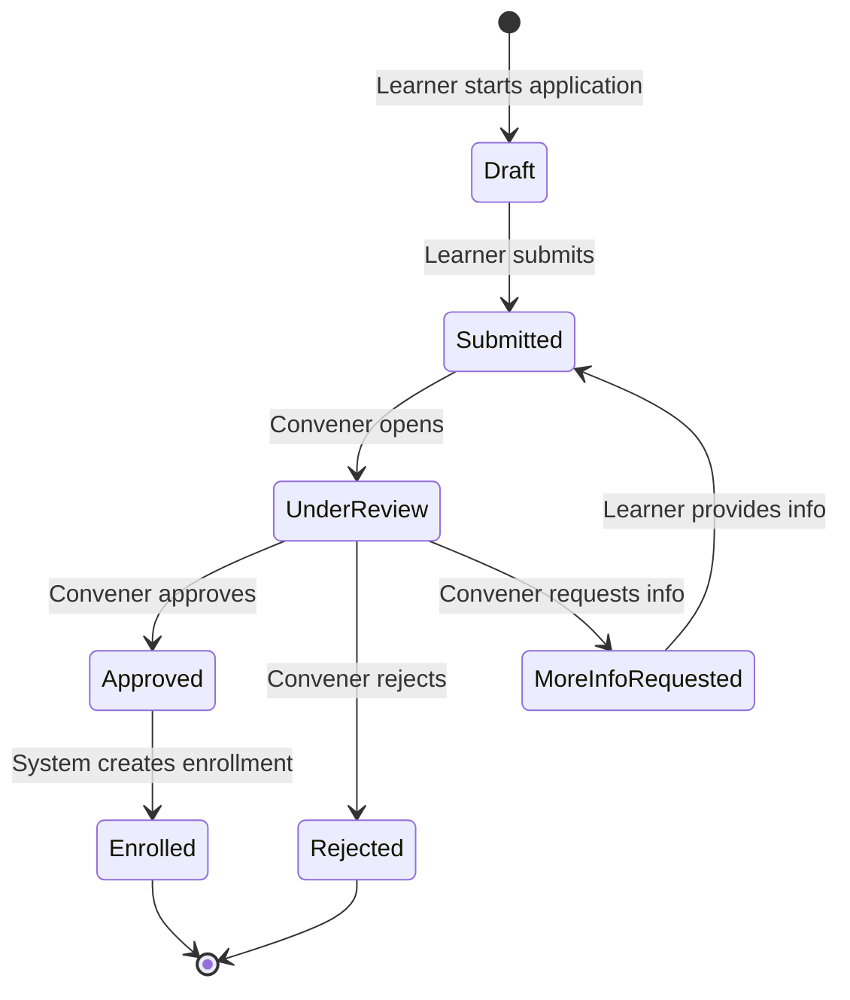

# Learner Application Workflow Architecture

## Overview

This document describes the architecture for the learner application workflow system. This is a **future feature** that will allow programmes to require learners to submit applications for convener review before joining cohorts, as an alternative to the current "join with code" approach.

**Current Status:** Architecture prepared, implementation pending

**Related Requirements:** Requirements 11.1-11.6 from role-validation-assignment-logic spec

**Last Updated:** March 5, 2026

## Purpose and Context

Cohortle is infrastructure for running cohort-based programmes such as fellowships, incubators, bootcamps, NGO training programmes, and leadership development cohorts. The learner application workflow provides conveners with control over who joins their programmes by requiring application submission and review, rather than automatic enrollment via codes.

This workflow maintains the core platform hierarchy:
```
Programme → Cohort → Learners
```

## Onboarding Modes

Programmes support two onboarding modes via the `onboarding_mode` field in the `programmes` table:

### 1. Code Mode (Current Implementation)
- **Value:** `'code'`
- **Behavior:** Learners join cohorts directly using an enrollment code
- **Validation:** Enrollment code validated against cohort entity
- **Use Cases:** Open programmes, internal training, low-barrier access
- **Status:** ✅ Fully implemented

### 2. Application Mode (Future Feature)
- **Value:** `'application'`
- **Behavior:** Learners submit applications for convener review
- **Validation:** Application reviewed and approved/rejected by convener
- **Use Cases:** Competitive fellowships, selective programmes, capacity-limited cohorts
- **Status:** ⏳ Architecture prepared, implementation pending

## System Architecture

### High-Level Flow

```
Learner discovers programme
    ↓
Checks onboarding_mode
    ↓
┌─────────────────────────────────────┐
│  IF mode = 'code'                   │
│    → Enter enrollment code          │
│    → Validate code                  │
    → Immediate enrollment          │
│    → Access programme content       │
└─────────────────────────────────────┘
                OR
┌─────────────────────────────────────┐
│  IF mode = 'application'            │
│    → Submit application             │
│    → Convener reviews               │
│    → Approve/Reject decision        │
│    → If approved: enrollment        │
│    → If rejected: notification      │
└─────────────────────────────────────┘
```

### Application Workflow States



## Data Models

### 1. Programme Configuration (Existing Table)

The `programmes` table already includes the necessary fields:

```javascript
{
  programme_id: 'uuid',
  name: 'string',
  description: 'text',
  lifecycle_status: 'string', // 'draft', 'recruiting', 'active', 'completed', 'archived'
  onboarding_mode: 'string',  // 'code' or 'application'
  status_changed_at: 'timestamp',
  status_changed_by: 'uuid',
  created_at: 'timestamp',
  updated_at: 'timestamp'
}
```

**Key Fields:**
- `onboarding_mode`: Determines whether learners join via code or application
- `lifecycle_status`: Must be 'recruiting' for applications to be accepted

### 2. Learner Applications (New Table - Future)

```javascript
{
  application_id: 'uuid',
  programme_id: 'uuid',
  cohort_id: 'uuid|null',      // Optional: specific cohort or programme-level
  learner_id: 'uuid',           // User ID of applicant
  status: 'string',             // 'draft', 'submitted', 'under_review', 'approved', 'rejected', 'more_info_requested'
  
  // Application content
  application_data: 'jsonb',    // Flexible structure for application questions/answers
  
  // Review information
  reviewed_by: 'uuid|null',     // Convener who reviewed
  reviewed_at: 'timestamp|null',
  review_notes: 'text|null',    // Internal notes from convener
  rejection_reason: 'text|null', // Reason provided to learner if rejected
  
  // Timestamps
  submitted_at: 'timestamp|null',
  created_at: 'timestamp',
  updated_at: 'timestamp'
}
```

**Application Status Values:**
- `draft`: Learner started but hasn't submitted
- `submitted`: Learner submitted, awaiting review
- `under_review`: Convener actively reviewing
- `approved`: Application approved, enrollment created
- `rejected`: Application rejected
- `more_info_requested`: Convener needs additional information

### 3. Application Templates (New Table - Future)

```javascript
{
  template_id: 'uuid',
  programme_id: 'uuid',
  name: 'string',
  description: 'text',
  
  // Template structure
  questions: 'jsonb',           // Array of question objects
  /*
  Example structure:
  [
    {
      id: 'q1',
      type: 'text|textarea|select|multiselect|file',
      question: 'Why do you want to join this programme?',
      required: true,
      max_length: 500,
      options: [] // For select/multiselect
    }
  ]
  */
  
  // Settings
  is_active: 'boolean',
  created_by: 'uuid',
  created_at: 'timestamp',
  updated_at: 'timestamp'
}
```

### 4. Application History (New Table - Future)

```javascript
{
  history_id: 'uuid',
  application_id: 'uuid',
  changed_by: 'uuid',
  previous_status: 'string',
  new_status: 'string',
  notes: 'text|null',
  changed_at: 'timestamp'
}
```

## API Endpoints (Future Implementation)

### Learner Endpoints

```
POST   /api/programmes/:programmeId/applications
       - Create new application (draft)
       - Body: { cohort_id?, application_data }
       - Returns: application object

PUT    /api/applications/:applicationId
       - Update draft application
       - Body: { application_data }
       - Returns: updated application

POST   /api/applications/:applicationId/submit
       - Submit application for review
       - Body: { application_data }
       - Returns: submitted application

GET    /api/applications/:applicationId
       - Get application details
       - Returns: application object

GET    /api/users/me/applications
       - List learner's applications
       - Query: ?status=submitted&programme_id=xxx
       - Returns: array of applications
```

### Convener Endpoints

```
GET    /api/programmes/:programmeId/applications
       - List applications for programme
       - Query: ?status=submitted&cohort_id=xxx
       - Returns: array of applications

GET    /api/applications/:applicationId
       - Get application details for review
       - Returns: application with learner info

PUT    /api/applications/:applicationId/review
       - Update review status
       - Body: { status: 'under_review|approved|rejected|more_info_requested', review_notes?, rejection_reason? }
       - Returns: updated application

POST   /api/applications/:applicationId/approve
       - Approve application and create enrollment
       - Body: { cohort_id, welcome_message? }
       - Returns: { application, enrollment }

POST   /api/applications/:applicationId/reject
       - Reject application
       - Body: { rejection_reason }
       - Returns: updated application

GET    /api/programmes/:programmeId/application-template
       - Get application template for programme
       - Returns: template object

PUT    /api/programmes/:programmeId/application-template
       - Update application template
       - Body: { questions, name, description }
       - Returns: updated template
```

### Admin Endpoints

```
GET    /api/applications
       - List all applications (admin view)
       - Query: ?status=submitted&programme_id=xxx
       - Returns: array of applications with programme info
```

## Business Logic

### Application Submission Rules

1. **Programme Requirements:**
   - Programme must have `onboarding_mode = 'application'`
   - Programme must be in 'recruiting' lifecycle status
   - Programme must have an active application template

2. **Learner Requirements:**
   - User must have 'learner' role (or higher)
   - User must not already be enrolled in the target cohort
   - User must not have a pending application for the same programme/cohort

3. **Application Validation:**
   - All required questions must be answered
   - Text responses must meet length requirements
   - File uploads must meet size/type requirements

### Review and Approval Rules

1. **Reviewer Authorization:**
   - Reviewer must be convener of the programme OR administrator
   - Reviewer must have 'manage_enrollments' permission

2. **Approval Process:**
   - When approved, system automatically creates enrollment record
   - Enrollment uses same structure as code-based enrollment
   - Learner receives notification of approval
   - Learner gains immediate access to programme content

3. **Rejection Process:**
   - Convener must provide rejection reason
   - Learner receives notification with reason
   - Application marked as rejected (not deleted)
   - Learner can submit new application after rejection

4. **More Info Request:**
   - Application returns to 'submitted' status
   - Learner can update and resubmit
   - Previous review notes preserved in history

### Notification System

**Learner Notifications:**
- Application submitted confirmation
- Application under review notification
- Application approved notification (with access instructions)
- Application rejected notification (with reason)
- More information requested notification

**Convener Notifications:**
- New application submitted
- Application updated after info request
- Application statistics (daily/weekly digest)

## Integration Points

### 1. Role System Integration

The application workflow respects the role hierarchy:
- **Learners**: Can submit applications
- **Conveners**: Can review applications for their programmes
- **Administrators**: Can review any application

**Important:** Application workflow is for cohort enrollment, NOT role assignment. All applicants must already have the 'learner' role.

### 2. Enrollment System Integration

When an application is approved:
```javascript
// Pseudo-code for approval process
async function approveApplication(applicationId, cohortId, reviewerId) {
  // 1. Validate reviewer permissions
  await validateConvenerAccess(reviewerId, cohortId);
  
  // 2. Update application status
  const application = await updateApplicationStatus(applicationId, 'approved', reviewerId);
  
  // 3. Create enrollment (same as code-based enrollment)
  const enrollment = await EnrollmentService.createEnrollment({
    user_id: application.learner_id,
    cohort_id: cohortId,
    enrollment_source: 'application',
    application_id: applicationId
  });
  
  // 4. Send notifications
  await notifyLearnerApproval(application.learner_id, cohortId);
  
  // 5. Log history
  await logApplicationHistory(applicationId, 'approved', reviewerId);
  
  return { application, enrollment };
}
```

### 3. Programme Lifecycle Integration

Application acceptance depends on programme lifecycle:
- **Draft**: Applications not accepted (programme not ready)
- **Recruiting**: Applications accepted and reviewed
- **Active**: Applications may be accepted (convener decision)
- **Completed**: Applications not accepted (programme finished)
- **Archived**: Applications not accepted (programme archived)

### 4. Authentication Integration

All application endpoints require authentication:
- JWT token must include user role
- Middleware validates role before processing
- Convener endpoints validate programme ownership

## Security Considerations

### 1. Access Control

**Learner Access:**
- Can only view/edit own applications
- Cannot view other learners' applications
- Cannot access review notes or internal comments

**Convener Access:**
- Can view applications for own programmes only
- Can review and approve/reject applications
- Can view learner profile information relevant to application

**Administrator Access:**
- Can view all applications
- Can override convener decisions if needed
- Can access application analytics

### 2. Data Privacy

**Personal Information:**
- Application data may contain sensitive information
- Access restricted to authorized reviewers only
- Audit trail for all application access

**GDPR Compliance:**
- Learners can request application data deletion
- Rejected applications retained for audit (anonymized after period)
- Clear consent for data processing in application

### 3. Validation and Sanitization

**Input Validation:**
- All application data validated against template schema
- File uploads scanned for malware
- Text inputs sanitized to prevent XSS

**Rate Limiting:**
- Limit application submissions per user per programme
- Prevent spam applications
- Throttle API requests

## Error Handling

### Application Submission Errors

```javascript
// Programme not accepting applications
{
  error: true,
  code: 'APPLICATIONS_NOT_ACCEPTED',
  message: 'This programme is not currently accepting applications',
  details: {
    programme_id: 'xxx',
    onboarding_mode: 'code',
    lifecycle_status: 'active'
  }
}

// Duplicate application
{
  error: true,
  code: 'DUPLICATE_APPLICATION',
  message: 'You already have a pending application for this programme',
  details: {
    existing_application_id: 'xxx',
    status: 'submitted'
  }
}

// Already enrolled
{
  error: true,
  code: 'ALREADY_ENROLLED',
  message: 'You are already enrolled in this cohort',
  details: {
    enrollment_id: 'xxx',
    cohort_id: 'xxx'
  }
}
```

### Review Errors

```javascript
// Unauthorized reviewer
{
  error: true,
  code: 'UNAUTHORIZED_REVIEWER',
  message: 'You do not have permission to review this application',
  details: {
    required_permission: 'manage_enrollments',
    programme_id: 'xxx'
  }
}

// Invalid status transition
{
  error: true,
  code: 'INVALID_STATUS_TRANSITION',
  message: 'Cannot transition from current status to requested status',
  details: {
    current_status: 'approved',
    requested_status: 'under_review'
  }
}
```

## Testing Strategy

### Unit Tests

**Application Service Tests:**
- Test application creation and validation
- Test status transitions
- Test approval/rejection logic
- Test duplicate detection

**Authorization Tests:**
- Test learner can only access own applications
- Test convener can only review own programme applications
- Test admin can access all applications

### Integration Tests

**End-to-End Application Flow:**
1. Learner discovers programme with application mode
2. Learner creates and submits application
3. Convener receives notification
4. Convener reviews and approves
5. System creates enrollment
6. Learner gains access to content

**Error Scenarios:**
- Application to programme not accepting applications
- Duplicate application submission
- Unauthorized review attempt
- Invalid status transitions

### Property-Based Tests

**Property 1: Application Status Integrity**
*For any* application status transition, the system must ensure the transition is valid according to the state machine, and must log the transition with complete audit information.

**Property 2: Enrollment Creation Consistency**
*For any* approved application, the system must create exactly one enrollment record, and the enrollment must reference the application that created it.

**Property 3: Access Control Enforcement**
*For any* application access attempt, the system must validate that the accessor has appropriate permissions (learner owns application, convener owns programme, or user is admin).

## Migration Path

### Phase 1: Database Schema (Future)
- Create `learner_applications` table
- Create `application_templates` table
- Create `application_history` table
- Add indexes for performance

### Phase 2: Backend API (Future)
- Implement application service
- Implement API endpoints
- Add authorization middleware
- Implement notification system

### Phase 3: Frontend UI (Future)
- Build application submission form
- Build convener review interface
- Add application status tracking
- Implement notifications

### Phase 4: Testing and Rollout (Future)
- Comprehensive testing
- Beta testing with select programmes
- Documentation and training
- Gradual rollout to all programmes

## Current Implementation Status

### ✅ Completed
- Programme `onboarding_mode` field added to database
- Programme lifecycle states implemented
- Role-based access control system in place
- Enrollment system supports both code and application sources

### ⏳ Pending Implementation
- Application tables and schema
- Application submission API
- Convener review interface
- Application notification system
- Application template builder

## Future Enhancements

### Advanced Features (Post-MVP)
1. **Batch Review:** Review multiple applications at once
2. **Application Scoring:** Numeric scoring system for applications
3. **Collaborative Review:** Multiple conveners review same application
4. **Application Analytics:** Track application metrics and trends
5. **Automated Screening:** AI-assisted initial screening
6. **Interview Scheduling:** Integrate interview scheduling for selected applicants
7. **Waitlist Management:** Automatic waitlist for capacity-limited programmes
8. **Application Templates Library:** Reusable templates across programmes

## Related Documentation

- [Role System Schema](./ROLE_SYSTEM_SCHEMA.md)
- [Role Hierarchy and Permission Inheritance](./ROLE_HIERARCHY_PERMISSION_INHERITANCE.md)
- [Multi-Level Access Control](./MULTI_LEVEL_ACCESS_CONTROL.md)
- [Role Validation Assignment Logic Spec](../.kiro/specs/role-validation-assignment-logic/)

## Conclusion

The learner application workflow provides conveners with fine-grained control over programme enrollment while maintaining the platform's core principles of role-based access control and programme-centric hierarchy. The architecture is designed to integrate seamlessly with existing systems while providing flexibility for future enhancements.

**Key Takeaways:**
- Application workflow is for cohort enrollment, not role assignment
- All applicants must already have 'learner' role
- Conveners control application review and approval
- System maintains audit trail of all application activities
- Architecture prepared for future implementation
